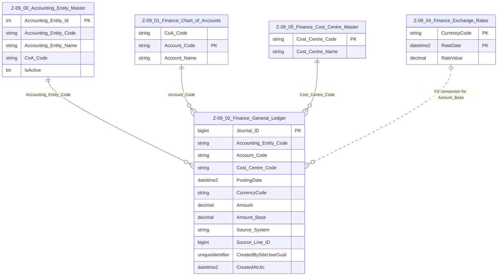

# Data Entity Specification: Z-09.02 Finance_General_Ledger

| **Document ID** | **Version** | **Status** | **Owner (Author)** | **Approved By** | **Approved On** |
| :--- | :--- | :--- | :--- | :--- | :--- |
| **Z-09.02** | 1.1.0 | **DRAFT** | Business Architect | Product Officer | |

---

## 1. Description & Scope

The **Finance General Ledger (GL)** is the central repository of all *posted* financial transactions.

This specification follows the **one-tier relationship rule** – only entities that connect **directly** to the GL appear in the ERD.

The GL consumes:

- **Accounting Entities** from **Z-09.00 Accounting_Entity_Master** (via `Accounting_Entity_Code`)  
- **Accounts** from **Z-09.01 Finance_Chart_of_Accounts** (via `Account_Code`)  
- **Cost Centres** from **Z-09.05 Finance_Cost_Centre_Master** (via `Cost_Centre_Code`)  
- **Exchange Rates** from **Z-09.04 Finance_Exchange_Rates** (for `Amount_Base` calculations)

It provides the base data for:

- Trial Balance and financial statements (**Z-09.03**)  
- Management reporting and analytics  
- ESG Actuals calculation (**Z-10.01 ESG_Position_Ledger**) via account and cost-centre mapping

---

## 2. Referential Integrity Standard

> **Referential Integrity Standard**  
> Relationships involving Finance_General_Ledger are **logical only** — application and reporting layers enforce correctness.  
> No physical FOREIGN KEY constraints are created at database level.

The physical implementation of this entity is:

- **Table**: `[Finance].[Z_09_02_Finance_General_Ledger]`

Logical relationships (no physical FKs) exist to:

- `[Finance].[Z_09_00_Accounting_Entity_Master]` (via `Accounting_Entity_Code`)  
- `[Finance].[Z_09_01_Finance_Chart_of_Accounts]` (via `Account_Code`)  
- `[Finance].[Z_09_05_Finance_Cost_Centre_Master]` (via `Cost_Centre_Code`)  
- `[Finance].[Z_09_04_Finance_Exchange_Rates]` (via currency and date for FX conversion)

---

## 3. ERD — One‑Tier View

---

## 4. Structure

### 4.1 Column Definitions

| Feature | Column | Type | Purpose |
| :--- | :--- | :--- | :--- |
| **Primary Key** | `Journal_ID` | BIGINT | Unique row identifier for each GL posting line. |
| **Accounting Entity** | `Accounting_Entity_Code` | NVARCHAR(50) | Logical pointer to Z-09.00 Accounting_Entity_Master – identifies which entity the posting belongs to. |
| **Account** | `Account_Code` | NVARCHAR(50) | Must exist in Z-09.01 Finance_Chart_of_Accounts for the relevant `CoA_Code`. |
| **Cost Centre** | `Cost_Centre_Code` | NVARCHAR(50) | Must exist in Z-09.05 Finance_Cost_Centre_Master where applicable. |
| **Posting Date** | `PostingDate` | DATETIME2 | Determines the accounting period and FX rate date (unless overridden). |
| **Currency** | `CurrencyCode` | NVARCHAR(10) | Transaction/original currency code (ISO 4217 recommended). |
| **Amount** | `Amount` | DECIMAL | Transaction-currency value (signed, typically +ve for debit, -ve for credit or vice versa depending on convention). |
| **Amount (Base)** | `Amount_Base` | DECIMAL | Value converted into the entity’s base currency using Z-09.04 Finance_Exchange_Rates. |
| **Source System** | `Source_System` | NVARCHAR(100) | System of origin (e.g. `PROC`, `BILLING`, `HR`, `MANUAL_JE`). |
| **Traceability** | `Source_Line_ID` | BIGINT | Identifier that links back to the originating transaction line in the source system. |
| **Audit – Created By** | `CreatedBySiteUserGuid` | UNIQUEIDENTIFIER | User or service that created the posting. |
| **Audit – Created At** | `CreatedAtUtc` | DATETIME2(3) | Timestamp of posting creation (UTC). |

> Additional fields such as `DocumentDate`, `Narrative`, or `Journal_Number` may be added in implementation-specific extensions, but the above represent the **canonical minimum** required for ledger integration and ESG calculation.

---

## 5. Behaviour & Business Rules

- Every GL posting must:
  - Have a valid `Accounting_Entity_Code` registered in Z-09.00.  
  - Use an `Account_Code` flagged as a **posting account** in Z-09.01.  
  - Use a valid `CurrencyCode` with an applicable FX rate in Z-09.04 if `Amount_Base` is populated.  
- `Amount_Base` is normally derived from `Amount` using the **posting date** and the appropriate FX rate.  
- `Cost_Centre_Code` is optional depending on CoA design and analytic needs but, when present, must exist in Z-09.05.  
- The table is **append-only** in normal operation – corrections are typically posted as **reversals + new postings** rather than overwriting existing rows.  
- Period close processes (see Data Management) control when postings can be added or adjusted for a given accounting period.

---

## 6. Data Management

| Object Type | Name | Description |
|-------------|------|-------------|
| **Stored Procedure** | **usp_Z_09_02_GL_PostJournal** | Inserts and validates one or more GL posting lines. Checks Accounting Entity, Account, Cost Centre, and FX rules before committing. |
| **Stored Procedure** | **usp_Z_09_02_GL_PostRevaluation** | Performs FX revaluation runs, writing adjusting entries that update `Amount_Base` positions for open balances. |
| **Stored Procedure** | **usp_Z_09_02_GL_ClosePeriod** | Executes period-close logic, preventing further postings to a specified period for selected Accounting Entities. |
| **Stored Procedure** | **usp_Z_09_02_GL_GetByEntityPeriod** | Returns GL lines for a given Accounting Entity, period, and account/filter set for reporting and downstream processes. |
| **View** | **vw_Z_09_02_GL_With_CoA** | Joins GL with Z-09.01 to expose account names, types, and reporting classifications. |
| **View** | **vw_Z_09_02_GL_Period_Summary** | Supplies summarised data (by account, entity, period) for Trial Balance (Z-09.03) and financial statements. |
| **Governance Process** | **Finance GL Posting & Close Workflow** | Governs manual journals, system interfaces, approval, and period close controls. |
| **DQ Process** | **DQ_Finance_GL_ValidationReport** | Identifies postings with invalid or inactive Accounting Entities, Accounts, Cost Centres, or FX gaps; checks for out-of-period postings and structural anomalies. |

---

## 7. Architectural Role

Z-09.02 **Finance_General_Ledger** is the **single source of truth** for posted financial activity in the platform.  

Together with:

- **Z-09.00 Accounting_Entity_Master** (who the posting belongs to)  
- **Z-09.01 Finance_Chart_of_Accounts** (what the posting is about)  
- **Z-09.05 Finance_Cost_Centre_Master** (where in the organisation)  
- **Z-09.04 Finance_Exchange_Rates** (how values translate to base currency)

it underpins:

- Trial Balance & financial statements (Z-09.03)  
- Management and statutory reporting  
- ESG actuals computation (Z-10.01) and other analytic workloads

---