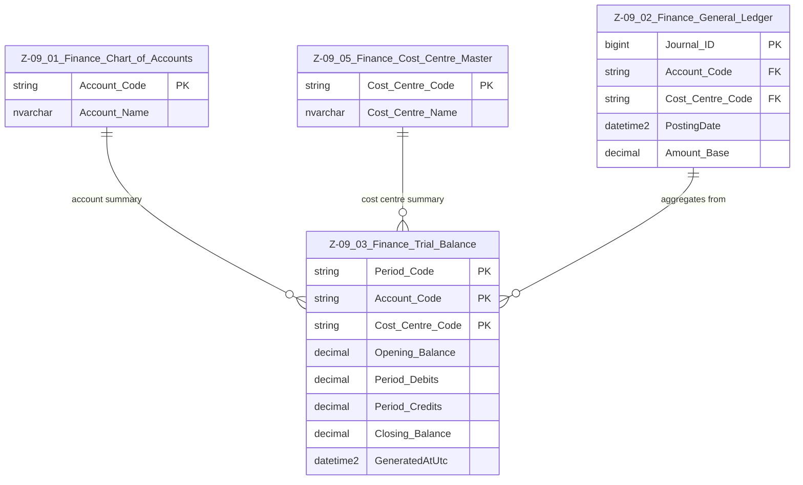

# Data Entity Specification: Z-09.03 Finance Trial Balance

| **Document ID** | **Version** | **Status** | **Owner (Author)** | **Approved By** | **Approved On** |
| :--- | :--- | :--- | :--- | :--- | :--- |
| **Z-09.03** | 1.0.0 | **DRAFT** | Business Architect | Product Officer | |

## 1. Description & Scope

The **Trial Balance (TB)** is the period-level financial summary produced from the General Ledger (Z-09.02).  
It aggregates all journal entries **for a specific accounting period**, grouped by account and cost centre.

This document follows the **one-tier relationship rule**.

## 2. ERD — One-Tier View

## 3. Structure

| Feature | Column | Type | Purpose |
| :--- | :--- | :--- | :--- |
| Period | Period_Code | NVARCHAR(20) | Accounting period identifier (e.g. 2024M01). |
| Account | Account_Code | NVARCHAR(50) | Maps to Z-09.01. |
| Cost Centre | Cost_Centre_Code | NVARCHAR(50) | Maps to Z-09.05. |
| Opening Balance | Opening_Balance | DECIMAL | Balance at period start. |
| Debits | Period_Debits | DECIMAL | Total debit postings. |
| Credits | Period_Credits | DECIMAL | Total credit postings. |
| Closing Balance | Closing_Balance | DECIMAL | Opening + Debits – Credits. |
| Generated Timestamp | GeneratedAtUtc | DATETIME2 | When TB snapshot was computed. |

## 4. Data Management

| Object Type | Name | Description |
| :--- | :--- | :--- |
| Stored Procedure | usp_Finance_GenerateTrialBalance | Builds TB for a given accounting period. |
| Stored Procedure | usp_Finance_ClosePeriod | Locks GL & TB for that period. |
| View | vw_Finance_TB_Expanded | Joins TB with CoA & cost centres. |
| View | vw_Finance_TB_FinancialStatements | Provides structured TB output for financial statements. |
