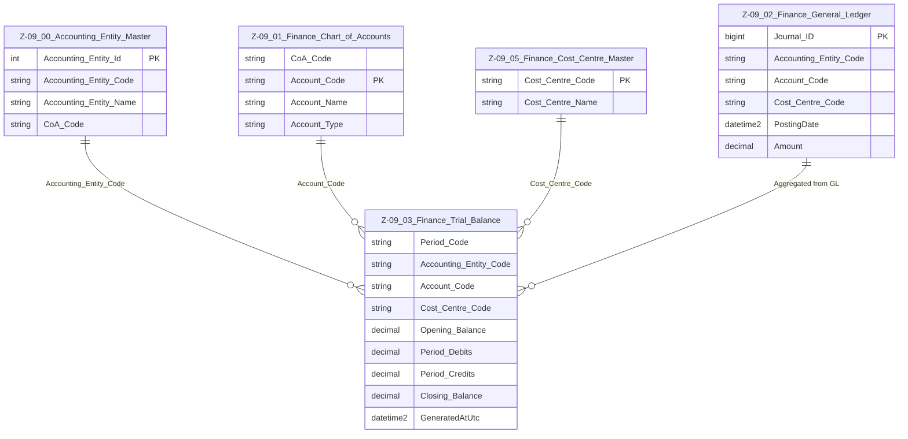

# Data Entity Specification: Z-09.03 Finance_Trial_Balance

| **Document ID** | **Version** | **Status** | **Owner (Author)** | **Approved By** | **Approved On** |
| :--- | :--- | :--- | :--- | :--- | :--- |
| **Z-09.03** | 1.1.0 | **DRAFT** | Business Architect | Product Officer | |

---

## 1. Description & Scope

The **Finance Trial Balance (TB)** is the **period-level financial summary** derived from the **Z-09.02 Finance_General_Ledger**.

For each **Accounting Entity**, **account**, and (optionally) **cost centre**, it aggregates:

- Opening balance at the start of the period  
- Period debits and credits  
- Closing balance at the end of the period  

This specification aligns the Trial Balance with:

- **Z-09.00 Accounting_Entity_Master** (`Accounting_Entity_Code`)  
- **Z-09.01 Finance_Chart_of_Accounts** (`Account_Code`, `CoA_Code`)  
- **Z-09.05 Finance_Cost_Centre_Master** (`Cost_Centre_Code`)  
- GL-based calculation rules in Z-09.02

The Trial Balance is a **derived, rebuildable structure**, not a primary entry ledger.

---

## 2. Referential Integrity Standard

> **Referential Integrity Standard**  
> Relationships involving Finance_Trial_Balance are **logical only** — application and reporting layers enforce correctness.  
> No physical FOREIGN KEY constraints are created at database level.

The physical implementation of this entity is typically:

- **Table**: `[Finance].[Z_09_03_Finance_Trial_Balance]`

Logical relationships (no physical FKs) exist to:

- `[Finance].[Z_09_00_Accounting_Entity_Master]`  
- `[Finance].[Z_09_01_Finance_Chart_of_Accounts]`  
- `[Finance].[Z_09_05_Finance_Cost_Centre_Master]`  
- `[Finance].[Z_09_02_Finance_General_Ledger]` (as its source)

---

## 3. ERD — One-Tier View

---

## 4. Structure

### 4.1 Column Definitions

| Feature | Column | Type | Purpose |
| :--- | :--- | :--- | :--- |
| **Period Identifier** | `Period_Code` | NVARCHAR(20) | Accounting period (e.g. `2024-01`, `2024Q1`, `FY2024`). |
| **Accounting Entity** | `Accounting_Entity_Code` | NVARCHAR(50) | Logical pointer to Z-09.00; identifies whose TB this row belongs to. |
| **Account** | `Account_Code` | NVARCHAR(50) | Logical pointer to Z-09.01; must be a posting account. |
| **Cost Centre** | `Cost_Centre_Code` | NVARCHAR(50) | Optional pointer to Z-09.05; may be NULL for pure account-level TB. |
| **Opening Balance** | `Opening_Balance` | DECIMAL | Balance brought forward at start of the period. |
| **Period Debits** | `Period_Debits` | DECIMAL | Sum of debit-side activity in the period. |
| **Period Credits** | `Period_Credits` | DECIMAL | Sum of credit-side activity in the period. |
| **Closing Balance** | `Closing_Balance` | DECIMAL | Balance carried forward: typically `Opening_Balance + Period_Debits – Period_Credits`. |
| **Generated Timestamp** | `GeneratedAtUtc` | DATETIME2(3) | When this TB snapshot was computed. |

> **Implementation Note**  
> The physical primary key is typically `(Period_Code, Accounting_Entity_Code, Account_Code, Cost_Centre_Code)` to ensure uniqueness of TB rows, but this can also be enforced in the application layer only, consistent with your logical-FK standard.

---

## 5. Behaviour & Business Rules

- The Trial Balance is **derived from Z-09.02 Finance_General_Ledger** and may be **rebuilt at any time** for a given period and entity, subject to period-close rules.  
- `Opening_Balance` is usually the **prior period** `Closing_Balance` (for the same entity, account, and cost centre).  
- `Period_Debits` and `Period_Credits` are aggregated from GL postings in the period based on accounting sign conventions.  
- `Closing_Balance` is computed, not directly entered; any manual adjustment must occur via new GL postings and a TB recompute.  
- Once a period is **closed**, TB rows should be treated as **locked** snapshots, and recomputation must follow formal reopening or adjustment workflows.  
- TB values may be maintained in base currency or in entity currency depending on design, but the rules should be consistent with Z-09.02.

---

## 6. Data Management

| Object Type | Name | Description |
|-------------|------|-------------|
| **Stored Procedure** | **usp_Z_09_03_TrialBalance_Build** | Builds or rebuilds the Trial Balance for a given `Period_Code` and `Accounting_Entity_Code` by aggregating Z-09.02 Finance_General_Ledger. |
| **Stored Procedure** | **usp_Z_09_03_TrialBalance_ClosePeriod** | Marks a period's Trial Balance as closed for an Accounting Entity and coordinates with GL period-close logic. |
| **Stored Procedure** | **usp_Z_09_03_TrialBalance_Get** | Retrieves Trial Balance rows for a given period, entity, and optional account/cost-centre filters. |
| **View** | **vw_Z_09_03_TrialBalance_With_CoA** | Joins TB with Z-09.01 Chart of Accounts to expose account names, types, and reporting lines. |
| **View** | **vw_Z_09_03_TrialBalance_For_FinancialStatements** | Presents TB data in the format required for income statement, balance sheet, and other financial reports. |
| **Governance Process** | **Trial Balance Generation & Close Workflow** | Controls when TB is generated, reviewed, approved, and locked; coordinates with GL and period-close processes. |
| **DQ Process** | **DQ_Finance_TrialBalance_ValidationReport** | Checks for imbalance (total debits vs credits), missing TB rows for active posting accounts, and inconsistencies between GL totals and TB aggregates. |

---

## 7. Architectural Role

Z-09.03 **Finance_Trial_Balance** is the **bridge** between detailed GL postings (Z-09.02) and higher-level reporting and statements.  

It provides:

- A **per-period snapshot** for each Accounting Entity, account, and cost centre  
- A stable base for Trial Balance checks, financial statements, and audit queries  
- A shared source for downstream domains (including ESG and analytics) that need **period-level, summarised financial data** rather than raw postings.

---