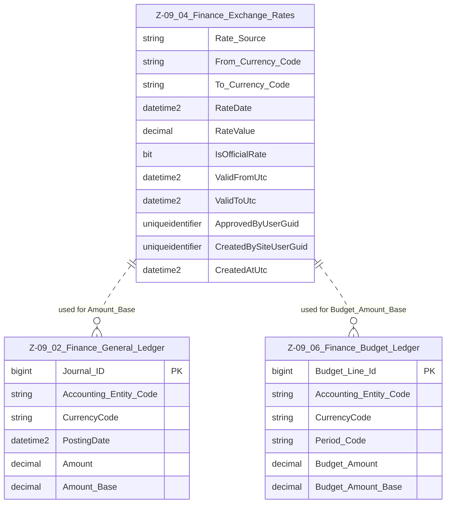

# Data Entity Specification: Z-09.04 Finance_Exchange_Rates

| **Document ID** | **Version** | **Status** | **Owner (Author)** | **Approved By** | **Approved On** |
| :--- | :--- | :--- | :--- | :--- | :--- |
| **Z-09.04** | 1.1.0 | **DRAFT** | Business Architect | Product Officer | |

---

## 1. Description & Scope

The **Finance Exchange Rates** entity provides the **authoritative FX conversion values** used by the Finance ledgers.  

It supports:

- Conversion of transaction amounts to **base currency** in **Z-09.02 Finance_General_Ledger**  
- Conversion of budget amounts to base currency in **Z-09.06 Finance_Budget_Ledger**  
- Revaluation and FX reporting across the platform  

Exchange rates are maintained at an agreed **granularity** (e.g. daily, monthly, or period-based) and are normally sourced from a **trusted market feed** or central treasury function.

This document follows the **one-tier relationship rule** and only shows entities that directly consume FX data.

---

## 2. Referential Integrity Standard

> **Referential Integrity Standard**  
> Relationships involving Finance_Exchange_Rates are **logical only** — application and reporting layers enforce correctness.  
> No physical FOREIGN KEY constraints are created at database level.

Physical implementation:

- **Table**: `[Finance].[Z_09_04_Finance_Exchange_Rates]`

Logical relationships (no physical FKs) exist to:

- `[Finance].[Z_09_02_Finance_General_Ledger]` (for `Amount_Base`)  
- `[Finance].[Z_09_06_Finance_Budget_Ledger]` (for base-currency budgets/forecasts)

---

## 3. ERD — One-Tier View

---

## 4. Structure

### 4.1 Column Definitions

| Column | Type | Nullability | Notes |
|--------|------|-------------|-------|
| `Rate_Source` | NVARCHAR(50) | NOT NULL | Identifier for the FX provider (e.g. ECB, internal treasury). |
| `From_Currency_Code` | CHAR(3) | NOT NULL | ISO 4217 currency code being converted **from**. |
| `To_Currency_Code` | CHAR(3) | NOT NULL | ISO 4217 currency code being converted **to** (usually group/entity base). |
| `RateDate` | DATE or DATETIME2 | NOT NULL | Effective date of the rate (pricing date). |
| `RateValue` | DECIMAL(18,10) | NOT NULL | Conversion factor such that: Base = Source × RateValue (or vice versa, defined by standard). |
| `IsOfficialRate` | BIT | NOT NULL DEFAULT 0 | Indicates whether this is the official rate for regulatory/statutory use. |
| `ValidFromUtc` | DATETIME2(3) | NOT NULL | When the rate becomes valid in the system. |
| `ValidToUtc` | DATETIME2(3) | NULL | When the rate ceases to be valid (nullable for open-ended). |
| `ApprovedByUserGuid` | UNIQUEIDENTIFIER | NULL | User who approved the rate for use. |
| `CreatedBySiteUserGuid` | UNIQUEIDENTIFIER | NOT NULL | User or service that loaded/created the rate row. |
| `CreatedAtUtc` | DATETIME2(3) | NOT NULL | Creation timestamp in UTC. |

> **Implementation Note**  
> The effective key is typically `(Rate_Source, From_Currency_Code, To_Currency_Code, RateDate)` with governance rules ensuring only one **official** rate per date/currency pair.

---

## 5. Behaviour & Business Rules

- FX rates are **append-only**; corrections are handled by new rows with updated validity and approvals.  
- GL (Z-09.02) and Budget (Z-09.06) use `CurrencyCode` and a relevant date (`PostingDate` or `Period_Code`) to select the correct rate.  
- Only rows marked `IsOfficialRate = 1` should be used for statutory and financial statements.  
- Non-official or indicative rates may be stored for analytics, what-if modelling, or alternative scenarios.  
- When `ValidToUtc` is NULL, the rate is considered valid until superseded or explicitly closed.  

---

## 6. Data Management

| Object Type | Name | Description |
|-------------|------|-------------|
| **Stored Procedure** | **usp_Z_09_04_FXRate_Load** | Loads FX rates (bulk or single) from upstream/source systems, applying validation, de-duplication, and audit fields. |
| **Stored Procedure** | **usp_Z_09_04_FXRate_Approve** | Marks a given rate as approved/official and, if required, retires or supersedes prior rates for the same pair/date. |
| **Stored Procedure** | **usp_Z_09_04_FXRate_GetEffectiveRate** | Returns the appropriate FX rate for a given currency pair and date (or period), used by GL and Budget processes. |
| **View** | **vw_Z_09_04_FXRate_Official_Current** | Exposes the currently valid official rates for each currency pair. |
| **View** | **vw_Z_09_04_FXRate_History** | Provides full rate history for audit, analytics, and reconciliation. |
| **Governance Process** | **FX Rate Stewardship Workflow** | Governs sourcing, validation, review, and approval of FX rates. |
| **DQ Process** | **DQ_Finance_FXRate_ValidationReport** | Identifies missing dates, overlapping validity windows, or inconsistent rate patterns for a given currency pair. |

---

## 7. Architectural Role

Z-09.04 **Finance_Exchange_Rates** is the **single source of FX truth** for Finance.  

It supports:

- Consistent calculation of **`Amount_Base`** in Z-09.02 GL  
- Base currency conversion of budgets and forecasts in Z-09.06  
- Transparent FX assumptions for audit, planning, and analytics  

---