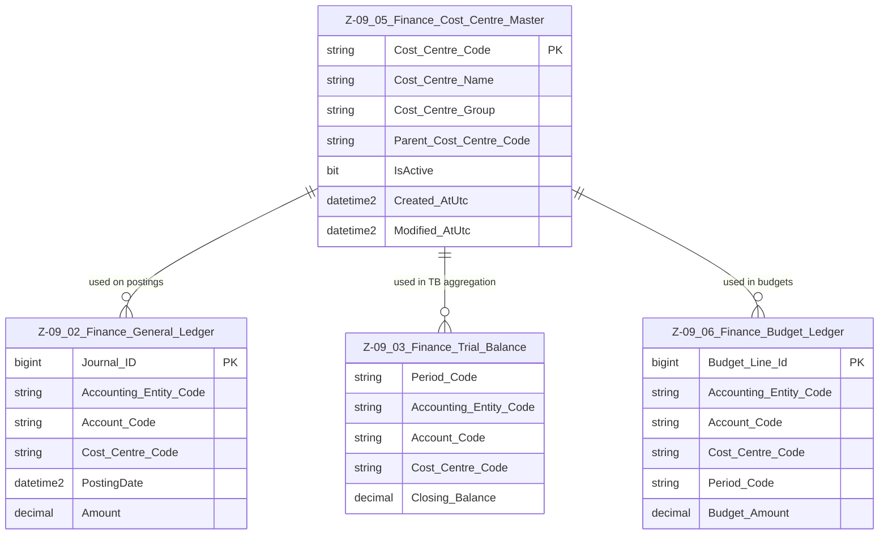

# Data Entity Specification: Z-09.05 Finance_Cost_Centre_Master

| **Document ID** | **Version** | **Status** | **Owner (Author)** | **Approved By** | **Approved On** |
| :--- | :--- | :--- | :--- | :--- | :--- |
| **Z-09.05** | 1.1.0 | **DRAFT** | Business Architect | Product Officer | |

---

## 1. Description & Scope

The **Finance Cost Centre Master** defines the organisational units used for **responsibility accounting**, such as departments, teams, and functional units.

Z-09.05 provides the authoritative list of valid cost centres used by:

- **Z-09.02 Finance_General_Ledger** — for posting and allocation  
- **Z-09.03 Finance_Trial_Balance** — for period-end summaries  
- **Z-09.06 Finance_Budget_Ledger** — for planning and forecasting  

Each cost centre can be associated (logically) with an **Accounting Entity** (Z-09.00), but that mapping may be managed in a separate relationship or reporting layer to keep the core master clean.

This document adheres to the **one-tier relationship rule**: only entities that link directly to the Cost Centre Master appear in the ERD.

---

## 2. Referential Integrity Standard

> **Referential Integrity Standard**  
> Relationships involving Finance_Cost_Centre_Master are **logical only** — application and reporting layers enforce correctness.  
> No physical FOREIGN KEY constraints are created at database level.

Physical implementation:

- **Table**: `[Finance].[Z_09_05_Finance_Cost_Centre_Master]`

Logical relationships (no physical FKs) exist to:

- `[Finance].[Z_09_02_Finance_General_Ledger]`  
- `[Finance].[Z_09_03_Finance_Trial_Balance]`  
- `[Finance].[Z_09_06_Finance_Budget_Ledger]`

---

## 3. ERD — One-Tier View

---

## 4. Structure

### 4.1 Column Definitions

| Column | Type | Nullability | Notes |
|--------|------|-------------|-------|
| `Cost_Centre_Code` | NVARCHAR(50) | NOT NULL | Primary business key for the cost centre. |
| `Cost_Centre_Name` | NVARCHAR(200) | NOT NULL | Human-readable label. |
| `Cost_Centre_Group` | NVARCHAR(100) | NULL | Optional grouping (e.g. region, function). |
| `Parent_Cost_Centre_Code` | NVARCHAR(50) | NULL | Logical parent for hierarchy/roll-ups. |
| `IsActive` | BIT | NOT NULL DEFAULT 1 | Lifecycle flag. Inactive centres should not receive new postings/budgets. |
| `Created_AtUtc` | DATETIME2(3) | NOT NULL | Creation timestamp. |
| `Modified_AtUtc` | DATETIME2(3) | NULL | Last modification timestamp. |

> **Implementation Note**  
> A separate mapping (e.g. `Cost_Centre_to_Accounting_Entity`) may be used to tie cost centres to Accounting Entities and/or Corporate Entities where required for governance and reporting.

---

## 5. Behaviour & Business Rules

- All postings in GL and Budget that carry a `Cost_Centre_Code` must reference **valid, active** cost centres.  
- Cost centre hierarchies are reconstructed via `Parent_Cost_Centre_Code` and may drive departmental reporting structures.  
- Inactivation of a cost centre (`IsActive = 0`) should follow governance rules and ensure that future-dated budgets or allocations are migrated or closed.  
- Historic data remains valid even if a cost centre becomes inactive, preserving auditability.  

---

## 6. Data Management

| Object Type | Name | Description |
|-------------|------|-------------|
| **Stored Procedure** | **usp_Z_09_05_CostCentre_Create** | Creates a new cost centre, validates uniqueness, applies hierarchy rules, and records audit fields. |
| **Stored Procedure** | **usp_Z_09_05_CostCentre_Update** | Updates cost centre name, grouping, hierarchy, and lifecycle flags. |
| **Stored Procedure** | **usp_Z_09_05_CostCentre_Deactivate** | Applies governance rules to deactivate a cost centre safely. |
| **Stored Procedure** | **usp_Z_09_05_CostCentre_Get** | Retrieves cost centre details by code for UI and integration layers. |
| **View** | **vw_Z_09_05_CostCentres_AllActive** | Returns all active cost centres for selection lists, reporting, and validation. |
| **View** | **vw_Z_09_05_CostCentres_Hierarchy** | Exposes the cost centre hierarchy for analytics and management reporting. |
| **Governance Process** | **Cost Centre Stewardship Workflow** | Governs creation, modification, and deactivation of cost centres. |
| **DQ Process** | **DQ_Finance_CostCentre_ValidationReport** | Identifies orphaned cost centres, inactive centres still used in GL or Budget, and hierarchy breaks. |

---

## 7. Architectural Role

Z-09.05 **Finance_Cost_Centre_Master** is the **canonical dictionary of responsibility centres**.

It enables:

- Departmental and functional breakdown of GL, TB, and Budget data  
- Consistent reporting structures across Finance and ESG domains  
- Clear accountability for spend, budgets, and variances at the organisational unit level  

---