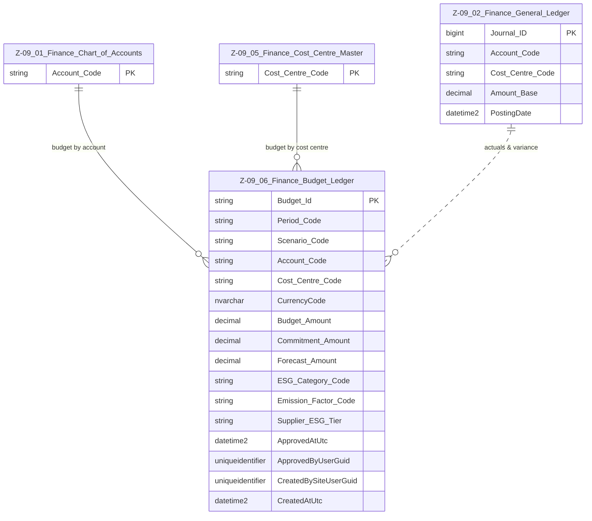

# Data Entity Specification: Z-09.06 Finance Budget Ledger (ESG‑Enhanced)

| **Document ID** | **Version** | **Status** | **Owner (Author)** | **Approved By** | **Approved On** |
| :--- | :--- | :--- | :--- | :--- | :--- |
| **Z-09.06** | 1.1.0 | **DRAFT — ESG Enhanced** | Business Architect | Product Officer | |

---

## 1. Description & Scope

The **Finance Budget Ledger** captures all approved, planned, and forecast expenditure across the organisation.  
It supports:

- Financial planning  
- Management reporting  
- Forecast variance analysis  
- Commitment tracking  
- ESG carbon/social/governance forecasting  

### ESG Enhancements (New in v1.1.0)

To support SME-scale ESG impact forecasting, three new optional fields have been added:

- **ESG_Category_Code** — maps the budget line to an ESG impact category  
- **Emission_Factor_Code** — selects the CO₂e factor used in forecasting  
- **Supplier_ESG_Tier** — assigns ESG quality tiers to budgeted supplier spend  

These fields allow Z‑09.08 (ESG Forecast Ledger) to project future ESG footprints.

---

## 2. ERD — One‑Tier View

---

## 3. Structure

### 3.1 Column‑Level Definitions

| Column | Type | Purpose |
|--------|------|---------|
| **Budget_Id** | NVARCHAR(50) | Unique identifier for this budget line. |
| **Period_Code** | NVARCHAR(20) | Budget period (e.g., 2025M03). |
| **Scenario_Code** | NVARCHAR(20) | ORIGINAL, REVISED, FORECAST, etc. |
| **Account_Code** | NVARCHAR(50) | GL account reference (Z‑09.01). |
| **Cost_Centre_Code** | NVARCHAR(50) | Cost centre reference (Z‑09.05). |
| **CurrencyCode** | NVARCHAR(10) | Budget currency. |
| **Budget_Amount** | DECIMAL | Approved/planned amount. |
| **Commitment_Amount** | DECIMAL | Future expected spend not yet in GL. |
| **Forecast_Amount** | DECIMAL | Updated expectation for total spend. |
| **ESG_Category_Code** | NVARCHAR(50) | ESG category (Energy, Travel, Waste, Social, etc.). |
| **Emission_Factor_Code** | NVARCHAR(50) | Defines CO₂e factor used in forecasting. |
| **Supplier_ESG_Tier** | NVARCHAR(20) | Optional ESG risk rating for suppliers (A/B/C). |
| **ApprovedAtUtc** | DATETIME2 | Timestamp when the scenario was approved. |
| **ApprovedByUserGuid** | UNIQUEIDENTIFIER | Approver’s identifier. |
| **CreatedBySiteUserGuid** | UNIQUEIDENTIFIER | Creator of the record. |
| **CreatedAtUtc** | DATETIME2 | Creation timestamp (UTC). |

---

## 4. Behaviour & SME‑Focused Analysis

The ESG‑enhanced Budget Ledger allows SMEs to derive:

- **Forecast carbon emissions**  
  `Forecast_CO2e = Budget_Amount × Emission_Factor`

- **Supplier ESG risk exposure**  
  Budget_Amount × Supplier_ESG_Tier weighting

- **Social and governance projections**  
  Derived through ESG category mapping

### Core financial calculations remain:

- **Actuals_To_Date** from GL  
- **Remaining_Budget = Budget – Actuals**  
- **Realistic_Remaining = Budget – Actuals – Commitments**  
- **Estimated_Outturn = Actuals + Forecast_Amount**

---

## 5. Data Management

| Object Type | Name | Description |
|-------------|------|-------------|
| **Stored Procedure** | `usp_Finance_LoadBudget` | Loads validated financial + ESG budget lines. |
| **Stored Procedure** | `usp_Finance_ApproveBudgetScenario` | Locks a budget scenario. |
| **Stored Procedure** | `usp_Finance_UpdateBudgetLine` | Performs controlled updates. |
| **Stored Procedure** | `usp_Finance_AddCommitmentsToBudget` | Imports PO/contract commitments automatically. |
| **View** | `vw_Finance_Budget_vs_Actuals` | Budget, actuals, remaining, and variance. |
| **View** | `vw_Finance_Budget_ESG_Mapping` | Combines budget lines with emission factors + ESG categories. |

---

## 6. Summary

Z‑09.06 now supports both:

### ✔ Traditional financial planning  
### ✔ ESG‑aware forecasting for SMEs  

This enhanced ledger feeds:

- **Z‑09.07 ESG Position Ledger** (actual ESG impact)  
- **Z‑09.08 ESG Forecast Ledger** (future ESG impact)

