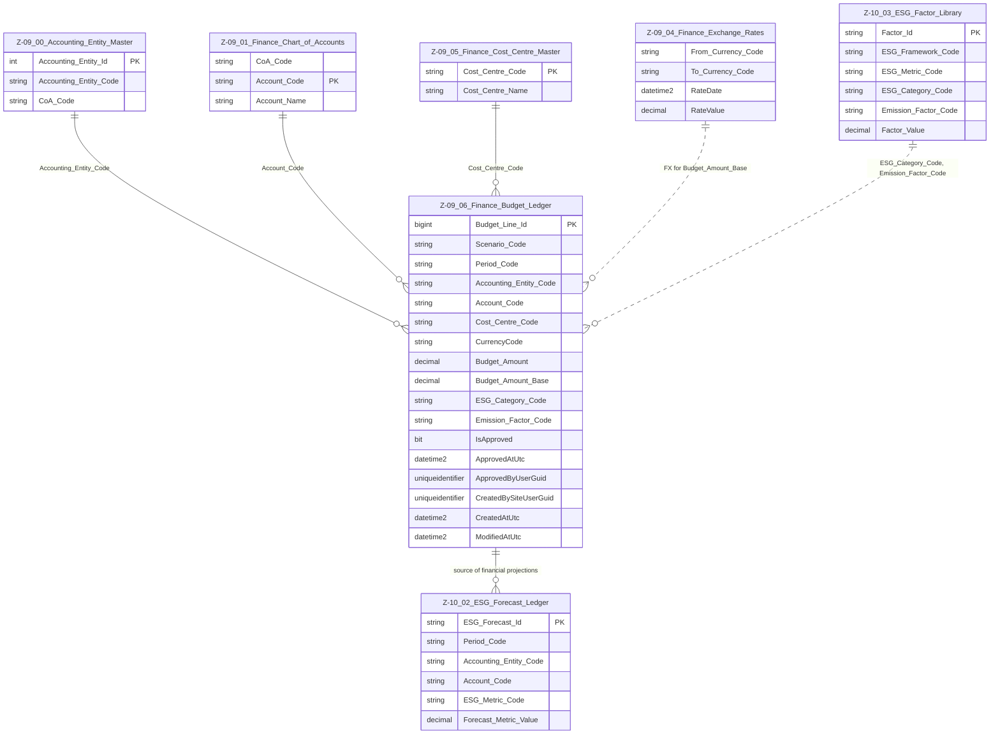

# Data Entity Specification: Z-09.06 Finance_Budget_Ledger (ESG-Enhanced)

| **Document ID** | **Version** | **Status** | **Owner (Author)** | **Approved By** | **Approved On** |
| :--- | :--- | :--- | :--- | :--- | :--- |
| **Z-09.06** | 1.3.0 | **DRAFT — ESG Integrated** | Business Architect | Product Officer | |

---

## 1. Description & Scope

The **Finance Budget Ledger** captures all **approved plans, budgets, and forecasts** across the organisation.

It is both:

- A **financial planning ledger** (by Accounting Entity, account, cost centre, period), and  
- An **ESG-enriched driver** for forward-looking ESG calculations via **Z-10.02 ESG_Forecast_Ledger** and **Z-10.03 ESG_Factor_Library**.

This entity is tightly integrated with:

- **Z-09.00 Accounting_Entity_Master** (`Accounting_Entity_Code`)  
- **Z-09.01 Finance_Chart_of_Accounts** (`Account_Code`, `CoA_Code`)  
- **Z-09.05 Finance_Cost_Centre_Master** (`Cost_Centre_Code`)  
- **Z-09.04 Finance_Exchange_Rates** (`Budget_Amount_Base` via FX)  
- **Z-10.03 ESG_Factor_Library** (`ESG_Category_Code`, `Emission_Factor_Code`)  
- **Z-10.02 ESG_Forecast_Ledger** (as the primary source of spend projections)

This document follows the **one-tier relationship rule**: only direct consumers and sources are shown in the ERD.

---

## 2. Referential Integrity Standard

> **Referential Integrity Standard**  
> Relationships involving Finance_Budget_Ledger are **logical only** — application and reporting layers enforce correctness.  
> No physical FOREIGN KEY constraints are created at database level.

Physical implementation:

- **Table**: `[Finance].[Z_09_06_Finance_Budget_Ledger]`

Logical relationships (no physical FKs) exist to:

- `[Finance].[Z_09_00_Accounting_Entity_Master]`  
- `[Finance].[Z_09_01_Finance_Chart_of_Accounts]`  
- `[Finance].[Z_09_05_Finance_Cost_Centre_Master]`  
- `[Finance].[Z_09_04_Finance_Exchange_Rates]`  
- `[ESG].[Z_10_03_ESG_Factor_Library]`  
- `[ESG].[Z_10_02_ESG_Forecast_Ledger]`

---

## 3. ERD — One-Tier View

---

## 4. Structure

### 4.1 Column Definitions

| Feature | Column | Type | Purpose |
| :--- | :--- | :--- | :--- |
| **Primary Key** | `Budget_Line_Id` | BIGINT | Unique identifier for each budget/forecast line. |
| **Scenario** | `Scenario_Code` | NVARCHAR(50) | Identifies the planning scenario (e.g. `BASE`, `STRESS`, `PLAN2026`). |
| **Period** | `Period_Code` | NVARCHAR(20) | Planning period (`2024-01`, `2024Q1`, `FY2024`, etc.). |
| **Accounting Entity** | `Accounting_Entity_Code` | NVARCHAR(50) | Logical pointer → Z-09.00 Accounting_Entity_Master. |
| **Account** | `Account_Code` | NVARCHAR(50) | Logical pointer → Z-09.01 Finance_Chart_of_Accounts (must be posting account). |
| **Cost Centre** | `Cost_Centre_Code` | NVARCHAR(50) | Optional pointer → Z-09.05 Finance_Cost_Centre_Master. |
| **Currency** | `CurrencyCode` | NVARCHAR(10) | The currency in which the budget amount is expressed (ISO 4217 recommended). |
| **Budget Amount** | `Budget_Amount` | DECIMAL | Planned value in the specified currency. |
| **Base Currency Amount** | `Budget_Amount_Base` | DECIMAL | Budget amount converted into base currency using Z-09.04 FX rates. |
| **ESG Category** | `ESG_Category_Code` | NVARCHAR(50) | Classifies the budget line into an ESG-relevant group (e.g. TRAVEL, ENERGY). |
| **Emission Factor Code** | `Emission_Factor_Code` | NVARCHAR(50) | Code used to look up the appropriate emission or ESG factor in Z-10.03. |
| **Approval Flag** | `IsApproved` | BIT | Indicates whether the line is part of an approved budget/forecast. |
| **Approval Timestamp** | `ApprovedAtUtc` | DATETIME2(3) | When the line (or scenario) was approved. |
| **Approval User** | `ApprovedByUserGuid` | UNIQUEIDENTIFIER | Who approved the line/scenario. |
| **Audit – Created By** | `CreatedBySiteUserGuid` | UNIQUEIDENTIFIER | User or service that created the row. |
| **Audit – Created At** | `CreatedAtUtc` | DATETIME2(3) | Creation timestamp. |
| **Audit – Modified At** | `ModifiedAtUtc` | DATETIME2(3) | Last modification timestamp. |

> **Implementation Note**  
> Uniqueness is typically enforced on the combination `(Scenario_Code, Period_Code, Accounting_Entity_Code, Account_Code, Cost_Centre_Code)` to prevent double-counting within a scenario.

---

## 5. Behaviour & Business Rules

- Budget lines drive both **financial planning** and **ESG forecasts**; therefore:
  - `Accounting_Entity_Code`, `Account_Code`, and `Period_Code` must be valid, aligned, and consistent.  
  - `ESG_Category_Code` and/or `Emission_Factor_Code` should be populated where ESG modelling is required.  
- `Budget_Amount_Base` is derived using Z-09.04 FX rates and should not be manually overridden except via governed processes.  
- Only lines with `IsApproved = 1` should flow into **official** ESG forecast runs and management reporting.  
- Scenario management (`Scenario_Code`) allows multiple what-if runs to coexist; governance defines which scenario is **official**.  
- Adjustments are typically logged as new or updated lines per scenario rather than overwriting history without audit.  

---

## 6. Data Management

| Object Type | Name | Description |
|-------------|------|-------------|
| **Stored Procedure** | **usp_Z_09_06_Budget_LoadScenario** | Loads or replaces a full planning scenario (set of budget lines) for one or more entities. Performs structure validation and FX conversion. |
| **Stored Procedure** | **usp_Z_09_06_Budget_UpdateLine** | Updates a specific budget line while maintaining audit and governance rules. |
| **Stored Procedure** | **usp_Z_09_06_Budget_ApproveScenario** | Marks a scenario as approved, sets `IsApproved` flags, and records approval metadata. |
| **Stored Procedure** | **usp_Z_09_06_Budget_GetByScenario** | Returns budget lines filtered by scenario, entity, account, cost centre, and period. |
| **View** | **vw_Z_09_06_Budget_With_CoA** | Joins Budget Ledger with CoA for account names and reporting structures. |
| **View** | **vw_Z_09_06_Budget_For_ESG** | Exposes the subset of budget lines with ESG attributes needed by Z-10.02 ESG_Forecast_Ledger. |
| **Governance Process** | **Budget Planning & Approval Workflow** | Governs scenario creation, review, approval, and locking for both finance and ESG use cases. |
| **DQ Process** | **DQ_Finance_Budget_ValidationReport** | Identifies lines with invalid or inactive entities/accounts/cost centres, missing ESG codes, or FX inconsistencies. |

---

## 7. Architectural Role

Z-09.06 **Finance_Budget_Ledger** is the **forward-looking counterpart** to Z-09.02 Finance_General_Ledger.

Together with Z-10.03 and Z-10.02 it enables:

- Scenario-based **financial planning** across entities, accounts, and cost centres  
- Conversion of planned spend into **ESG forecast metrics** under multiple frameworks  
- A consistent, auditable bridge between Finance planning and ESG reporting  

---