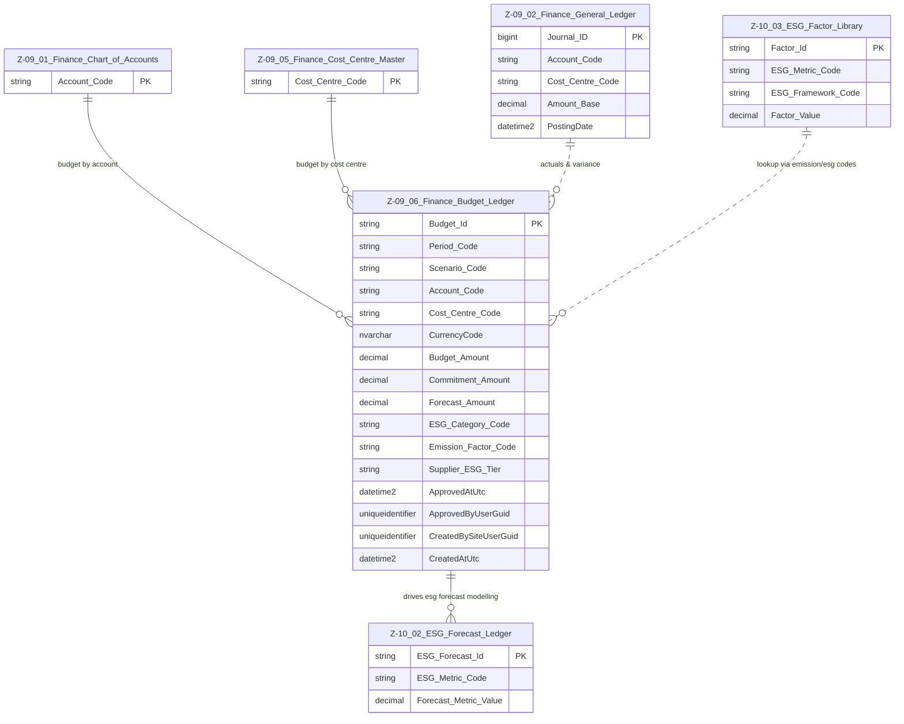

# Data Entity Specification: Z-09.06 Finance Budget Ledger (ESG‑Enhanced)

| **Document ID** | **Version** | **Status** | **Owner (Author)** | **Approved By** | **Approved On** |
| :--- | :--- | :--- | :--- | :--- | :--- |
| **Z-09.06** | 1.2.0 | **DRAFT — ESG Integrated** | Business Architect | Product Officer | |

---

## 1. Description & Scope

The **Finance Budget Ledger** captures all approved, planned, and forecast expenditure across the organisation.  
It supports:

- Financial planning  
- Management reporting  
- Forecast variance analysis  
- Commitment tracking  
- **Direct ESG integration via Z‑10 ESG Domain**  

### ESG Integration (New in v1.2.0)

This version formalises the bridge between **Finance (Z‑09)** and **ESG (Z‑10)**.

Budget lines may now reference ESG structures through:

- **ESG_Category_Code** → Maps spend to an ESG impact category (E/S/G grouping).  
- **Emission_Factor_Code** → Soft‑links to **Z‑10.03 ESG Factor Library** to select the correct CO₂e / social / governance factor.  
- **Supplier_ESG_Tier** → Introduces ESG risk/quality ratings used in Z‑10 forecasting logic.

**Z‑09.06 is now the financial driver of Z‑10.02 (ESG Forecast Ledger).**

---

## 2. ERD — One‑Tier View



### Notes on ESG Bridge

- The connection to **Z‑10.03** is a *code‑based soft link*, not a physical FK.  
- The **Budget Ledger** is now the *financial source* for ESG forecasting.  
- Z‑10.02 consumes Budget Lines + Factor Library rows to produce ESG forecasts.

---

## 3. Structure

### 3.1 Column‑Level Definitions

| Column | Type | Purpose |
|--------|------|---------|
| **Budget_Id** | NVARCHAR(50) | Unique identifier for this budget line. |
| **Period_Code** | NVARCHAR(20) | Budget period (e.g., 2025M03). |
| **Scenario_Code** | NVARCHAR(20) | ORIGINAL, REVISED, FORECAST, etc. |
| **Account_Code** | NVARCHAR(50) | GL account reference (Z‑09.01). |
| **Cost_Centre_Code** | NVARCHAR(50) | Cost centre reference (Z‑09.05). |
| **CurrencyCode** | NVARCHAR(10) | Budget currency. |
| **Budget_Amount** | DECIMAL | Approved/planned amount. |
| **Commitment_Amount** | DECIMAL | Future expected spend not yet in GL. |
| **Forecast_Amount** | DECIMAL | Updated expectation for total spend. |
| **ESG_Category_Code** | NVARCHAR(50) | ESG domain category (Energy, Travel, Waste, Social, Governance). |
| **Emission_Factor_Code** | NVARCHAR(50) | Points to Z‑10.03 factor rows used to derive ESG forecast metrics. |
| **Supplier_ESG_Tier** | NVARCHAR(20) | Optional ESG risk rating (Tier A/B/C). |
| **ApprovedAtUtc** | DATETIME2 | Timestamp when the scenario was approved. |
| **ApprovedByUserGuid** | UNIQUEIDENTIFIER | Approver’s identifier. |
| **CreatedBySiteUserGuid** | UNIQUEIDENTIFIER | Creator of the record. |
| **CreatedAtUtc** | DATETIME2 | Creation timestamp (UTC). |

---

## 4. Behaviour & ESG Integration

### 4.1 SME‑Focused ESG Forecasting  
Z‑10.02 Forecast Ledger uses:

- `Budget_Amount`
- `Commitment_Amount`
- `Forecast_Amount`
- `ESG_Category_Code`
- `Emission_Factor_Code`
- `Supplier_ESG_Tier`

to compute:

```
Forecast_CO2e     = Forecast_Amount × Emission_Factor
Social_Impact     = Forecast_Amount × Social_Factor
Governance_Score  = Forecast_Amount × Gov_Weighting
```

### 4.2 Core Financial Calculations Remain

- **Actuals_To_Date** from GL  
- **Remaining_Budget = Budget – Actuals**  
- **Realistic_Remaining = Budget – Actuals – Commitments**  
- **Estimated_Outturn = Actuals + Forecast_Amount**

---

## 5. Data Management

| Object Type | Name | Description |
|-------------|------|-------------|
| **Stored Procedure** | `usp_Finance_LoadBudget` | Loads validated financial + ESG budget lines. |
| **Stored Procedure** | `usp_Finance_ApproveBudgetScenario` | Locks a budget scenario. |
| **Stored Procedure** | `usp_Finance_UpdateBudgetLine` | Performs controlled updates. |
| **Stored Procedure** | `usp_Finance_AddCommitmentsToBudget` | Imports PO/contract commitments automatically. |
| **View** | `vw_Finance_Budget_vs_Actuals` | Budget, actuals, remaining, and variance. |
| **View** | `vw_Finance_Budget_ESG_Mapping` | Joins budget lines to ESG factors via Z‑10.03. |

---

## 6. Summary

Z‑09.06 now supports both:

### ✔ Traditional financial planning  
### ✔ Full ESG‑aware forecasting (via Z‑10 domain)

It is now the **financial engine** that powers:

- **Z‑10.01 ESG Position** (indirectly through GL actuals)  
- **Z‑10.02 ESG Forecast**  
- ESG factor resolution via **Z‑10.03**  

This makes Z‑09.06 the **bridge between Finance and ESG** for the entire platform.

