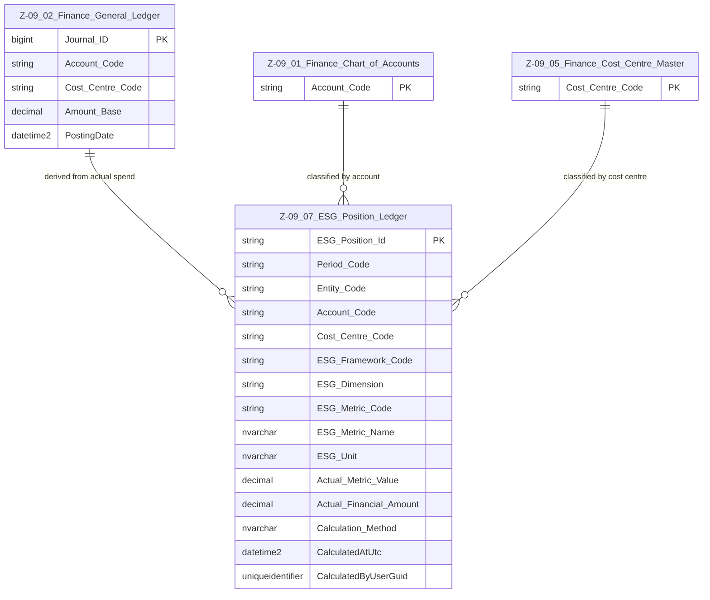

# Data Entity Specification: Z-09.07 ESG Position Ledger

| **Document ID** | **Version** | **Status** | **Owner (Author)** | **Approved By** | **Approved On** |
| :--- | :--- | :--- | :--- | :--- | :--- |
| **Z-09.07** | 1.0.0 | **DRAFT** | Business Architect | Product Officer | |

---

## 1. Description & Scope

The **ESG Position Ledger** converts **actual financial activity** (from the General Ledger) into a structured, comparable view of **actual ESG impact**.

Z-09.07 is designed to support:

- A **simple SME-friendly ESG model** (e.g. CO₂e, Social score, Governance score), **and**
- **Regulatory / framework-specific models** such as:
  - GHG Protocol (Scopes & Categories)
  - CSRD / ESRS (E1–E5, S1–S4, G1–G2)
  - Any future internal or external ESG framework

It does this by using a **framework-agnostic metric structure**:

- `ESG_Framework_Code` (which framework is being used)
- `ESG_Dimension` (E / S / G)
- `ESG_Metric_Code` (e.g. CO2E, E1, S1, INTERNAL_SCORE)
- `ESG_Unit` (e.g. kgCO2e, score_0_100, %revenue)
- `Actual_Metric_Value` (the numeric impact value)

This allows **multiple frameworks to coexist in parallel** in the same ledger, with each metric expressed as a separate row.

---

## 2. ERD — One-Tier View

---

## 3. Structure

### 3.1 Column-Level Definitions

| Column | Type | Purpose |
|--------|------|---------|
| **ESG_Position_Id** | NVARCHAR(50) | Unique identifier for the ESG metric record (one row per metric, period, and structural combination). |
| **Period_Code** | NVARCHAR(20) | Accounting or reporting period (e.g. `2025M03`, `2025Y01`). |
| **Entity_Code** | NVARCHAR(50) | Optional code representing legal entity, business unit, or SME location. |
| **Account_Code** | NVARCHAR(50) | GL account from which the ESG metric is derived (Z-09.01). |
| **Cost_Centre_Code** | NVARCHAR(50) | Cost centre, enabling departmental / project ESG views (Z-09.05). |
| **ESG_Framework_Code** | NVARCHAR(50) | Identifies the framework or model used (e.g. `SME_SIMPLE`, `GHG_SCOPE3`, `CSRD_ESRS`). |
| **ESG_Dimension** | NVARCHAR(10) | High-level dimension: `E` (Environmental), `S` (Social), `G` (Governance). |
| **ESG_Metric_Code** | NVARCHAR(50) | Code for the metric: e.g. `CO2E_TOTAL`, `E1`, `S1`, `G1`, `SOCIAL_SCORE`, `GOV_SCORE`. |
| **ESG_Metric_Name** | NVARCHAR(200) | Human-readable description of the metric. |
| **ESG_Unit** | NVARCHAR(50) | Unit of measure (e.g. `kgCO2e`, `tCO2e`, `score_0_100`, `%revenue`). |
| **Actual_Metric_Value** | DECIMAL | Calculated ESG impact value for the metric (e.g. tonnes CO₂e, score value). |
| **Actual_Financial_Amount** | DECIMAL | Underlying financial value (from GL) that contributed to this ESG metric. |
| **Calculation_Method** | NVARCHAR(200) | Short code or description of how the metric was calculated (e.g. `SPEND_X_FACTOR`, `SUPPLIER_RATING`, `HEADCOUNT_X_FACTOR`). |
| **CalculatedAtUtc** | DATETIME2 | Timestamp when the metric was last calculated or refreshed. |
| **CalculatedByUserGuid** | UNIQUEIDENTIFIER | ID of the user/service responsible for the calculation. |

---

## 4. Behaviour & Framework Support

### 4.1 Multiple Frameworks, One Ledger

Because each record includes `ESG_Framework_Code` and `ESG_Metric_Code`, Z-09.07 can store:

- **SME Simple Model**  
  - `ESG_Framework_Code = 'SME_SIMPLE'`  
  - Metrics:
    - `CO2E_TOTAL` (tonnes CO₂e)
    - `SOCIAL_SCORE` (0–100)
    - `GOVERNANCE_SCORE` (0–100)

- **GHG Protocol Model**  
  - `ESG_Framework_Code = 'GHG_SCOPE3'`  
  - Metrics:
    - `SCOPE1_CO2E`
    - `SCOPE2_CO2E`
    - `SCOPE3_CAT01_CO2E` (Purchased Goods & Services)  
    - etc.

- **CSRD / ESRS Model**  
  - `ESG_Framework_Code = 'CSRD_ESRS'`  
  - Metrics:
    - `E1_GHG_EMISSIONS`
    - `E2_ENERGY`
    - `S1_OWN_WORKFORCE`
    - `G1_BUSINESS_CONDUCT`  
    - etc.

Each framework can be reported separately or combined, without changing the schema.

---

### 4.2 Relationship to the General Ledger

For each metric row:

- `Actual_Financial_Amount` is derived by aggregating GL postings (Z-09.02) for the:
  - Period
  - Account(s)
  - Cost centre(s)
  - Entity (if used)

- `Actual_Metric_Value` is then calculated by applying ESG factors, such as:
  - Emission factors (kgCO₂e per currency unit, kWh, km, etc.)
  - Social impact factors (e.g. jobs supported, training hours)
  - Governance metrics (e.g. % of suppliers with due diligence completed)

---

## 5. SME-Focused Use Cases

Using Z-09.07, an SME can:

- See **current carbon footprint** by:
  - Account (e.g. Electricity, Travel)
  - Cost Centre (e.g. Operations, Sales)
  - Entity / Site

- Track **social metrics**, such as:
  - Training hours
  - Community spend
  - Staff well-being scores

- Track **governance metrics**, such as:
  - % spend with vetted suppliers
  - % policies implemented

- Run **different ESG reports** without changing the ledger:
  - Internal simple metrics for management
  - External frameworks (GHG / CSRD / bank / investor templates)

---

## 6. Data Management

| Object Type | Name | Description |
|-------------|------|-------------|
| **Stored Procedure** | `usp_ESG_BuildPosition_FromGL` | Aggregates GL postings and applies ESG factors to populate Z-09.07. |
| **Stored Procedure** | `usp_ESG_RecalculatePosition_ForFramework` | Recomputes metrics for a specific `ESG_Framework_Code` (e.g. after factor updates). |
| **Stored Procedure** | `usp_ESG_ClearAndRebuildPeriod` | Clears and rebuilds ESG metrics for a given period/entity. |
| **View** | `vw_ESG_Position_SimpleModel` | Projects Z-09.07 into the SME-simple model (CO₂e, Social, Governance). |
| **View** | `vw_ESG_Position_GHG` | Presents Z-09.07 metrics according to GHG protocol categories. |
| **View** | `vw_ESG_Position_CSRD` | Presents Z-09.07 metrics according to CSRD / ESRS structures. |

---

## 7. Summary

Z-09.07 **does not hard-code any single ESG model**.  
Instead, it:

- Stores ESG metrics as **framework-aware, dimensioned rows**
- Links them directly to **actual financial activity**
- Allows SMEs and larger organisations to:
  - Start simple
  - Grow into more complex ESG frameworks
  - Reuse the same ledger for multiple reporting obligations

This entity is the **core source of truth for actual ESG impact**, feeding:

- Management dashboards  
- Regulatory ESG reports  
- Bank / investor ESG questionnaires  
- Z-09.08 ESG Forecast Ledger (for comparison of **actual vs forecast** ESG impact)

