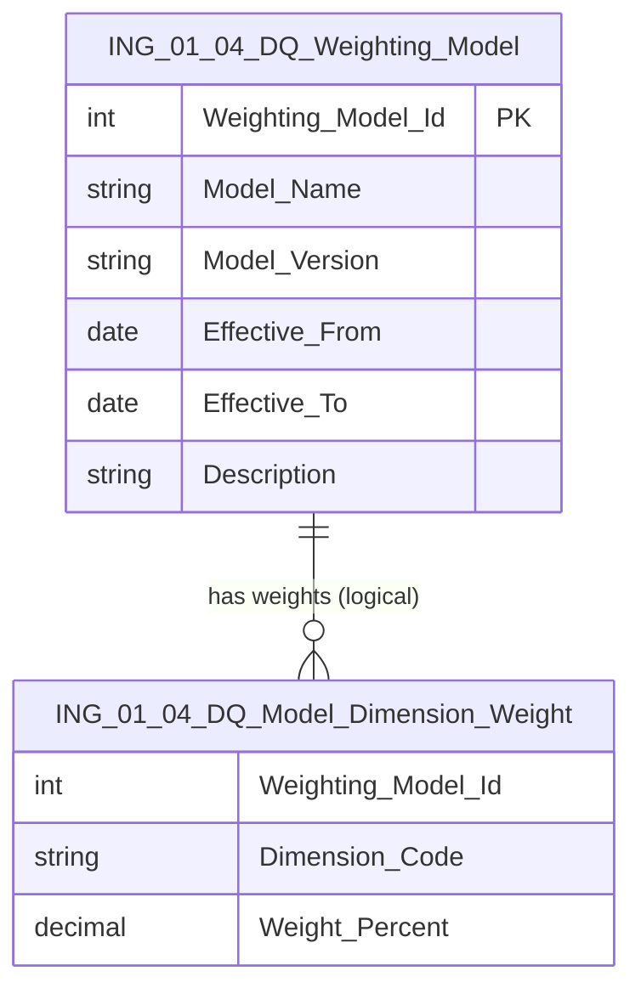

# Data Entity Specification: ING-01.04.01 DQ_Weighting_Model

| **Document ID** | **Version** | **Status** | **Owner (Author)** |
| :--- | :--- | :--- | :--- |
| **ING-01.04.01** | 1.0.0 | **DRAFT** | Business Architect |

---

## 1. Description & Scope

The **ING-01.04.01 DQ_Weighting_Model** entity defines the **versioned weighting models** used to calculate the `DataQuality_Score` for `Normalised_Activity` records (ING-01).

Each weighting model specifies:

- Which **dimensions** contribute to the overall score (e.g. Completeness, SourceReliability, UnitAccuracy, MappingSuccess, AnomalyDetection)  
- The **weighting** applied to each dimension (as a percentage)  
- The **effective period** over which the model is valid  

This allows SUSTINA to:

- Change or tune scoring behaviour without modifying activity data  
- Support multiple models over time (e.g. v1.0, v1.1)  
- Provide ISO-9001 style auditability for data quality logic

---

## 2. Referential Integrity Standard

> All relationships are **logical only**.  
> No physical FOREIGN KEY constraints exist.

Logical references:
- `Weighting_Model_Id` → **ING-01.04.03 DQ_Model_Dimension_Weight**  
- `Weighting_Model_Id` → DQ usage in **ING-01.04 Data_Quality_Scoring** and `Activity_DQ` logic  

Physical table (suggested):
- **[ING].[ING_01_04_DQ_Weighting_Model]**

---

## 3. ERD (Context)

---

## 4. Table Definition

**Table:** `[ING].[ING_01_04_DQ_Weighting_Model]`

| Column | Type | Null | Notes |
|--------|------|------|-------|
| `Weighting_Model_Id` | INT IDENTITY | NOT NULL | Primary key for weighting model. |
| `Model_Name` | NVARCHAR(100) | NOT NULL | Human-readable name (e.g. 'Default Activity DQ Model'). |
| `Model_Version` | NVARCHAR(20) | NOT NULL | Semantic version (e.g. '1.0.0'). |
| `Effective_From` | DATE | NOT NULL | Date from which model is used. |
| `Effective_To` | DATE | NULL | Optional end date; NULL = still active. |
| `Description` | NVARCHAR(500) | NULL | Short description of intent or change rationale. |

---

## 5. Data Management

| Object Type | Name | Description |
|-------------|------|-------------|
| Stored Procedure | **usp_ING_01_04_DQWeightingModel_Create** | Creates a new weighting model with metadata and effective dates. |
| Stored Procedure | **usp_ING_01_04_DQWeightingModel_Close** | Sets `Effective_To` to retire a model. |
| Stored Procedure | **usp_ING_01_04_DQWeightingModel_GetActive** | Returns the active model for a given date. |
| View | **vw_ING_01_04_DQWeightingModel_Current** | Returns the single current model used for scoring. |
| Governance Process | **DQ_Weighting_Model_Approval_Workflow** | Approves introduction or retirement of models. |

---

## 6. Business Rules

- Exactly **one** weighting model should be active for a given date for the ESG production environment.  
- Changes to weighting logic (e.g. dimension weights) must be introduced via a **new model/version**, not by updating a model in place.  
- Historic `DataQuality_Score` values should always be reproducible using the model that was active at calculation time.  
- Test and sandbox environments may use different models, but they must be clearly labelled and not conflict with production models.

---

## 7. Change History

| Version | Date | Author | Notes |
|---------|------|--------|-------|
| 1.0.0 | 2025-12-10 | Business Architect | Initial definition of DQ weighting model entity for ING-01.04. |
