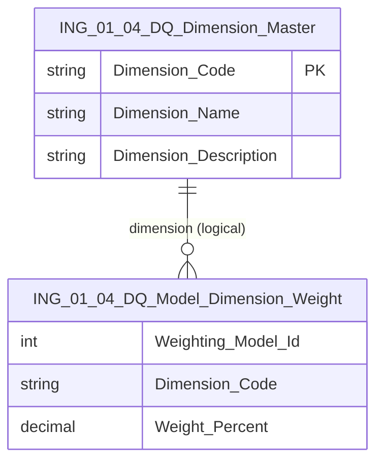

# Data Entity Specification: ING-01.04.02 DQ_Dimension_Master

| **Document ID** | **Version** | **Status** | **Owner (Author)** |
| :--- | :--- | :--- | :--- |
| **ING-01.04.02** | 1.0.0 | **DRAFT** | Business Architect |

---

## 1. Description & Scope

The **ING-01.04.02 DQ_Dimension_Master** entity defines the **set of data quality dimensions** that may contribute to the `DataQuality_Score`.

Examples of dimensions:

- `COMPLETENESS`  
- `SOURCE_RELIABILITY`  
- `UNIT_ACCURACY`  
- `MAPPING_SUCCESS`  
- `ANOMALY_DETECTION`  

This entity provides:

- A controlled vocabulary for dimensions  
- Descriptions for each dimension  
- A basis for reporting and model configuration in **ING-01.04.01 DQ_Weighting_Model** and **ING-01.04.03 DQ_Model_Dimension_Weight**.

---

## 2. Referential Integrity Standard

> All relationships are **logical only**.  
> No physical FOREIGN KEY constraints exist.

Logical references:
- `Dimension_Code` → **ING-01.04.03 DQ_Model_Dimension_Weight.Dimension_Code**  

Physical table (suggested):
- **[ING].[ING_01_04_DQ_Dimension_Master]**

---

## 3. ERD (Context)

---

## 4. Table Definition

**Table:** `[ING].[ING_01_04_DQ_Dimension_Master]`

| Column | Type | Null | Notes |
|--------|------|------|-------|
| `Dimension_Code` | NVARCHAR(50) | NOT NULL | Primary code (e.g. 'COMPLETENESS'). |
| `Dimension_Name` | NVARCHAR(100) | NOT NULL | Human-readable name. |
| `Dimension_Description` | NVARCHAR(500) | NULL | Detailed description of how the dimension is evaluated. |

---

## 5. Data Management

| Object Type | Name | Description |
|-------------|------|-------------|
| Stored Procedure | **usp_ING_01_04_DQDimension_Create** | Creates a new DQ dimension. |
| Stored Procedure | **usp_ING_01_04_DQDimension_Update** | Updates name or description. |
| Stored Procedure | **usp_ING_01_04_DQDimension_Delete** | Deactivates/removes a dimension (if allowed by governance). |
| View | **vw_ING_01_04_DQDimension_All** | Returns all dimensions for configuration UIs. |
| Governance Process | **DQ_Dimension_Definition_Workflow** | Governs the introduction or deprecation of DQ dimensions. |

---

## 6. Business Rules

- Dimension codes must be **stable identifiers**; renaming a dimension should be done by updating `Dimension_Name`, not changing `Dimension_Code`.  
- Removal of a dimension that is still in use by any `DQ_Weighting_Model` is not allowed without explicit governance decision.  
- Any new dimension must be accompanied by changes in **ING-01.04** to define how it is scored.

---

## 7. Change History

| Version | Date | Author | Notes |
|---------|------|--------|-------|
| 1.0.0 | 2025-12-10 | Business Architect | Initial definition of DQ dimension master entity. |
