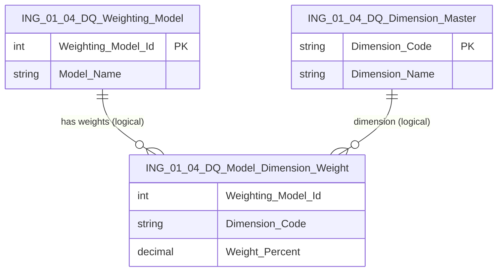

# Data Entity Specification: ING-01.04.03 DQ_Model_Dimension_Weight

| **Document ID** | **Version** | **Status** | **Owner (Author)** |
| :--- | :--- | :--- | :--- |
| **ING-01.04.03** | 1.0.0 | **DRAFT** | Business Architect |

---

## 1. Description & Scope

The **ING-01.04.03 DQ_Model_Dimension_Weight** entity defines the **weighting percentages** applied to each data quality dimension for a given weighting model.

Each row represents:

- One weighting model (`Weighting_Model_Id`)  
- One dimension (`Dimension_Code`)  
- The weight assigned to that dimension (`Weight_Percent`)  

These rows collectively implement the formula:

```text
DataQuality_Score =
    Σ( Dimension_Score * Weight_Percent )
```

where all `Weight_Percent` values for a model should sum to **100%**.

---

## 2. Referential Integrity Standard

> All relationships are **logical only**.  
> No physical FOREIGN KEY constraints exist.

Logical references:
- `Weighting_Model_Id` → **ING-01.04.01 DQ_Weighting_Model**  
- `Dimension_Code` → **ING-01.04.02 DQ_Dimension_Master**  

Physical table (suggested):
- **[ING].[ING_01_04_DQ_Model_Dimension_Weight]**

---

## 3. ERD (Context)



---

## 4. Table Definition

**Table:** `[ING].[ING_01_04_DQ_Model_Dimension_Weight]`

| Column | Type | Null | Notes |
|--------|------|------|-------|
| `Weighting_Model_Id` | INT | NOT NULL | Logical FK → DQ_Weighting_Model. |
| `Dimension_Code` | NVARCHAR(50) | NOT NULL | Logical FK → DQ_Dimension_Master. |
| `Weight_Percent` | DECIMAL(5,2) | NOT NULL | Percentage weight, typically summing to 100 per model. |

> Composite key recommendation: (`Weighting_Model_Id`, `Dimension_Code`).

---

## 5. Data Management

| Object Type | Name | Description |
|-------------|------|-------------|
| Stored Procedure | **usp_ING_01_04_DQModelDimensionWeight_Set** | Inserts or updates a weight for a given model & dimension. |
| Stored Procedure | **usp_ING_01_04_DQModelDimensionWeight_ClearModel** | Removes all weights for a model (e.g. before redefining). |
| View | **vw_ING_01_04_DQModelDimensionWeight_ByModel** | Returns all dimension weights for a given model. |
| DQ Process | **DQ_Weighting_Sum_Validation** | Verifies that all weights for a model sum to 100%. |

---

## 6. Business Rules

- For any `Weighting_Model_Id`, the sum of `Weight_Percent` across all dimensions **must be 100.00**.  
- A dimension may appear at most **once** per model.  
- Introducing a new dimension for a model should be accompanied by recalibration of existing weights.  
- Any changes to weights for a model already used in production should be treated as a **new model**, not an in-place update (see ING-01.04.01).

---

## 7. Change History

| Version | Date | Author | Notes |
|---------|------|--------|-------|
| 1.0.0 | 2025-12-10 | Business Architect | Initial definition of DQ model–dimension weighting entity. |
