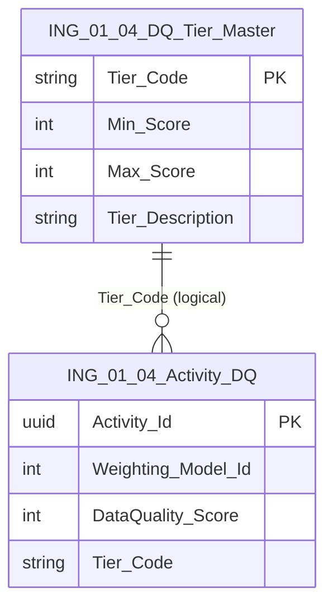

# Data Entity Specification: ING-01.04.04 DQ_Tier_Master

| **Document ID** | **Version** | **Status** | **Owner (Author)** |
| :--- | :--- | :--- | :--- |
| **ING-01.04.04** | 1.0.0 | **DRAFT** | Business Architect |

---

## 1. Description & Scope

The **ING-01.04.04 DQ_Tier_Master** entity defines the **tier classification** applied to `DataQuality_Score` values for activities.

Each tier:

- Represents a score range (e.g. 85–100 = Tier 'A')  
- Has a human-readable description (e.g. 'High quality – safe for production ESG calculations')  

This supports simplified reporting and thresholds in downstream processes (ING-02, ING-03, Z-10 ESG Ledgers).

---

## 2. Referential Integrity Standard

> All relationships are **logical only**.  
> No physical FOREIGN KEY constraints exist.

Logical references:
- `Tier_Code` → used by `Activity_DQ` representation in **ING-01.04 Data_Quality_Scoring**  

Physical table (suggested):
- **[ING].[ING_01_04_DQ_Tier_Master]**

---

## 3. ERD (Context)

---

## 4. Table Definition

**Table:** `[ING].[ING_01_04_DQ_Tier_Master]`

| Column | Type | Null | Notes |
|--------|------|------|-------|
| `Tier_Code` | NVARCHAR(10) | NOT NULL | Primary key (e.g. 'A', 'B', 'C', 'D'). |
| `Min_Score` | INT | NOT NULL | Inclusive minimum score for tier. |
| `Max_Score` | INT | NOT NULL | Inclusive maximum score for tier. |
| `Tier_Description` | NVARCHAR(200) | NULL | Description of the tier meaning. |

---

## 5. Data Management

| Object Type | Name | Description |
|-------------|------|-------------|
| Stored Procedure | **usp_ING_01_04_DQTier_CreateOrUpdate** | Creates or updates a DQ tier. |
| Stored Procedure | **usp_ING_01_04_DQTier_Delete** | Removes a DQ tier (subject to governance rules). |
| View | **vw_ING_01_04_DQTier_All** | Returns all tiers in score order. |
| Governance Process | **DQ_Tier_Definition_Workflow** | Governs changes to tier ranges and descriptions. |

---

## 6. Business Rules

- `Min_Score` and `Max_Score` ranges across tiers must be **contiguous** and **non-overlapping** to avoid ambiguity.  
- Score ranges must be within **0–100**.  
- Changing tier thresholds may impact historical interpretation of scores and should be treated as a governed change (documented in ING-01.04).  

---

## 7. Change History

| Version | Date | Author | Notes |
|---------|------|--------|-------|
| 1.0.0 | 2025-12-10 | Business Architect | Initial definition of DQ tier master entity. |
