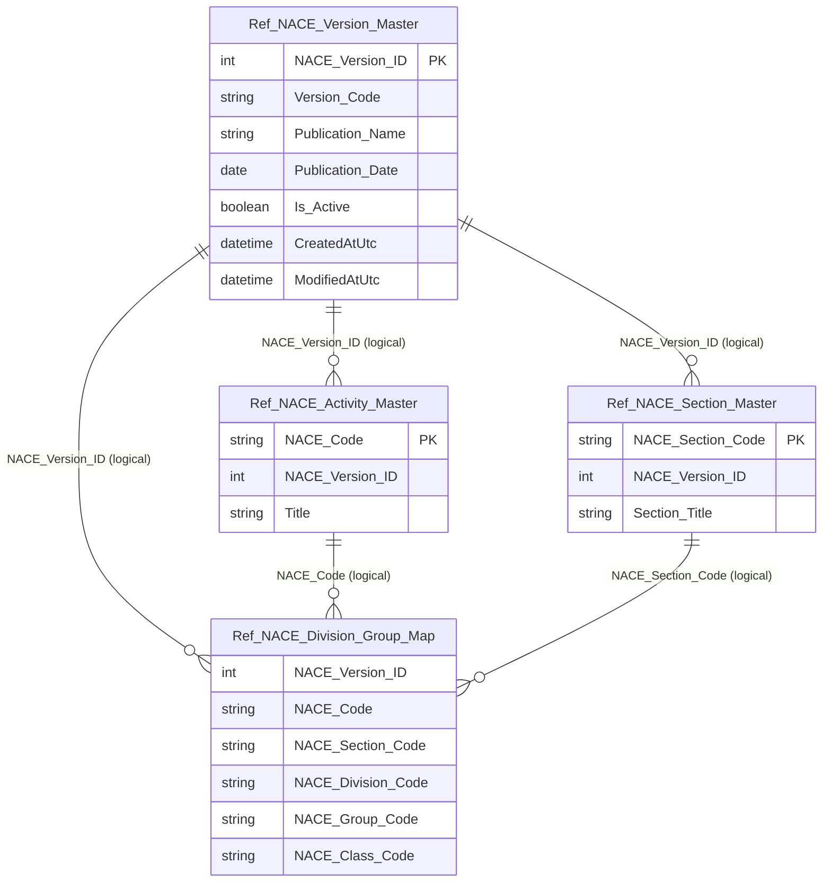

# Data Entity Specification: Z-10.00 Ref_NACE_Version_Master

| **Document ID** | **Version** | **Status** | **Owner (Author)** |
| :--- | :--- | :--- | :--- |
| **Z-10.00** | 1.0.0 | **DRAFT** | Business Architect |

---

## 1. Description & Scope

The **Z-10.00 Ref_NACE_Version_Master** entity defines the **version lineage** of the NACE classification standard adopted by the organisation.

Each row represents an **official NACE publication/revision** (e.g. Rev.2, Rev.2.1), providing a chronological anchor so that:

- NACE activity codes are always interpreted **in the correct revision context**
- ESG factor libraries can be version-bound and therefore **reproducible over time**
- historical reporting can resolve meaning **by version**, not by overwrite

This entity is **reference lineage only** — it does **not** implement posting logic or financial calculation behaviour.

---

## 2. Referential Integrity Standard

> All relationships are **logical only**.  
> No physical FOREIGN KEY constraints exist.

Logical references:
- `NACE_Version_ID` → used by **Z-10.01 Ref_NACE_Activity_Master**
- `NACE_Version_ID` → used by **Z-10.02 Ref_NACE_Section_Master**
- `NACE_Version_ID` → used by **Z-10.03 Ref_NACE_Division_Group_Map**

Physical table (suggested):
- **[Ref].[NACE_Version_Master]**

---

## 3. ERD (Context)

---

## 4. Table Definition

**Table:** `[Ref].[NACE_Version_Master]`

| Column | Type | Null | Notes |
|--------|------|------|-------|
| `NACE_Version_ID` | INT IDENTITY(1,1) | NOT NULL | Primary key (surrogate). |
| `Version_Code` | NVARCHAR(50) | NOT NULL | System-friendly code (e.g. `REV_2_1`). |
| `Publication_Name` | NVARCHAR(200) | NOT NULL | Official name (e.g. `NACE Rev. 2.1`). |
| `Publication_Date` | DATE | NOT NULL | Official publication/adoption date. |
| `Is_Active` | BIT | NOT NULL | Exactly one active version expected for production use. |
| `CreatedAtUtc` | DATETIME2(3) | NOT NULL | Audit timestamp (UTC). |
| `ModifiedAtUtc` | DATETIME2(3) | NULL | Audit timestamp (UTC). |

---

## 5. Data Management

| Object Type | Name | Description |
|-------------|------|-------------|
| Stored Procedure | **usp_Z_10_10_GetActiveNACEVersion** | Returns the currently active NACE version. |
| Stored Procedure | **usp_Z_10_11_GetNACEVersionByDate** | Resolves which NACE version applied for a given reference date. |
| Stored Procedure | **usp_Z_10_12_SearchNACE_AllVersions** | Searches NACE codes across all versions by code/title; returns lineage. |
| Stored Procedure | **usp_Z_10_13_SearchNACE_ByVersion** | Returns NACE activity list for a specific `NACE_Version_ID`. |
| Stored Procedure | **usp_Z_10_14_SearchNACE_ByYear** | Resolves version by year and returns its activity codes. |
| Stored Procedure | **usp_Z_10_15_CompareNACEVersions** | Compares two versions (added/removed/changed codes). |
| Stored Procedure | **usp_Z_10_16_GetNACEVersionHistory** | Returns chronological history of NACE versions. |
| View | **vw_Z_10_17_NACEVersion_WithUsage** | Summarises version usage across activities/factors/ledgers. |
| DQ Process | **DQ_Z_10_50_NACE_DataQualitySuite** | Aggregates NACE DQ checks (orphan, duplicates, completeness, lineage). |

---

## 6. Business Rules

- Exactly **one** version should be active (`Is_Active = 1`) for the production ESG environment.
- A version row represents a **published standard**; it must not be repurposed to mean something else.
- Historical reporting must resolve meaning using the version that was effective for the reporting period (by `Publication_Date` / selection logic), not by updating older versions in place.

---

## 7. Change History

| Version | Date | Author | Notes |
|---------|------|--------|-------|
| 1.0.0 | 2025-12-12 | Business Architect | Initial definition of NACE version lineage entity (Z-10.00). |
