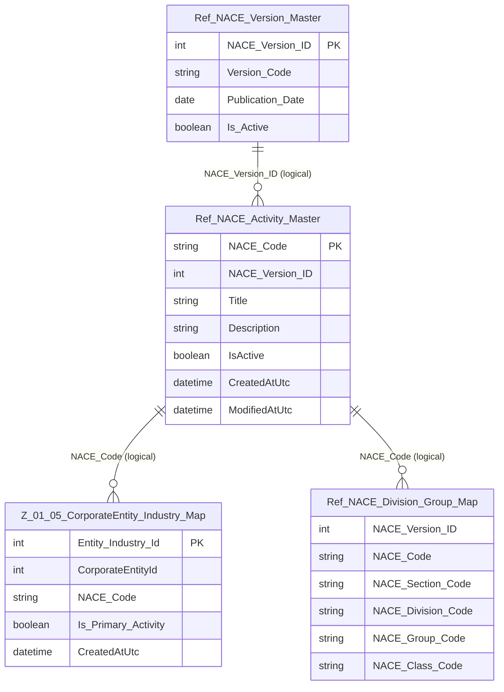

# Data Entity Specification: Z-10.01 Ref_NACE_Activity_Master

| **Document ID** | **Version** | **Status** | **Owner (Author)** |
| :--- | :--- | :--- | :--- |
| **Z-10.01** | 1.0.0 | **DRAFT** | Business Architect |

---

## 1. Description & Scope

The **Z-10.01 Ref_NACE_Activity_Master** entity defines the **versioned list of NACE activity codes** (economic activities).

Each row represents:
- one **NACE activity code** (`NACE_Code`)
- bound to one NACE revision (`NACE_Version_ID`)

This entity provides the stable reference vocabulary consumed by:
- **Z-01.05 CorporateEntity_Industry_Map** (entity → industry assignment)
- ESG factor libraries (where a factor is defined in an industry context)

This entity is **reference meaning only** — it does not decide which entities have which codes (that is owned by Z-01.05).

---

## 2. Referential Integrity Standard

> All relationships are **logical only**.  
> No physical FOREIGN KEY constraints exist.

Logical references:
- `NACE_Version_ID` → **Z-10.00 Ref_NACE_Version_Master**
- `NACE_Code` → used by **Z-01.05 CorporateEntity_Industry_Map**
- `NACE_Code` → used by **Z-10.03 Ref_NACE_Division_Group_Map**

Physical table (suggested):
- **[Ref].[NACE_Activity_Master]**

---

## 3. ERD (Context)

---

## 4. Table Definition

**Table:** `[Ref].[NACE_Activity_Master]`

| Column | Type | Null | Notes |
|--------|------|------|-------|
| `NACE_Code` | NVARCHAR(10) | NOT NULL | Primary key (e.g. `62.01`). Stable identifier within a versioned catalogue. |
| `NACE_Version_ID` | INT | NOT NULL | Logical FK → Z-10.00 `NACE_Version_ID`. |
| `Title` | NVARCHAR(250) | NOT NULL | Official short title for the activity. |
| `Description` | NVARCHAR(1000) | NULL | Optional extended description/notes. |
| `IsActive` | BIT | NOT NULL | Soft-deactivation flag (does not delete historical meaning). |
| `CreatedAtUtc` | DATETIME2(3) | NOT NULL | Audit timestamp (UTC). |
| `ModifiedAtUtc` | DATETIME2(3) | NULL | Audit timestamp (UTC). |

> Composite uniqueness recommendation: (`NACE_Version_ID`, `NACE_Code`) if the organisation maintains multiple versions side-by-side.

---

## 5. Data Management

| Object Type | Name | Description |
|-------------|------|-------------|
| Stored Procedure | **usp_Z_10_20_NACEActivity_LoadByVersion** | Bulk loads activity codes for a given `NACE_Version_ID`. |
| Stored Procedure | **usp_Z_10_21_NACEActivity_Search** | Searches NACE activities by code/title (scoped to version or across versions). |
| Stored Procedure | **usp_Z_10_22_NACEActivity_GetByCode** | Returns activity record and version context for one code. |
| View | **vw_Z_10_23_NACEActivity_ActiveVersion** | Returns activity catalogue for the current active version. |
| DQ Process | **DQ_Z_10_45_NACE_ActivityIntegrityCheck** | Validates titles present, duplicates not present, version consistency. |
| Governance Process | **NACE_Catalogue_Load_Approval_Workflow** | Governs adoption of a new NACE revision and its activity catalogue. |

---

## 6. Business Rules

- `NACE_Code` must be treated as a **stable identifier**; names/titles may change between versions, codes must not be repurposed.
- Activity records are **version-bound**; the same code string may exist in multiple versions only if it is formally retained by the standard.
- Deactivation (`IsActive = 0`) must not remove the ability to reproduce historical outputs.

---

## 7. Change History

| Version | Date | Author | Notes |
|---------|------|--------|-------|
| 1.0.0 | 2025-12-12 | Business Architect | Initial definition of NACE activity reference entity (Z-10.01). |
