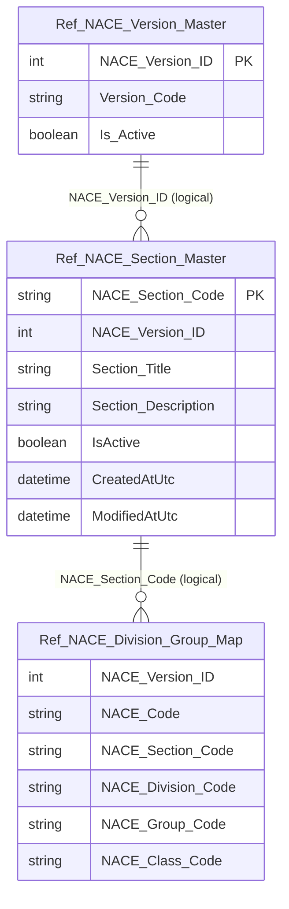

# Data Entity Specification: Z-10.02 Ref_NACE_Section_Master

| **Document ID** | **Version** | **Status** | **Owner (Author)** |
| :--- | :--- | :--- | :--- |
| **Z-10.02** | 1.0.0 | **DRAFT** | Business Architect |

---

## 1. Description & Scope

The **Z-10.02 Ref_NACE_Section_Master** entity defines the **top-level NACE section taxonomy** (typically A–U), bound to a specific NACE revision.

Sections provide:
- human-readable grouping for reporting
- the parent level for divisions / groups / classes in the hierarchy map (Z-10.03)

This entity is **reference meaning only** and is used to interpret NACE activities, not to assign industries to entities.

---

## 2. Referential Integrity Standard

> All relationships are **logical only**.  
> No physical FOREIGN KEY constraints exist.

Logical references:
- `NACE_Version_ID` → **Z-10.00 Ref_NACE_Version_Master**
- `NACE_Section_Code` → used by **Z-10.03 Ref_NACE_Division_Group_Map**

Physical table (suggested):
- **[Ref].[NACE_Section_Master]**

---

## 3. ERD (Context)

---

## 4. Table Definition

**Table:** `[Ref].[NACE_Section_Master]`

| Column | Type | Null | Notes |
|--------|------|------|-------|
| `NACE_Section_Code` | NVARCHAR(5) | NOT NULL | Primary key (e.g. `A`, `B`, ...). |
| `NACE_Version_ID` | INT | NOT NULL | Logical FK → Z-10.00 `NACE_Version_ID`. |
| `Section_Title` | NVARCHAR(250) | NOT NULL | Official title of the section. |
| `Section_Description` | NVARCHAR(1000) | NULL | Optional extended description. |
| `IsActive` | BIT | NOT NULL | Soft-deactivation flag. |
| `CreatedAtUtc` | DATETIME2(3) | NOT NULL | Audit timestamp (UTC). |
| `ModifiedAtUtc` | DATETIME2(3) | NULL | Audit timestamp (UTC). |

---

## 5. Data Management

| Object Type | Name | Description |
|-------------|------|-------------|
| Stored Procedure | **usp_Z_10_30_NACESection_LoadByVersion** | Bulk loads sections for a given `NACE_Version_ID`. |
| Stored Procedure | **usp_Z_10_31_NACESection_GetAll** | Returns all sections (optionally filtered by version). |
| View | **vw_Z_10_32_NACESection_ActiveVersion** | Returns sections for the current active version. |
| Governance Process | **NACE_Section_Taxonomy_Governance** | Governs adoption and validation of section definitions per revision. |

---

## 6. Business Rules

- Section codes are **stable identifiers** within a revision context.
- Section definitions must match the official publication for the NACE revision.
- Any changes to section meaning must be introduced via a **new version**, not by overwriting existing section records.

---

## 7. Change History

| Version | Date | Author | Notes |
|---------|------|--------|-------|
| 1.0.0 | 2025-12-12 | Business Architect | Initial definition of NACE section reference entity (Z-10.02). |
