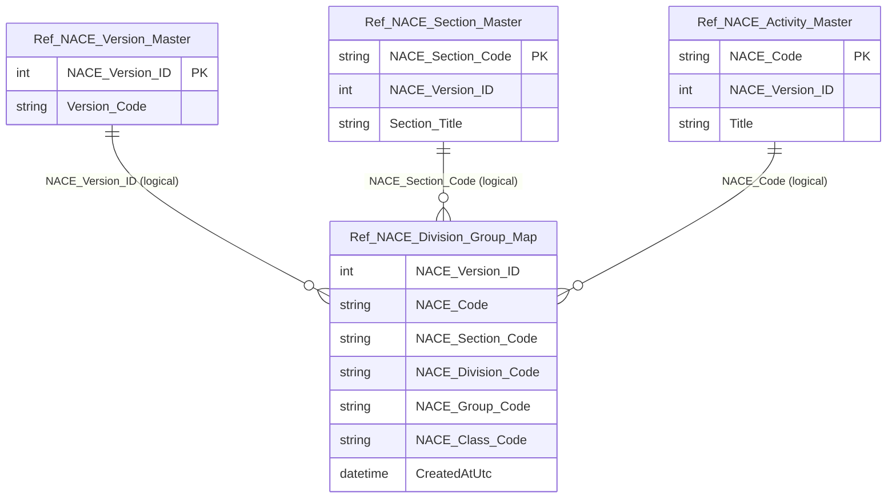

# Data Entity Specification: Z-10.03 Ref_NACE_Division_Group_Map

| **Document ID** | **Version** | **Status** | **Owner (Author)** |
| :--- | :--- | :--- | :--- |
| **Z-10.03** | 1.0.0 | **DRAFT** | Business Architect |

---

## 1. Description & Scope

The **Z-10.03 Ref_NACE_Division_Group_Map** entity defines the **structural hierarchy** of NACE:

- Section → Division → Group → Class → Activity (code)

It provides the reporting scaffold needed to:
- group activities into higher levels for ESG/Risk analytics
- validate completeness of imported catalogues
- support structured browsing and reporting (e.g. “all activities in Section C”)

This is a **reference mapping** entity only.  
It does not allocate industries to entities (Z-01.05 owns that mapping).

---

## 2. Referential Integrity Standard

> All relationships are **logical only**.  
> No physical FOREIGN KEY constraints exist.

Logical references:
- `NACE_Version_ID` → **Z-10.00 Ref_NACE_Version_Master**
- `NACE_Code` → **Z-10.01 Ref_NACE_Activity_Master**
- `NACE_Section_Code` → **Z-10.02 Ref_NACE_Section_Master**

Physical table (suggested):
- **[Ref].[NACE_Division_Group_Map]**

---

## 3. ERD (Context)

---

## 4. Table Definition

**Table:** `[Ref].[NACE_Division_Group_Map]`

| Column | Type | Null | Notes |
|--------|------|------|-------|
| `NACE_Version_ID` | INT | NOT NULL | Logical FK → Z-10.00 `NACE_Version_ID`. |
| `NACE_Code` | NVARCHAR(10) | NOT NULL | Logical FK → Z-10.01 `NACE_Code`. |
| `NACE_Section_Code` | NVARCHAR(5) | NOT NULL | Logical FK → Z-10.02 `NACE_Section_Code`. |
| `NACE_Division_Code` | NVARCHAR(10) | NOT NULL | Division identifier (e.g. `62`). |
| `NACE_Group_Code` | NVARCHAR(10) | NULL | Optional group identifier (e.g. `62.0`). |
| `NACE_Class_Code` | NVARCHAR(10) | NULL | Optional class identifier (e.g. `62.01`). |
| `CreatedAtUtc` | DATETIME2(3) | NOT NULL | Audit timestamp (UTC). |

> Composite key recommendation: (`NACE_Version_ID`, `NACE_Code`).  
> Additional uniqueness rules may apply depending on how group/class are represented.

---

## 5. Data Management

| Object Type | Name | Description |
|-------------|------|-------------|
| Stored Procedure | **usp_Z_10_33_NACEHierarchy_LoadByVersion** | Bulk loads hierarchy rows for a given `NACE_Version_ID`. |
| Stored Procedure | **usp_Z_10_34_NACEHierarchy_GetBySection** | Returns hierarchy for one section (optionally version-scoped). |
| Stored Procedure | **usp_Z_10_35_NACEHierarchy_GetByDivision** | Returns hierarchy for one division (optionally version-scoped). |
| View | **vw_Z_10_36_NACEHierarchy_ActiveVersion** | Returns hierarchy for the current active version. |
| DQ Process | **DQ_Z_10_41_NACE_CompletenessCheck** | Validates imported activity counts match expected totals per publication. |
| DQ Process | **DQ_Z_10_40_NACE_OrphanCheck** | Detects hierarchy rows referencing invalid codes/versions. |

---

## 6. Business Rules

- The hierarchy must be **non-cyclical** and internally consistent (one activity resolves to one structural path per version).
- A hierarchy row must not reference an inactive or unknown `NACE_Version_ID`.
- If the organisation stores multiple revisions, hierarchy resolution must always be **explicitly version-scoped**.

---

## 7. Change History

| Version | Date | Author | Notes |
|---------|------|--------|-------|
| 1.0.0 | 2025-12-12 | Business Architect | Initial definition of NACE hierarchy mapping entity (Z-10.03). |
