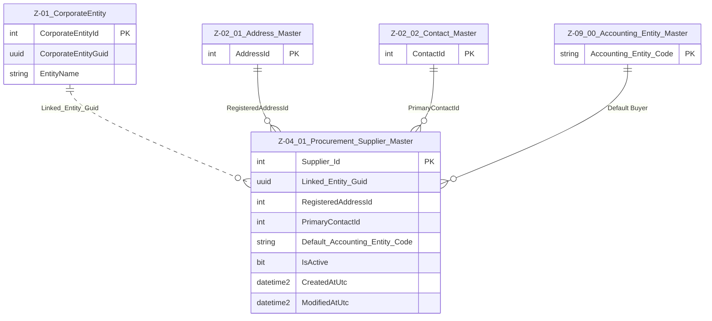

# Data Entity Specification: Z-04.01 Procurement_Supplier_Master

| **Document ID** | **Version** | **Status** | **Owner (Author)** |
| :--- | :--- | :--- | :--- |
| Z-04.01 | 1.0.0 | **DRAFT** | Business Architect |

## 1. Description & Scope
The **Z‑04.01 Procurement_Supplier_Master** entity defines the core identity of a supplier.  
Each supplier is represented as a **CorporateEntity (Z‑01)** with a supplier role.

This table stores procurement‑specific extensions including:
- Registered address used for procurement
- Primary contact for purchasing
- Default accounting entity (buyer)
- Link back to the supplier's legal identity via `Linked_Entity_Guid`

---

## 2. Referential Integrity Standard
> All relationships are **logical only**.  
> No physical FOREIGN KEY constraints exist.

Logical references:
- `Linked_Entity_Guid` → **Z‑01 CorporateEntity**
- `RegisteredAddressId` → **Z‑02.01 Address_Master**
- `PrimaryContactId` → **Z‑02.02 Contact_Master**
- `Default_Accounting_Entity_Code` → **Z‑09.00 Accounting_Entity_Master**

Physical table:
- **[Procurement].[Z_04_01_Supplier_Master]**

---

## 3. ERD (Context)

---

## 4. Table Definition

**Table:** `[Procurement].[Z_04_01_Supplier_Master]`

| Column | Type | Null | Notes |
|--------|------|------|-------|
| `Supplier_Id` | INT IDENTITY | NOT NULL | Primary Key |
| `Linked_Entity_Guid` | UNIQUEIDENTIFIER | NOT NULL | Points to Z‑01 CorporateEntity |
| `RegisteredAddressId` | INT | NULL | Logical FK → Z‑02.01 |
| `PrimaryContactId` | INT | NULL | Logical FK → Z‑02.02 |
| `Default_Accounting_Entity_Code` | NVARCHAR(50) | NULL | Logical FK → Z‑09.00 |
| `IsActive` | BIT | NOT NULL DEFAULT 1 | Supplier lifecycle |
| `CreatedAtUtc` | DATETIME2(3) | NOT NULL | Audit |
| `ModifiedAtUtc` | DATETIME2(3) | NULL | Audit |

---

## 5. Data Management

| Object Type | Name | Description |
|-------------|------|-------------|
| Stored Procedure | **usp_Z_04_01_Supplier_Create** | Creates new supplier record. Validates CorporateEntity link + address + contact. |
| Stored Procedure | **usp_Z_04_01_Supplier_Update** | Updates address, contact, or accounting entity. |
| Stored Procedure | **usp_Z_04_01_Supplier_Get** | Retrieves supplier by Supplier_Id or CorporateEntityGuid. |
| View | **vw_Z_04_01_Supplier_AllActive** | All active suppliers. |
| Governance Process | **Supplier Stewardship Workflow** | Approves onboarding, changes, and deactivation. |
| DQ Process | **DQ_Supplier_ValidationReport** | Identifies missing address/contact, invalid accounting entity links. |

---

## 6. Business Rules

- A supplier **must** have a valid `Linked_Entity_Guid` referencing an active CorporateEntity.  
- `RegisteredAddressId` and `PrimaryContactId` must refer to active Z‑02 records if populated.  
- Suppliers must map to a **default internal accounting entity** for posting logic.  
- Deactivated suppliers remain available for history and audit but cannot be assigned new transactions.
