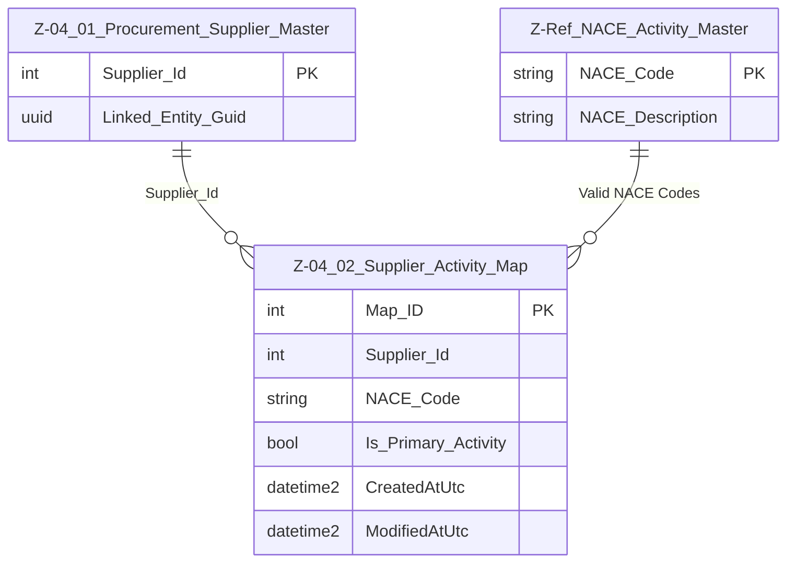

# Data Entity Specification: Z-04.02 Supplier_Activity_Map

| **Document ID** | **Version** | **Status** | **Owner (Author)** |
| :--- | :--- | :--- | :--- |
| Z-04.02 | 1.0.0 | **DRAFT** | Business Architect |

## 1. Description & Scope
The **Z‑04.02 Supplier_Activity_Map** entity records the **economic activities (NACE codes)** for which a supplier provides goods or services.

This provides the procurement‑side classification of a supplier, distinct from the supplier’s **legal industry classification** stored in **Z‑01.05 CorporateEntity_Industry_Map**.

A supplier may have multiple procurement activities.

---

## 2. Referential Integrity Standard
> All relationships are **logical only**.  
> No physical FOREIGN KEY constraints exist.

Logical references:
- `Supplier_Id` → **Z‑04.01 Supplier_Master**
- `NACE_Code` → **Z‑Ref NACE_Activity_Master**

Physical table:
- **[Procurement].[Z_04_02_Supplier_Activity_Map]**

---

## 3. ERD (Context)

---

## 4. Table Definition

**Table:** `[Procurement].[Z_04_02_Supplier_Activity_Map]`

| Column | Type | Null | Notes |
|--------|------|------|-------|
| `Map_ID` | INT IDENTITY | NOT NULL | Primary Key |
| `Supplier_Id` | INT | NOT NULL | Logical FK → Supplier_Master |
| `NACE_Code` | NVARCHAR(10) | NOT NULL | Logical FK → NACE Reference |
| `Is_Primary_Activity` | BIT | NOT NULL DEFAULT 0 | Flags main procurement activity |
| `CreatedAtUtc` | DATETIME2(3) | NOT NULL | Audit |
| `ModifiedAtUtc` | DATETIME2(3) | NULL | Audit |

---

## 5. Data Management

| Object Type | Name | Description |
|-------------|------|-------------|
| Stored Procedure | **usp_Z_04_02_SupplierActivity_Add** | Adds a new NACE activity for a supplier. |
| Stored Procedure | **usp_Z_04_02_SupplierActivity_Update** | Updates NACE code or primary flag. |
| Stored Procedure | **usp_Z_04_02_SupplierActivity_Remove** | Deactivates/removes an activity link. |
| Stored Procedure | **usp_Z_04_02_SupplierActivity_GetBySupplier** | Returns all activities for a supplier. |
| View | **vw_Z_04_02_SupplierActivity_PrimaryOnly** | Shows each supplier with its primary procurement activity. |
| Governance Process | **Supplier Activity Classification Workflow** | Ensures correct mapping and approval of supplier activities. |
| DQ Process | **DQ_SupplierActivity_ValidationReport** | Identifies suppliers with no activity mapping or invalid NACE codes. |

---

## 6. Business Rules

- A supplier may be associated with **multiple NACE codes**.  
- Exactly **one** activity per supplier *should* have `Is_Primary_Activity = 1`.  
- Procurement activity NACE codes describe **what is purchased**, not the supplier’s legal industry.  
- Activity codes must exist in the **NACE reference table**.  