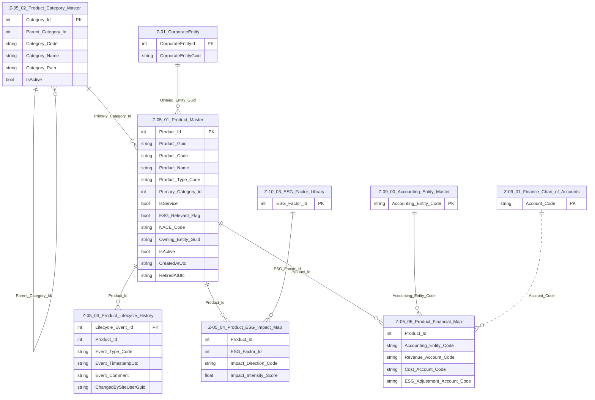

# Data Entity Specification: Z-05 Product Domain Overview  
**Version:** 1.0.0  
**Status:** DRAFT  

---

## 1. Description & Scope  
The **Product Domain (Z-05)** describes all **products and services** that the corporate entity designs, produces, sells, or otherwise offers to its customers and internal consumers.

This domain exists to:

- Provide a **single, governed Product Master** for all offerings  
- Support **financial accounting and reporting** by mapping products to the Finance domain (Z-09)  
- Provide **ESG traceability** by linking products to ESG factors and impact measures (Z-10)  
- Allow **classification and lifecycle management** of products and services across business units and regions  

The domain is strictly **product/offering–centric**; it does **not** cover customer, order, or inventory transaction details. Those are assumed to be handled in separate domains or operational systems and integrated logically.

---

## 2. Domain Boundary & Relationships  

The Product Domain (Z-05) relates to other domains as follows:

- **Corporate Domain (Z-01)**  
  - Product ownership, brand, and internal producer/business unit are represented by **CorporateEntity (Z-01)**.  

- **Address & Contacts Domain (Z-02)**  
  - Optional references for product support contacts or primary information owners.  

- **Finance Domain (Z-09)**  
  - Each product can be mapped to one or more **Chart of Accounts (Z-09.01)** entries and **Accounting Entities (Z-09.00)**.  

- **ESG Domain (Z-10)**  
  - Products are linked to **ESG_Factor_Library (Z-10.03)** through **Product_ESG_Impact_Map (Z-05.04)**.  

- **Reference NACE / Industry Codes (Z-10_Ref_NACE_Version_Master)**  
  - Products may optionally be tagged against sector / activity codes for regulatory and ESG alignment.  

The Product Domain does **not** enforce physical foreign keys. All relationships are **logical only** and governed through application- and stewardship-layer controls.

---

## 3. Core Entities in Z-05  

| Entity ID | Name                        | Description                                                                 |
|----------|-----------------------------|-----------------------------------------------------------------------------|
| Z-05.01  | **Product_Master**          | Canonical list of all products and services offered by the corporate entity. |
| Z-05.02  | **Product_Category_Master** | Hierarchical classification and grouping of products and services.         |
| Z-05.03  | **Product_Lifecycle_History** | Tracks material lifecycle events for a product (design, launch, change, retirement). |
| Z-05.04  | **Product_ESG_Impact_Map**  | Logical mapping of products to ESG factors and metrics.                    |
| Z-05.05  | **Product_Financial_Map**   | Logical mapping of products to Finance CoA, accounting entities, and reporting structures. |

---

## 4. ERD Overview (Logical)  

---

## 5. Data Flow Summary  

**Product design → Product_Master → Category and Lifecycle → Finance & ESG mapping → Reporting / Analytics**

- New products or services are designed and approved.  
- Approved products are created in **Product_Master (Z-05.01)** and assigned to one or more categories in **Product_Category_Master (Z-05.02)**.  
- Lifecycle changes are captured in **Product_Lifecycle_History (Z-05.03)**.  
- Products are mapped to ESG factors in **Product_ESG_Impact_Map (Z-05.04)**.  
- Products are mapped to financial structures in **Product_Financial_Map (Z-05.05)** for revenue, cost, and ESG adjustments.  

---

## 6. Data Management  

| Object Type       | Name                                   | Description                                                                  |
|-------------------|----------------------------------------|------------------------------------------------------------------------------|
| Stored Procedure  | **usp_Z_05_01_Product_Create**         | Creates a new product master record with mandatory classification and basic financial mapping. |
| Stored Procedure  | **usp_Z_05_01_Product_Update**         | Updates name, category, ESG relevance flags, and lifecycle attributes.      |
| Stored Procedure  | **usp_Z_05_02_ProductCategory_Upsert** | Maintains the product category hierarchy and derived `Category_Path`.       |
| Stored Procedure  | **usp_Z_05_03_ProductLifecycle_AddEvent** | Appends lifecycle events (design, launch, change, suspension, retirement). |
| Stored Procedure  | **usp_Z_05_04_ProductESG_MapFactor**   | Adds or updates a mapping between Product and ESG factor.                    |
| Stored Procedure  | **usp_Z_05_05_ProductFinancial_MapAccounts** | Adds or updates mapping between Product and financial accounts.          |
| View              | **vw_Z_05_Product_AllActive**          | Returns all active products, with category and key financial mappings.       |
| View              | **vw_Z_05_Product_ESGProfile**         | Provides Product → ESG factor view for ESG analytics and reporting.          |
| Governance Process| **Product_Stewardship_Workflow**       | Approves creation, change, and retirement of products in Z-05.               |
| DQ Process        | **DQ_Product_ValidationReport**        | Identifies missing categories, missing financial mappings, and inconsistent ESG mappings. |

---

## 7. Architectural Role  

The Product Domain (Z-05) provides the **canonical view of offerings** used by Finance, ESG, Sales, and Operational systems.

- It is the **bridge** between **financial accountability (Z-09)** and **ESG accountability (Z-10)**.  
- All downstream analytical and reporting solutions must reference products via **Product_Guid** (Z-05.01) to ensure cross-domain consistency.  
- The domain is governed by **Product stewardship** and subject to data quality monitoring and audit.  
