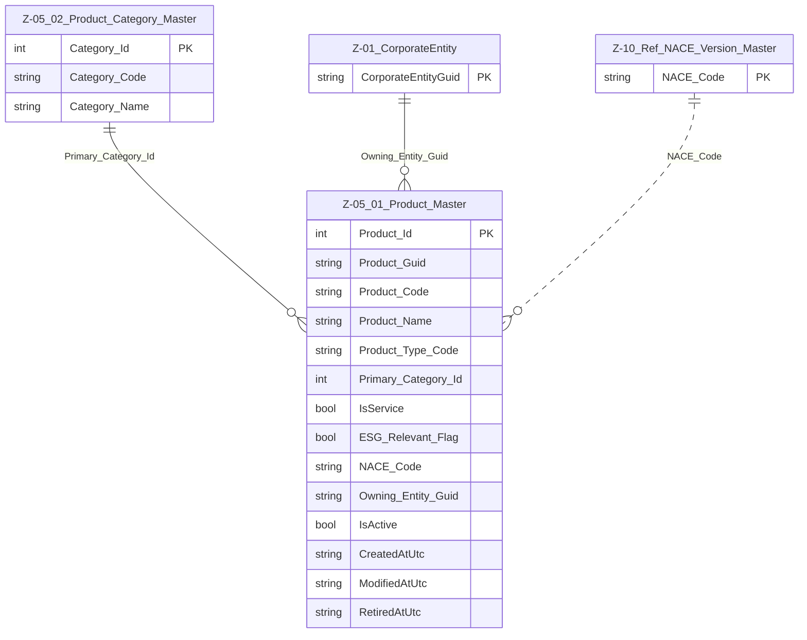

# Data Entity Specification: Z-05.01 Product_Master

| **Document ID** | **Version** | **Status** | **Owner (Author)** |
| :--- | :--- | :--- | :--- |
| Z-05.01 | 1.0.0 | **DRAFT** | Business Architect |

## 1. Description & Scope
The **Z-05.01 Product_Master** entity is the **canonical list of all products and services** offered by the corporate entity.  

A “product” in this context includes:

- Tangible goods manufactured or procured for resale  
- Intangible services (consulting, support, subscriptions)  
- Bundled offerings and composite products  
- Internal chargeable services that must be **financially accounted for** and **ESG-assessed**  

Product_Master is **domain-agnostic**: it does not model orders, inventory, or customers. Instead, it provides a **stable identity** and core attributes used by other domains and operational systems.  

---

## 2. Referential Integrity Standard  

> All relationships are **logical only** – no physical FOREIGN KEY constraints are enforced at database level.  

Logical references relevant to Product_Master:

- `Owning_Entity_Guid` → **Z-01 CorporateEntity** (business unit / brand owner)  
- `Primary_Category_Id` → **Z-05.02 Product_Category_Master**  
- `NACE_Code` → **Z-10_Ref_NACE_Version_Master** (optional)  

These references are validated by application services and data stewardship processes, not by physical FK constraints.  

---

## 3. Entity–Relationship Context (Logical)  

---

## 4. Table Definition  

**Table:** `[Product].[Z_05_01_Product_Master]`  

| Column | Type | Null | Notes |
|--------|------|------|-------|
| `Product_Id` | INT IDENTITY | NOT NULL | Surrogate primary key. |
| `Product_Guid` | UNIQUEIDENTIFIER | NOT NULL | Globally unique product identifier used across domains. |
| `Product_Code` | NVARCHAR(200) | NOT NULL | Business key or SKU; must be unique within system. |
| `Product_Name` | NVARCHAR(400) | NOT NULL | Human-readable product / service name. |
| `Product_Type_Code` | NVARCHAR(50) | NOT NULL | Local classification (e.g. GOOD, SERVICE, BUNDLE). |
| `Primary_Category_Id` | INT | NULL | Logical FK → Z-05.02 Product_Category_Master. |
| `IsService` | BIT | NOT NULL | 1 = Service; 0 = Tangible good. |
| `ESG_Relevant_Flag` | BIT | NOT NULL | 1 = Product is in scope for ESG assessment; 0 = out of scope. |
| `NACE_Code` | NVARCHAR(20) | NULL | Optional mapping to NACE activity code. |
| `Owning_Entity_Guid` | UNIQUEIDENTIFIER | NULL | Logical FK → CorporateEntity that owns the product. |
| `IsActive` | BIT | NOT NULL DEFAULT 1 | Product lifecycle status (active/inactive). |
| `CreatedAtUtc` | DATETIME2(3) | NOT NULL | Creation timestamp. |
| `ModifiedAtUtc` | DATETIME2(3) | NULL | Last change timestamp. |
| `RetiredAtUtc` | DATETIME2(3) | NULL | When product was formally retired / withdrawn. |

---

## 5. Data Management  

| Object Type | Name | Description |
|-------------|------|-------------|
| Stored Procedure | **usp_Z_05_01_Product_Create** | Creates a new Product_Master row; validates uniqueness of `Product_Code` and presence of mandatory attributes. |
| Stored Procedure | **usp_Z_05_01_Product_Update** | Updates product attributes, ESG flag, and lifecycle dates. |
| Stored Procedure | **usp_Z_05_01_Product_Get** | Retrieves product by `Product_Id` or `Product_Guid`. |
| View | **vw_Z_05_01_Product_AllActive** | Returns all active products with key attributes. |
| Governance Process | **Product_Stewardship_Workflow** | Approves creation, change, and retirement of products. |
| DQ Process | **DQ_Product_ValidationReport** | Detects missing category, invalid NACE mappings, and duplicated codes. |

---

## 6. Business Rules  

- Every product **must** have a unique `Product_Guid` and `Product_Code`.  
- `Product_Name` must be populated and meaningful for external and internal consumers.  
- `Primary_Category_Id`, if populated, must reference an **active** category in Z-05.02.  
- For ESG-relevant products (`ESG_Relevant_Flag = 1`), at least one mapping should exist in **Z-05.04 Product_ESG_Impact_Map**.  
- Products marked as inactive (`IsActive = 0`) may not be assigned in new orders or financial mappings but remain for history and audit.  
