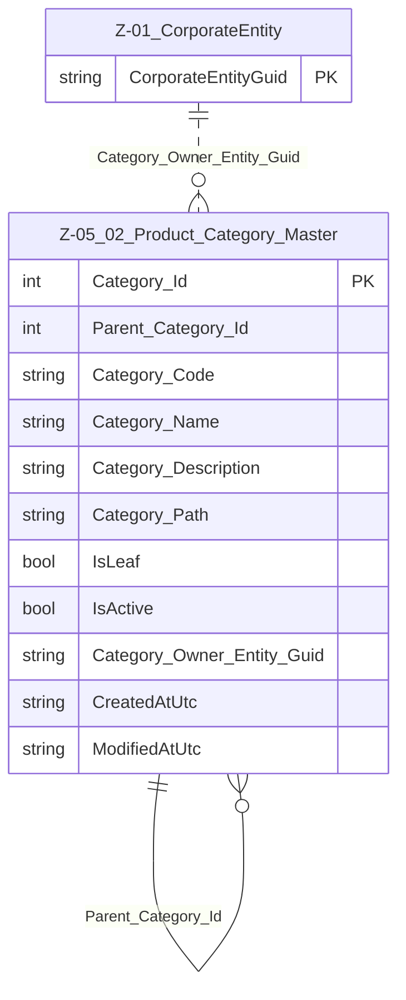

# Data Entity Specification: Z-05.02 Product_Category_Master

| **Document ID** | **Version** | **Status** | **Owner (Author)** |
| :--- | :--- | :--- | :--- |
| Z-05.02 | 1.0.0 | **DRAFT** | Business Architect |

## 1. Description & Scope
The **Z-05.02 Product_Category_Master** entity defines the **hierarchical classification** of products and services.  

It supports:

- Commercial product hierarchy (lines, families, SKUs)  
- ESG reporting groupings (e.g. “High-emission materials”, “Low-carbon services”)  
- Financial and management reporting groups  

Categories may be re-used across business units and regions, but the hierarchy must be globally consistent.  

---

## 2. Referential Integrity Standard  

> All relationships are logical; no physical FOREIGN KEYs.  

Logical references:

- `Parent_Category_Id` → Z-05.02 Product_Category_Master (self-reference)  
- `Category_Owner_Entity_Guid` → Z-01 CorporateEntity (optional owner)  

These references are governed by category stewardship workflows.  

---

## 3. Entity–Relationship Context (Logical)  

---

## 4. Table Definition  

**Table:** `[Product].[Z_05_02_Product_Category_Master]`  

| Column | Type | Null | Notes |
|--------|------|------|-------|
| `Category_Id` | INT IDENTITY | NOT NULL | Surrogate primary key. |
| `Parent_Category_Id` | INT | NULL | Logical FK → parent category. |
| `Category_Code` | NVARCHAR(50) | NOT NULL | Unique category code. |
| `Category_Name` | NVARCHAR(200) | NOT NULL | Category label. |
| `Category_Description` | NVARCHAR(500) | NULL | Optional narrative description. |
| `Category_Path` | NVARCHAR(500) | NULL | Derived path (e.g. `/Line/Family/SKU`). |
| `IsLeaf` | BIT | NOT NULL | 1 = leaf node; 0 = internal grouping. |
| `IsActive` | BIT | NOT NULL DEFAULT 1 | Category lifecycle status. |
| `Category_Owner_Entity_Guid` | UNIQUEIDENTIFIER | NULL | Logical FK → CorporateEntity owning the category. |
| `CreatedAtUtc` | DATETIME2(3) | NOT NULL | Creation timestamp. |
| `ModifiedAtUtc` | DATETIME2(3) | NULL | Last change timestamp. |

---

## 5. Data Management  

| Object Type | Name | Description |
|-------------|------|-------------|
| Stored Procedure | **usp_Z_05_02_ProductCategory_Upsert** | Creates or updates categories, regenerating `Category_Path`. |
| Stored Procedure | **usp_Z_05_02_ProductCategory_Reparent** | Supports safe hierarchy changes under governance. |
| View | **vw_Z_05_02_ProductCategory_AllActive** | All active categories with hierarchy context. |
| Governance Process | **ProductCategory_Stewardship_Workflow** | Approves new categories and changes to hierarchy. |
| DQ Process | **DQ_ProductCategory_ValidationReport** | Detects orphan categories, cycles, and duplicate codes. |

---

## 6. Business Rules  

- `Category_Code` must be unique across all active categories.  
- Root categories have `Parent_Category_Id = NULL`.  
- Hierarchy must be acyclic; **no loops** are allowed.  
- A category must not be deactivated if active products still reference it (unless remapped).  
