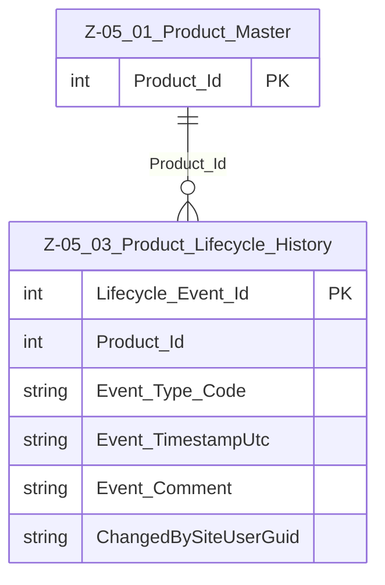

# Data Entity Specification: Z-05.03 Product_Lifecycle_History

| **Document ID** | **Version** | **Status** | **Owner (Author)** |
| :--- | :--- | :--- | :--- |
| Z-05.03 | 1.0.0 | **DRAFT** | Business Architect |

## 1. Description & Scope
The **Z-05.03 Product_Lifecycle_History** entity records **discrete lifecycle events** for products in **Z-05.01 Product_Master**.  

Examples of lifecycle events:

- DESIGNED, APPROVED, LAUNCHED  
- PRICE_CHANGED, PACK_CHANGED, ESG_RECLASSIFIED  
- SUSPENDED, REINSTATED, RETIRED  

Lifecycle history is essential for **audit, regulatory reporting, ESG traceability**, and understanding when changes took effect.  

---

## 2. Referential Integrity Standard  

> Relationships are logical only.  

Logical references:

- `Product_Id` → Z-05.01 Product_Master  
- `Event_Type_Code` → reference list (implementation-specific, e.g. code set table)  
- `ChangedBySiteUserGuid` → identity of the user / service that initiated the change  

---

## 3. Entity–Relationship Context (Logical)  

---

## 4. Table Definition  

**Table:** `[Product].[Z_05_03_Product_Lifecycle_History]`  

| Column | Type | Null | Notes |
|--------|------|------|-------|
| `Lifecycle_Event_Id` | INT IDENTITY | NOT NULL | Surrogate primary key. |
| `Product_Id` | INT | NOT NULL | Logical FK → Z-05.01 Product_Master. |
| `Event_Type_Code` | NVARCHAR(50) | NOT NULL | Coded event type (e.g. LAUNCHED, RETIRED). |
| `Event_TimestampUtc` | DATETIME2(3) | NOT NULL | When the event became effective. |
| `Event_Comment` | NVARCHAR(4000) | NULL | Optional narrative description / justification. |
| `ChangedBySiteUserGuid` | UNIQUEIDENTIFIER | NOT NULL | Who or what triggered the change. |

---

## 5. Data Management  

| Object Type | Name | Description |
|-------------|------|-------------|
| Stored Procedure | **usp_Z_05_03_ProductLifecycle_AddEvent** | Adds a lifecycle event for a product. |
| View | **vw_Z_05_03_ProductLifecycle_ByProduct** | Returns ordered lifecycle history for a product. |
| Governance Process | **ProductLifecycle_Stewardship_Workflow** | Controls creation of critical lifecycle events (e.g. launch, retirement). |
| DQ Process | **DQ_ProductLifecycle_ValidationReport** | Detects inconsistent or overlapping events (e.g. launch after retirement). |

---

## 6. Business Rules  

- Every lifecycle record **must** reference an existing Product_Master row.  
- Event timestamps must be in UTC and **non-null**.  
- Critical events (LAUNCHED, RETIRED) should be unique per product; multiple such events require explicit governance.  
- Lifecycle history must not be physically deleted; corrections are made via new events.  
