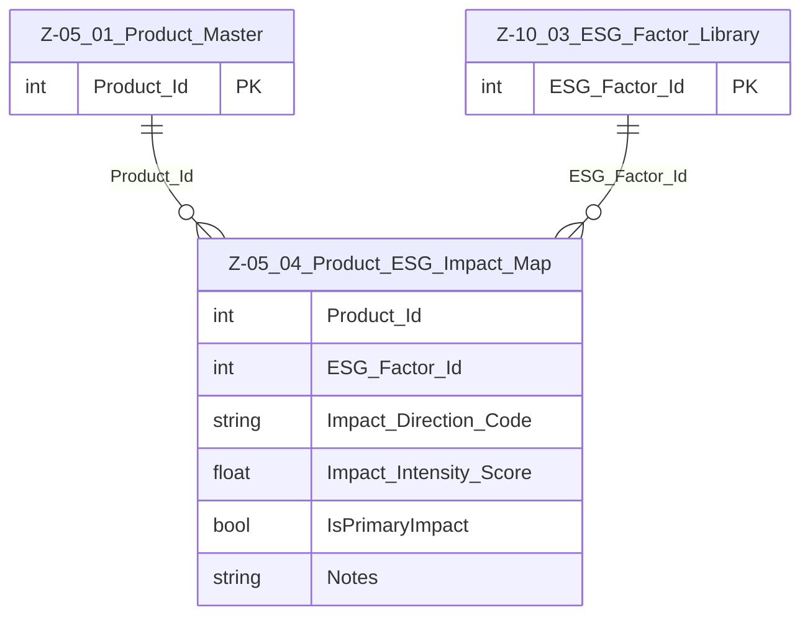

# Data Entity Specification: Z-05.04 Product_ESG_Impact_Map

| **Document ID** | **Version** | **Status** | **Owner (Author)** |
| :--- | :--- | :--- | :--- |
| Z-05.04 | 1.0.0 | **DRAFT** | Business Architect |

## 1. Description & Scope
The **Z-05.04 Product_ESG_Impact_Map** entity provides the **logical link** between products and the **ESG factor library (Z-10.03)**.  

It supports:

- Identification of which ESG factors are materially impacted by a given product  
- Direction and intensity of impact (e.g. POSITIVE, NEGATIVE, NEUTRAL)  
- Product-level aggregation for ESG position and forecast ledgers (Z-10.01, Z-10.02)  

This entity does **not** store actual ESG measurement values; those belong in the respective ESG ledgers. It defines **what should be measured and how products contribute**.  

---

## 2. Referential Integrity Standard  

> Relationships are logical only.  

Logical references:

- `Product_Id` → Z-05.01 Product_Master  
- `ESG_Factor_Id` → Z-10.03 ESG_Factor_Library  
- `Impact_Direction_Code` → local code list (e.g. POS, NEG, NEU)  

---

## 3. Entity–Relationship Context (Logical)  

---

## 4. Table Definition  

**Table:** `[Product].[Z_05_04_Product_ESG_Impact_Map]`  

| Column | Type | Null | Notes |
|--------|------|------|-------|
| `Product_Id` | INT | NOT NULL | Logical FK → Z-05.01 Product_Master. |
| `ESG_Factor_Id` | INT | NOT NULL | Logical FK → Z-10.03 ESG_Factor_Library. |
| `Impact_Direction_Code` | NVARCHAR(50) | NOT NULL | Indicates direction of impact (e.g. POSITIVE, NEGATIVE, NEUTRAL). |
| `Impact_Intensity_Score` | DECIMAL(18,6) | NULL | Optional scalar for intensity (e.g. -1 to +1 or 0–100 scale). |
| `IsPrimaryImpact` | BIT | NOT NULL DEFAULT 0 | Flags whether this is the primary ESG factor for the product. |
| `Notes` | NVARCHAR(400) | NULL | Optional commentary / assumptions. |

**Primary Key (logical):** (`Product_Id`, `ESG_Factor_Id`)  

---

## 5. Data Management  

| Object Type | Name | Description |
|-------------|------|-------------|
| Stored Procedure | **usp_Z_05_04_ProductESG_MapFactor** | Creates or updates Product → ESG factor mappings. |
| Stored Procedure | **usp_Z_05_04_ProductESG_RemoveFactor** | Removes a mapping (soft delete if required by audit policy). |
| View | **vw_Z_05_04_ProductESG_ByProduct** | Returns all ESG factors mapped to a product. |
| View | **vw_Z_05_04_ProductESG_ByFactor** | Returns all products mapped to an ESG factor. |
| Governance Process | **ProductESG_Stewardship_Workflow** | Ensures mappings are reviewed by ESG and Product teams. |
| DQ Process | **DQ_ProductESG_ValidationReport** | Checks for unmapped ESG-relevant products and invalid factors. |

---

## 6. Business Rules  

- Products with `ESG_Relevant_Flag = 1` in Z-05.01 **should** have at least one mapping in this table.  
- A given (`Product_Id`, `ESG_Factor_Id`) pair must be unique.  
- `Impact_Direction_Code` must come from a governed ESG impact code list.  
- Changes to mappings must be subject to ESG governance, especially when impact direction or intensity changes.  
