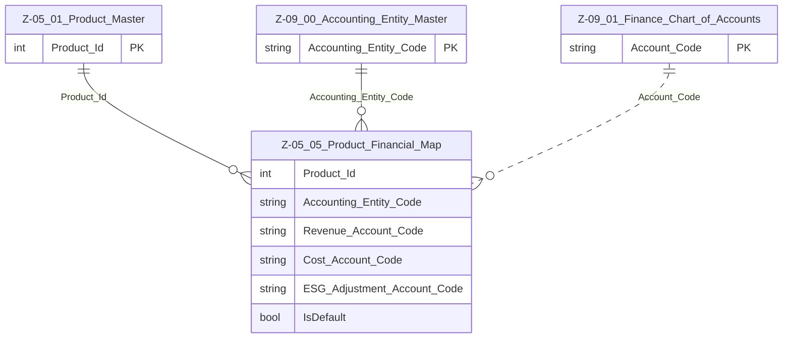

# Data Entity Specification: Z-05.05 Product_Financial_Map

| **Document ID** | **Version** | **Status** | **Owner (Author)** |
| :--- | :--- | :--- | :--- |
| Z-05.05 | 1.0.0 | **DRAFT** | Business Architect |

## 1. Description & Scope
The **Z-05.05 Product_Financial_Map** entity describes the **logical mapping** between products in **Z-05.01 Product_Master** and the **Finance domain (Z-09)**.  

It supports:

- Posting of revenue and cost to appropriate **Chart of Accounts (Z-09.01)**  
- Assignment of products to **Accounting Entities (Z-09.00)** for statutory and management reporting  
- Optional mapping of products to **ESG-adjustment accounts** where ESG-related financial adjustments are booked  

The entity is a **mapping / bridge** table only; it does not store transactional values.  

---

## 2. Referential Integrity Standard  

> Relationships are logical; no physical FOREIGN KEYs.  

Logical references:

- `Product_Id` → Z-05.01 Product_Master  
- `Accounting_Entity_Code` → Z-09.00 Finance_Entity_Master / Accounting_Entity_Master  
- `Revenue_Account_Code` → Z-09.01 Finance_Chart_of_Accounts  
- `Cost_Account_Code` → Z-09.01 Finance_Chart_of_Accounts  
- `ESG_Adjustment_Account_Code` → Z-09.01 Finance_Chart_of_Accounts (optional)  

---

## 3. Entity–Relationship Context (Logical)  

---

## 4. Table Definition  

**Table:** `[Product].[Z_05_05_Product_Financial_Map]`  

| Column | Type | Null | Notes |
|--------|------|------|-------|
| `Product_Id` | INT | NOT NULL | Logical FK → Z-05.01 Product_Master. |
| `Accounting_Entity_Code` | NVARCHAR(50) | NOT NULL | Logical FK → Z-09.00 Accounting entity / Finance entity. |
| `Revenue_Account_Code` | NVARCHAR(50) | NOT NULL | Logical FK → Z-09.01 Chart of Accounts (revenue account). |
| `Cost_Account_Code` | NVARCHAR(50) | NULL | Logical FK → Z-09.01 Chart of Accounts (cost account). |
| `ESG_Adjustment_Account_Code` | NVARCHAR(50) | NULL | Optional ESG-specific adjustment account in CoA. |
| `IsDefault` | BIT | NOT NULL DEFAULT 1 | Indicates default mapping when multiple mappings exist (e.g. by region). |

**Primary Key (logical):** (`Product_Id`, `Accounting_Entity_Code`, `Revenue_Account_Code`)  

---

## 5. Data Management  

| Object Type | Name | Description |
|-------------|------|-------------|
| Stored Procedure | **usp_Z_05_05_ProductFinancial_MapAccounts** | Creates or updates mappings between products and financial accounts. |
| Stored Procedure | **usp_Z_05_05_ProductFinancial_RemoveMapping** | Retires or deactivates an existing mapping. |
| View | **vw_Z_05_05_ProductFinancial_ByProduct** | Shows financial mappings for each product. |
| Governance Process | **ProductFinancial_Stewardship_Workflow** | Ensures finance sign-off for any mapping changes. |
| DQ Process | **DQ_ProductFinancial_ValidationReport** | Detects products without valid financial mappings or using obsolete accounts. |

---

## 6. Business Rules  

- Every product that is **commercially offered** should have at least one financial mapping row.  
- `Accounting_Entity_Code` and all account codes must refer to **active** entries in Z-09.00 / Z-09.01.  
- Only one mapping per product may be flagged `IsDefault = 1` for a given accounting context (enforced at application level).  
- Changes to mapping must be coordinated with Finance and, where relevant, ESG reporting stakeholders.  
