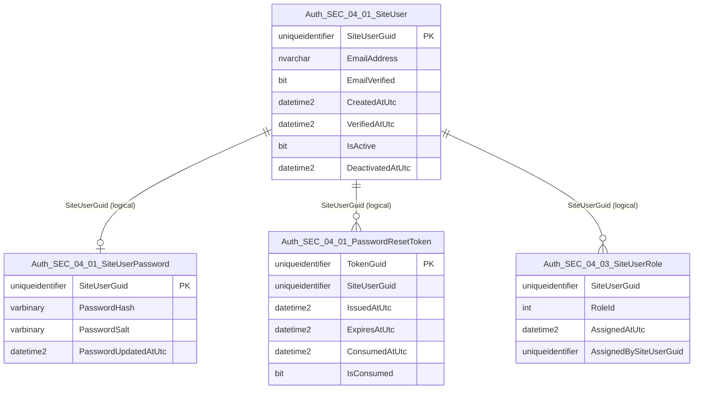
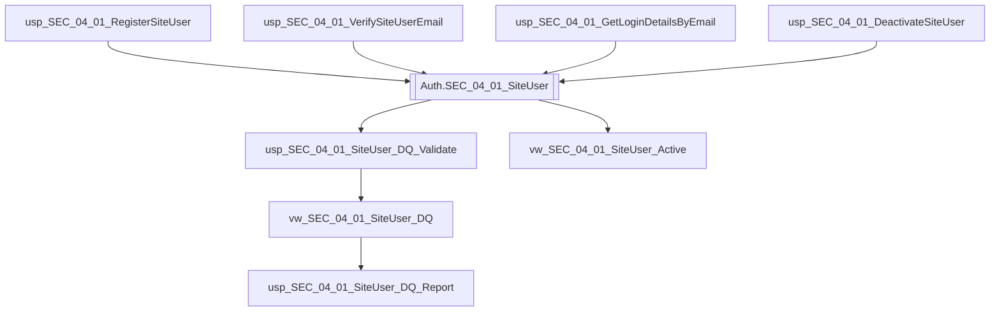

# Data Entity Specification: SEC-04.01.01 SiteUser

| **Document ID** | **Version** | **Status** | **Owner (Author)** | **Reviewer** |
| :--- | :--- | :--- | :--- |:--- |
| **SEC-04.01.01** | 1.0.0 | **DRAFT** | Architect |Product Owner |

<strong>Table - 1 SEC-04.01.01  –</strong> Document control header
 

---

## 1. Description & Scope

The **SEC-04.01.01 SiteUser** entity defines the **authoritative user identity record** used for registration, login, and account lifecycle management.

This entity supports:
- New user registration (including email verification workflow)
- Account state management (active, verified, deactivated)
- Identity anchor for role assignment and access control

---

## 2. Referential Integrity Standard

> All relationships are **logical only**.  
> No physical FOREIGN KEY constraints exist.

Logical references (examples):
- `SiteUserGuid` → used by **SEC-04.03** entitlement mapping (roles)
- `SiteUserGuid` → used by password and reset token entities (SEC-04.01.02 / SEC-04.01.03)

---

## 3. ERD (Context) — One Level Only

<strong>Figure - 1 SEC-04.01.01 –</strong> One-level ERD context for SiteUser
 

---

## 4. Table Definition

**Table:** `[Auth].[SEC_04_01_SiteUser]`

| Column | Type | Null | Notes |
|--------|------|------|-------|
| `SiteUserGuid` | UNIQUEIDENTIFIER | NOT NULL | Primary key. Subject identifier (User GUID). |
| `EmailAddress` | NVARCHAR(320) | NOT NULL | User login identifier. Max aligns to RFC email length conventions. |
| `EmailVerified` | BIT | NOT NULL | Indicates whether email verification is complete. |
| `CreatedAtUtc` | DATETIME2(3) | NOT NULL | Issuance timestamp for identity record. |
| `VerifiedAtUtc` | DATETIME2(3) | NULL | Timestamp when verification completed. |
| `IsActive` | BIT | NOT NULL | Account enablement state. |
| `DeactivatedAtUtc` | DATETIME2(3) | NULL | Timestamp when account was deactivated. |

<strong>Table - 2 SEC-04.01.01  –</strong> Physical table definition for `[Auth].[SEC_04_01_SiteUser]`
 

---

## 5. Data Management

> This section lists **only** the stored procedures and views created **directly** to manage this entity, including operational management and data quality (DQ) controls.

| Object Type | Name | Description |
|-------------|------|-------------|
| Stored Procedure | **usp_SEC_04_01_RegisterSiteUser** | Creates a new SiteUser record (registration). |
| Stored Procedure | **usp_SEC_04_01_VerifySiteUserEmail** | Marks email as verified and sets `VerifiedAtUtc`. |
| Stored Procedure | **usp_SEC_04_01_GetLoginDetailsByEmail** | Returns login identity data by email (minimal fields only). |
| Stored Procedure | **usp_SEC_04_01_DeactivateSiteUser** | Deactivates a user account (soft-disable). |
| View | **vw_SEC_04_01_SiteUser_Active** | Returns active users (governed consumer view). |
| View | **vw_SEC_04_01_SiteUser_DQ** | Exposes row-level data quality flags (uniqueness, completeness, state integrity). |
| Stored Procedure | **usp_SEC_04_01_SiteUser_DQ_Validate** | Executes DQ validation rules and returns pass/fail results with rule codes. |
| Stored Procedure | **usp_SEC_04_01_SiteUser_DQ_Report** | Produces a standardised DQ exception report for governance and operations. |

<strong>Table - 3 SEC-04.01.01  –</strong> SiteUser data management objects (including DQ controls)
 

---

## 6. Data Management Diagram (Direct Objects Only)

## 6. Data Management Diagram (Direct Objects Only)

<strong>Figure - 2 SEC-04.01.01 –</strong> Stored procedures and views created directly for SiteUser
 

---

## 7. Business Rules

- `EmailAddress` must be unique for active accounts (enforced by logical rule; physical unique index optional by implementation policy).
- `UserName` must be unique for active accounts (enforced by logical rule; physical unique index optional by implementation policy).
- `CreatedAtUtc` is always stored in UTC with millisecond precision (`DATETIME2(3)`).
- Account deactivation must not delete identity history; use `IsActive = 0` and set `DeactivatedAtUtc`.
- Verification must be an explicit state transition: `EmailVerified = 1` implies `VerifiedAtUtc IS NOT NULL`.

---

## 8. Change History

| Version | Date | Author | Notes |
|---------|------|--------|-------|
| 1.0.0 | 2025-12-13 | Architect | Initial definition of SiteUser entity for registration and lifecycle management. |

<strong>Table - 4 SEC-04.01.01  –</strong> Change history
 
