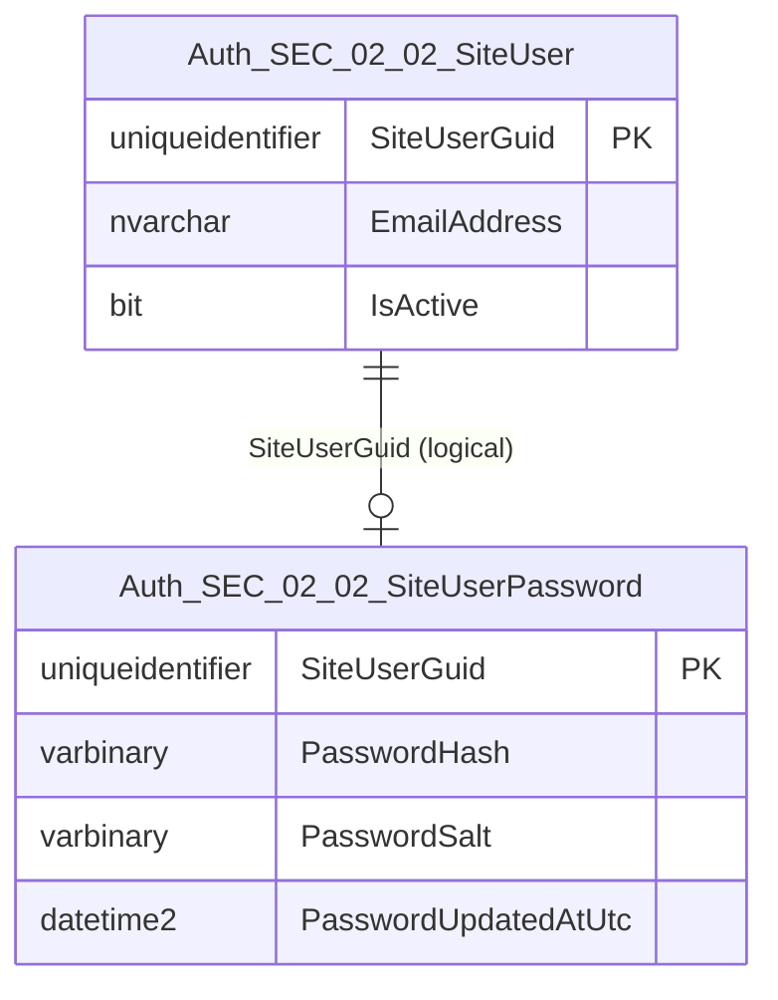
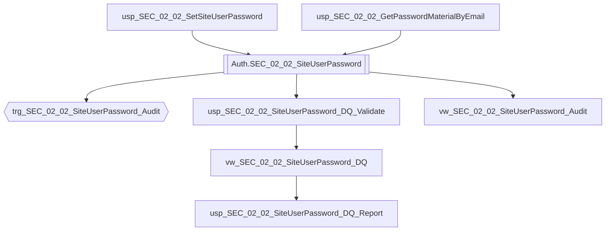

# Data Entity Specification: SEC-02.02.02 SiteUserPassword

| **Document ID** | **Version** | **Status** | **Owner (Author)** | **Reviewer** |
| :--- | :--- | :--- | :--- | :--- |
| **SEC-02.02.02** | 1.1.0 | **DRAFT** | Architect | Product Owner |

<strong>Table - 1 SEC-02.02.02  –</strong> Document control header
 

---

## 1. Description & Scope

The **SEC-02.02.02 SiteUserPassword** entity stores the **credential material** (password hash and salt) associated with a SiteUser.

This entity is intentionally separated from the core identity record to:
- Reduce exposure of sensitive credential material
- Support tighter access controls
- Enable independent credential lifecycle governance
- Support password change auditability through direct management objects (views, DQ controls, and triggers)

---

## 2. Referential Integrity Standard

> All relationships are **logical only**.  
> No physical FOREIGN KEY constraints exist.

Logical references:
- `SiteUserGuid` → **SEC-02.02.01 SiteUser**

---

## 3. ERD (Context) — One Level Only

<strong>Figure - 1 SEC-02.02.02 –</strong> One-level ERD context for SiteUserPassword
 

---

## 4. Table Definition

**Table:** `[Auth].[SEC_02_02_SiteUserPassword]`

| Column | Type | Null | Notes |
|--------|------|------|-------|
| `SiteUserGuid` | UNIQUEIDENTIFIER | NOT NULL | Primary key and logical reference to SiteUser. |
| `PasswordHash` | VARBINARY(64) | NOT NULL | Hash output (algorithm-defined). |
| `PasswordSalt` | VARBINARY(32) | NOT NULL | Salt (algorithm-defined). |
| `PasswordUpdatedAtUtc` | DATETIME2(3) | NOT NULL | Timestamp of last password set/reset. |

<strong>Table - 2 SEC-02.02.02  –</strong> Physical table definition for `[Auth].[SEC_02_02_SiteUserPassword]`
 

---

## 5. Data Management

> This section lists **only** the stored procedures, views, and triggers created **directly** to manage this entity, including credential lifecycle operations and data quality (DQ) controls.

| Object Type | Name | Description |
|-------------|------|-------------|
| Stored Procedure | **usp_SEC_02_02_SetSiteUserPassword** | Creates or updates password hash and salt for a SiteUser. |
| Stored Procedure | **usp_SEC_02_02_GetPasswordMaterialByEmail** | Returns password hash/salt by email for authentication flow (restricted use). |
| View | **vw_SEC_02_02_SiteUserPassword_Audit** | Audit-oriented view for password changes (metadata only; no password material exposure beyond policy). |
| Trigger | **trg_SEC_02_02_SiteUserPassword_Audit** | Captures password change events on INSERT/UPDATE and writes audit records to `[Auth].[SEC_02_02_SiteUserPasswordAudit]`. |
| View | **vw_SEC_02_02_SiteUserPassword_DQ** | Exposes credential DQ flags (missing material, stale credentials, invalid timestamps). |
| Stored Procedure | **usp_SEC_02_02_SiteUserPassword_DQ_Validate** | Executes credential DQ validation rules and returns pass/fail results with rule codes. |
| Stored Procedure | **usp_SEC_02_02_SiteUserPassword_DQ_Report** | Produces a standardised DQ exception report for credential governance and security review. |

<strong>Table - 3 SEC-02.02.02  –</strong> SiteUserPassword data management objects (including DQ controls and audit trigger)
 

---

## 6. Data Management Diagram (Direct Objects Only)

<strong>Figure - 2 SEC-02.02.02 –</strong> Direct operational, audit, and DQ objects created for SiteUserPassword
 

---

## 7. Business Rules

- Exactly one password record exists per SiteUser (`SiteUserGuid` is the primary key).
- Password material must never be exposed via broad access patterns; consumption is limited to authentication workflows.
- Password change auditing must be captured for INSERT/UPDATE events via `trg_SEC_02_02_SiteUserPassword_Audit` (governed audit record).
- `PasswordUpdatedAtUtc` is always stored in UTC (`DATETIME2(3)`).
- Hash/salt sizes are fixed by the approved algorithm; adjust VARBINARY sizes only via governed change.

---

## 8. Change History

| Version | Date | Author | Notes |
|---------|------|--------|-------|
| 1.1.0 | 2025-12-13 | Architect | Standardised SEC-02 numbering, corrected references, and completed DQ + audit trigger declarations. |

<strong>Table - 4 SEC-02.02.02  –</strong> Change history
 
