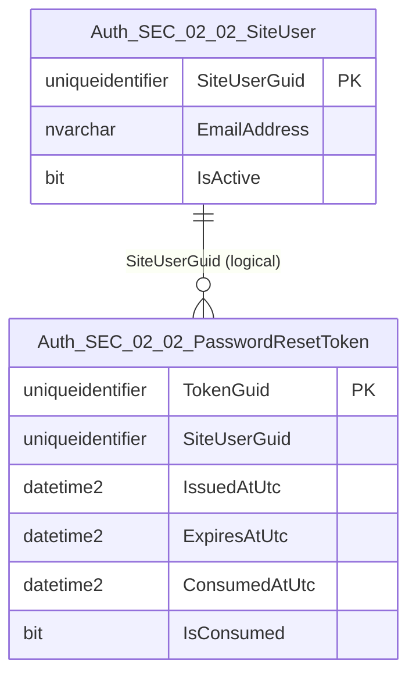
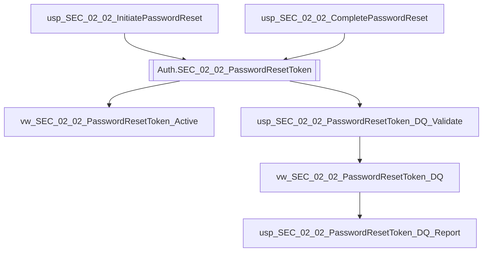

# Data Entity Specification: SEC-02.02.03 PasswordResetToken

| **Document ID** | **Version** | **Status** | **Owner (Author)** | **Reviewer** |
| :--- | :--- | :--- | :--- | :--- |
| **SEC-02.02.03** | 1.1.0 | **DRAFT** | Architect | Product Owner |

<strong>Table - 1 SEC-02.02.03  –</strong> Document control header
 

---

## 1. Description & Scope

The **SEC-02.02.03 PasswordResetToken** entity governs issuance, validity, and consumption of password reset tokens.

Each token must carry, in a verifiable form:
- Subject identifier (User GUID)
- Issuance timestamp
- Expiry timestamp

Token consumption state is retained for auditability and security review.

---

## 2. Referential Integrity Standard

> All relationships are **logical only**.  
> No physical FOREIGN KEY constraints exist.

Logical references:
- `SiteUserGuid` → **SEC-02.02.01 SiteUser**

---

## 3. ERD (Context) — One Level Only

<strong>Figure - 1 SEC-02.02.03 –</strong> One-level ERD context for PasswordResetToken
 

---

## 4. Table Definition

**Table:** `[Auth].[SEC_02_02_PasswordResetToken]`

| Column | Type | Null | Notes |
|--------|------|------|-------|
| `TokenGuid` | UNIQUEIDENTIFIER | NOT NULL | Primary key for reset token. |
| `SiteUserGuid` | UNIQUEIDENTIFIER | NOT NULL | Subject identifier (User GUID). |
| `IssuedAtUtc` | DATETIME2(3) | NOT NULL | Issuance timestamp. |
| `ExpiresAtUtc` | DATETIME2(3) | NOT NULL | Expiry timestamp. |
| `ConsumedAtUtc` | DATETIME2(3) | NULL | Timestamp when token is consumed. |
| `IsConsumed` | BIT | NOT NULL | Consumption state. |

<strong>Table - 2 SEC-02.02.03  –</strong> Physical table definition for `[Auth].[SEC_02_02_PasswordResetToken]`
 

---

## 5. Data Management

> This section lists **only** the stored procedures and views created **directly** to manage this entity, including token lifecycle operations and data quality (DQ) controls.

| Object Type | Name | Description |
|-------------|------|-------------|
| Stored Procedure | **usp_SEC_02_02_InitiatePasswordReset** | Issues a new password reset token (writes issuance + expiry). |
| Stored Procedure | **usp_SEC_02_02_CompletePasswordReset** | Consumes token (single-use) and completes reset workflow. |
| View | **vw_SEC_02_02_PasswordResetToken_Active** | Returns active (unexpired, unconsumed) tokens. |
| View | **vw_SEC_02_02_PasswordResetToken_DQ** | Exposes token DQ flags (expired-but-active, consumed-without-timestamp, orphaned tokens). |
| Stored Procedure | **usp_SEC_02_02_PasswordResetToken_DQ_Validate** | Executes token DQ validation rules and returns pass/fail results with rule codes. |
| Stored Procedure | **usp_SEC_02_02_PasswordResetToken_DQ_Report** | Produces a standardised DQ exception report for token governance and security review. |

<strong>Table - 3 SEC-02.02.03  –</strong> PasswordResetToken data management objects (including DQ controls)
 

---

## 6. Data Management Diagram (Direct Objects Only)

<strong>Figure - 2 SEC-02.02.03 –</strong> Direct token lifecycle and DQ objects created for PasswordResetToken
 

---

## 7. Business Rules

- Tokens are single-use:
  - consuming sets `IsConsumed = 1`
  - consuming sets `ConsumedAtUtc` (must not be NULL when consumed)
- A token is active only if:
  - `IsConsumed = 0`, and
  - current UTC time is less than `ExpiresAtUtc`
- `IssuedAtUtc` and `ExpiresAtUtc` are mandatory and stored in UTC (`DATETIME2(3)`).
- DQ must flag:
  - tokens where `IsConsumed = 1` and `ConsumedAtUtc IS NULL`
  - tokens where current time > `ExpiresAtUtc` and `IsConsumed = 0`
  - tokens with missing `SiteUserGuid`

---

## 8. Change History

| Version | Date | Author | Notes |
|---------|------|--------|-------|
| 1.1.0 | 2025-12-13 | Architect | Completed SEC-02.02.03 spec with consistent numbering and DQ objects. |

<strong>Table - 4 SEC-02.02.03  –</strong> Change history
 
