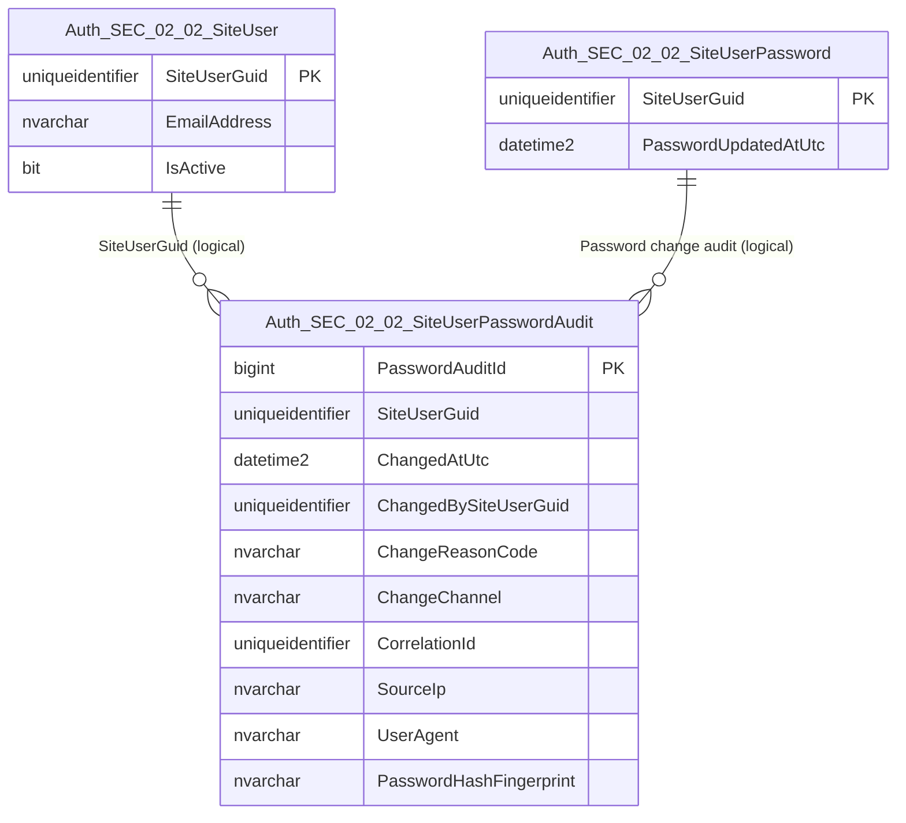
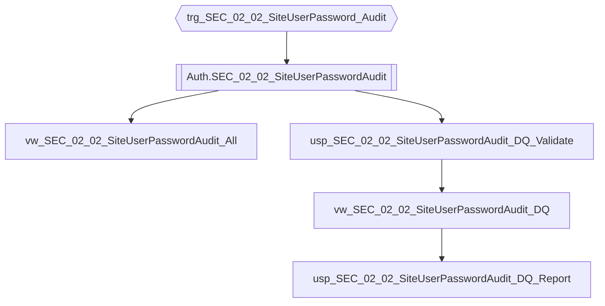

# Data Entity Specification: SEC-02.02.04 SiteUserPasswordAudit

| **Document ID** | **Version** | **Status** | **Owner (Author)** | **Reviewer** |
| :--- | :--- | :--- | :--- | :--- |
| **SEC-02.02.04** | 1.1.0 | **DRAFT** | Architect | Product Owner |

<strong>Table - 1 SEC-02.02.04  –</strong> Document control header
 

---

## 1. Description & Scope

The **SEC-02.02.04 SiteUserPasswordAudit** entity provides the **append-only audit record** of password material changes for a SiteUser.

This entity supports:
- Evidence that credential material was changed (without exposing sensitive content)
- Security investigations and governance reporting
- DQ validation of audit completeness and suspicious change patterns

---

## 2. Referential Integrity Standard

> All relationships are **logical only**.  
> No physical FOREIGN KEY constraints exist.

Logical references:
- `SiteUserGuid` → **SEC-02.02.01 SiteUser**
- `ChangedBySiteUserGuid` → **SEC-02.02.01 SiteUser** (actor; nullable for system actions)

---

## 3. ERD (Context) — One Level Only

<strong>Figure - 1 SEC-02.02.04 –</strong> One-level ERD context for SiteUserPasswordAudit
 

---

## 4. Table Definition

**Table:** `[Auth].[SEC_02_02_SiteUserPasswordAudit]`

| Column | Type | Null | Notes |
|--------|------|------|-------|
| `PasswordAuditId` | BIGINT IDENTITY | NOT NULL | Primary key for audit row. |
| `SiteUserGuid` | UNIQUEIDENTIFIER | NOT NULL | Subject identifier (User GUID). |
| `ChangedAtUtc` | DATETIME2(3) | NOT NULL | UTC timestamp of password change. |
| `ChangedBySiteUserGuid` | UNIQUEIDENTIFIER | NULL | Actor performing the change; NULL allowed for system-initiated actions. |
| `ChangeReasonCode` | NVARCHAR(50) | NULL | Optional controlled reason code (e.g., 'RESET', 'ADMIN', 'ROTATION'). |
| `ChangeChannel` | NVARCHAR(30) | NULL | Optional channel (e.g., 'WEB', 'API', 'SYSTEM'). |
| `CorrelationId` | UNIQUEIDENTIFIER | NULL | Optional request correlation identifier for traceability. |
| `SourceIp` | NVARCHAR(45) | NULL | Optional IP address (supports IPv4/IPv6). |
| `UserAgent` | NVARCHAR(500) | NULL | Optional user agent string (truncated by policy). |
| `PasswordHashFingerprint` | NVARCHAR(128) | NULL | Optional irreversible fingerprint to detect hash reuse without storing secret material. |

<strong>Table - 2 SEC-02.02.04  –</strong> Physical table definition for `[Auth].[SEC_02_02_SiteUserPasswordAudit]`
 

---

## 5. Data Management

> This section lists **only** the stored procedures, views, and triggers created **directly** to manage this entity, including DQ controls.

| Object Type | Name | Description |
|-------------|------|-------------|
| Trigger | **trg_SEC_02_02_SiteUserPassword_Audit** | Writes audit rows to this table on password INSERT/UPDATE (source entity: `SEC-02.02.02`). |
| View | **vw_SEC_02_02_SiteUserPasswordAudit_All** | Governed view returning audit rows (reverse chronological). |
| View | **vw_SEC_02_02_SiteUserPasswordAudit_DQ** | Audit DQ flags (missing timestamps, invalid actors, suspicious frequency). |
| Stored Procedure | **usp_SEC_02_02_SiteUserPasswordAudit_DQ_Validate** | Executes DQ validation rules for audit completeness and integrity. |
| Stored Procedure | **usp_SEC_02_02_SiteUserPasswordAudit_DQ_Report** | Produces a standardised DQ exception report for audit governance. |

<strong>Table - 3 SEC-02.02.04  –</strong> SiteUserPasswordAudit management objects (including DQ controls)
 

---

## 6. Data Management Diagram (Direct Objects Only)

<strong>Figure - 2 SEC-02.02.04 –</strong> Direct audit and DQ objects created for SiteUserPasswordAudit
 

---

## 7. Business Rules

- Audit rows are append-only; updates/deletes are not permitted in governed environments.
- `ChangedAtUtc` is always stored in UTC (`DATETIME2(3)`).
- `SiteUserGuid` is mandatory for every audit row.
- `ChangedBySiteUserGuid` may be NULL only for explicitly system-initiated operations.
- DQ reporting must flag:
  - missing `ChangedAtUtc`
  - audit rows with missing `SiteUserGuid`
  - unusually frequent password changes per user (policy-defined threshold)

---

## 8. Change History

| Version | Date | Author | Notes |
|---------|------|--------|-------|
| 1.1.0 | 2025-12-13 | Architect | Standardised numbering and completed DQ objects for audit integrity and suspicious pattern detection. |

<strong>Table - 4 SEC-02.02.04  –</strong> Change history
 
