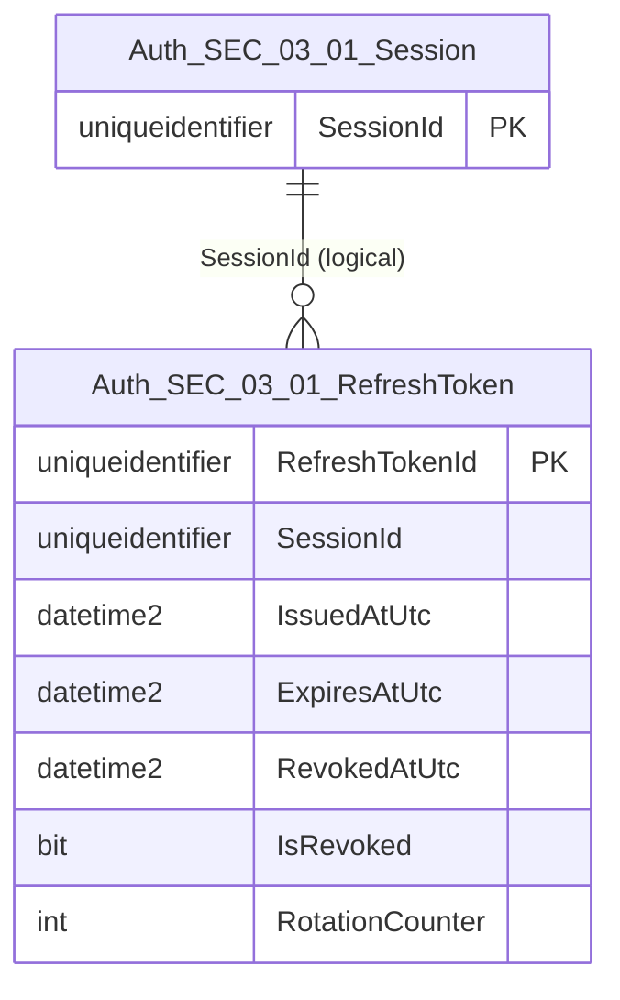
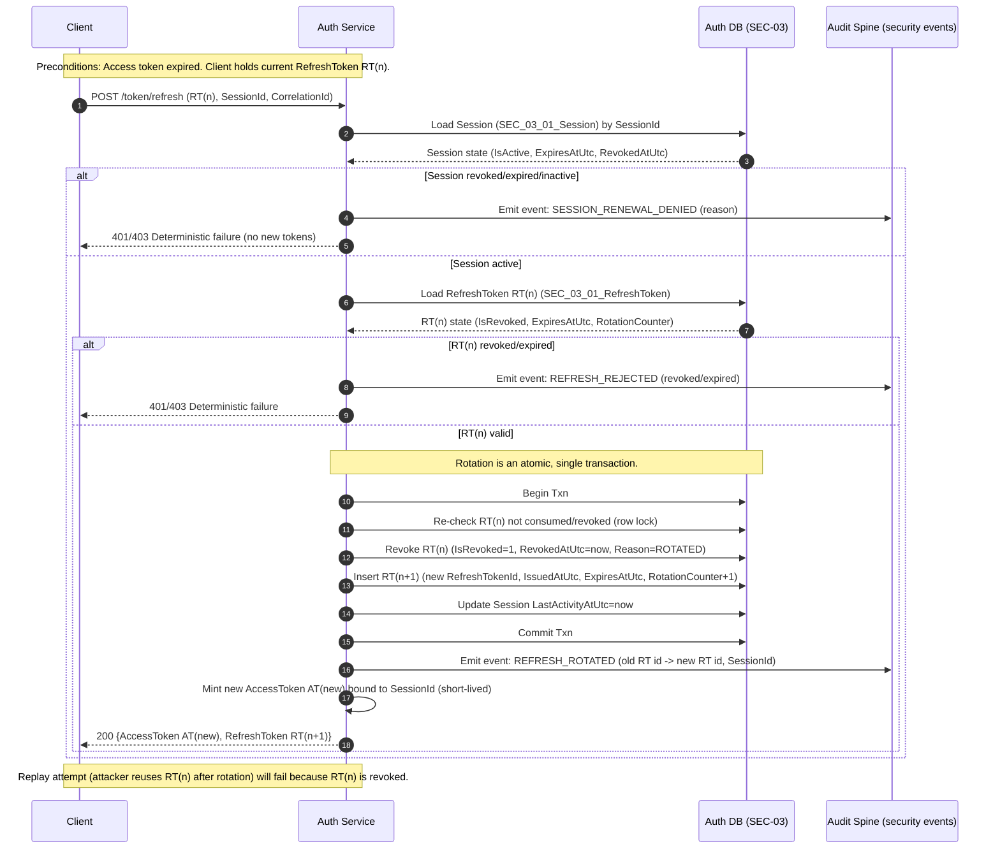

# Data Entity Specification: SEC-03.01.02 RefreshToken

| **Document ID** | **Version** | **Status** | **Owner (Author)** | **Reviewer** |
|-----------------|-------------|------------|---------------------|--------------|
| **SEC-03.01.02** | **1.0.0** | **DRAFT** | Business Architect | Product Officer |

<strong>Table – 1 SEC-03.01.02 –</strong> Document control header
 

---

## 1. Description & Scope

The **RefreshToken** entity represents a **persisted renewal artefact** bound to a session.

It supports:
- Controlled session renewal
- Rotation and replay prevention
- Deterministic revocation

---

## 2. ERD (Context)

<strong>Figure – 1 SEC-03.01.02 –</strong> RefreshToken ERD
 

---

## 3. Table Definition

**Table:** `[Auth].[SEC_03_01_RefreshToken]`

| Column | Type | Null | Notes |
|------|------|------|------|
| `RefreshTokenId` | UNIQUEIDENTIFIER | NOT NULL | Surrogate identifier |
| `SessionId` | UNIQUEIDENTIFIER | NOT NULL | Logical session reference |
| `IssuedAtUtc` | DATETIME2(3) | NOT NULL | Issuance timestamp |
| `ExpiresAtUtc` | DATETIME2(3) | NOT NULL | Expiry boundary |
| `RevokedAtUtc` | DATETIME2(3) | NULL | Revocation timestamp |
| `IsRevoked` | BIT | NOT NULL | Revocation indicator |
| `RotationCounter` | INT | NOT NULL | Replay detection |

---

## 4. Business Rules

- Refresh tokens are single-use per rotation.
- Rotation invalidates prior token.
- Revoked tokens cannot renew sessions.

---

## 5. Change History

| Version | Date | Author | Notes |
|--------|------|--------|-------|
| 1.0.0 | 2025-12-14 | Business Architect | Initial RefreshToken entity |
