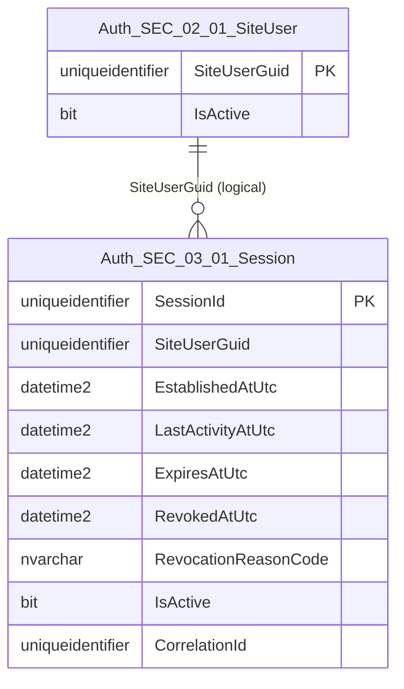

# Data Entity Specification: SEC-03.01.01 Session

| **Document ID** | **Version** | **Status** | **Owner (Author)** | **Reviewer** |
|-----------------|-------------|------------|---------------------|--------------|
| **SEC-03.01.01** | **1.0.0** | **DRAFT** | Business Architect | Product Officer |

<strong>Table – 1 SEC-03.01.01 –</strong> Document control header
 

---

## 1. Description & Scope

The **SEC-03.01.01 Session** entity represents the **authoritative logical session record** established after successful authentication.

This entity supports:
- Session establishment following authentication (SEC-02.02)
- Binding of access and refresh tokens to a session
- Enforcement of expiry, inactivity, and revocation
- Deterministic session termination across all access paths
- Auditability and governance in accordance with ISO-9001

This entity **does not store token material** and **does not perform authorisation**.

---

## 2. Relationship to SEC-03.01 Specification

This entity implements the logical behaviour defined in **SEC-03.01 Token & Session Handling**.

---

## 3. Referential Integrity Standard

> All relationships are **logical only**.  
> No physical FOREIGN KEY constraints exist.

Logical references:
- `SiteUserGuid` → **SEC-02.01 SiteUser**
- `SessionId` → referenced by token artefacts (SEC-03.01, logical)
- `CorrelationId` → unified security audit spine

---

## 4. ERD (Context) — One Level Only

<strong>Figure – 1 SEC-03.01.01 –</strong> One-level ERD context for Session
 

---

## 5. Table Definition

**Table:** `[Auth].[SEC_03_01_Session]`

| Column | Type | Null | Notes |
|------|------|------|------|
| `SessionId` | UNIQUEIDENTIFIER | NOT NULL | Primary key. Logical session identifier. |
| `SiteUserGuid` | UNIQUEIDENTIFIER | NOT NULL | Subject identifier (pseudonymised). |
| `EstablishedAtUtc` | DATETIME2(3) | NOT NULL | Session creation timestamp. |
| `LastActivityAtUtc` | DATETIME2(3) | NOT NULL | Updated on authorised activity. |
| `ExpiresAtUtc` | DATETIME2(3) | NOT NULL | Absolute expiry boundary. |
| `RevokedAtUtc` | DATETIME2(3) | NULL | Timestamp of revocation (if revoked). |
| `RevocationReasonCode` | NVARCHAR(50) | NULL | Controlled reason (e.g. LOGOUT, PASSWORD_RESET). |
| `IsActive` | BIT | NOT NULL | Active session indicator. |
| `CorrelationId` | UNIQUEIDENTIFIER | NULL | Trace identifier for audit linkage. |

<strong>Table – 2 SEC-03.01.01 –</strong> Physical table definition for Session
 

---

## 6. Data Management

| Object Type | Name | Description |
|------------|------|-------------|
| Stored Procedure | **usp_SEC_03_01_EstablishSession** | Creates a new session after authentication success. |
| Stored Procedure | **usp_SEC_03_01_UpdateSessionActivity** | Updates `LastActivityAtUtc` on authorised use. |
| Stored Procedure | **usp_SEC_03_01_RevokeSession** | Revokes a session deterministically. |
| Stored Procedure | **usp_SEC_03_01_RevokeAllUserSessions** | Revokes all active sessions for a user. |
| View | **vw_SEC_03_01_Session_Active** | Returns active, non-expired sessions. |
| View | **vw_SEC_03_01_Session_DQ** | Exposes data-quality and state-integrity flags. |
| Stored Procedure | **usp_SEC_03_01_Session_DQ_Validate** | Executes DQ validation rules. |
| Stored Procedure | **usp_SEC_03_01_Session_DQ_Report** | Standardised DQ exception reporting. |
| Trigger | **trg_SEC_03_01_Session_AuditSignal** | Emits session lifecycle events to unified audit spine. |

<strong>Table – 3 SEC-03.01.01 –</strong> Session data management objects
 

---

## 7. Data Quality Measures (DQ)

| Rule Code | Rule |
|----------|------|
| DQ-SEC-03-01-01 | `ExpiresAtUtc` must be > `EstablishedAtUtc` |
| DQ-SEC-03-01-02 | `IsActive = 0` implies `RevokedAtUtc IS NOT NULL` |
| DQ-SEC-03-01-03 | `LastActivityAtUtc` must be ≥ `EstablishedAtUtc` |
| DQ-SEC-03-01-04 | Active session must reference active user |

---

## 8. Business Rules

- A session is authoritative for renewal eligibility.
- Revoked sessions must not be renewable.
- Revocation is deterministic and irreversible.
- Session identifiers are unique and non-reusable.
- All timestamps are stored in UTC with millisecond precision.

---

## 9. Audit & Governance Alignment

- All session lifecycle events emit audit signals.
- Revocation reasons must use controlled vocabulary.
- `CorrelationId` links session behaviour to authentication and access events.

---

## 10. Change History

| Version | Date | Author | Notes |
|--------|------|--------|-------|
| 1.0.0 | 2025-12-14 | Business Architect | Initial entity implementation of SEC-03.01 |

<strong>Table – 4 SEC-03.01.01 –</strong> Change history
 