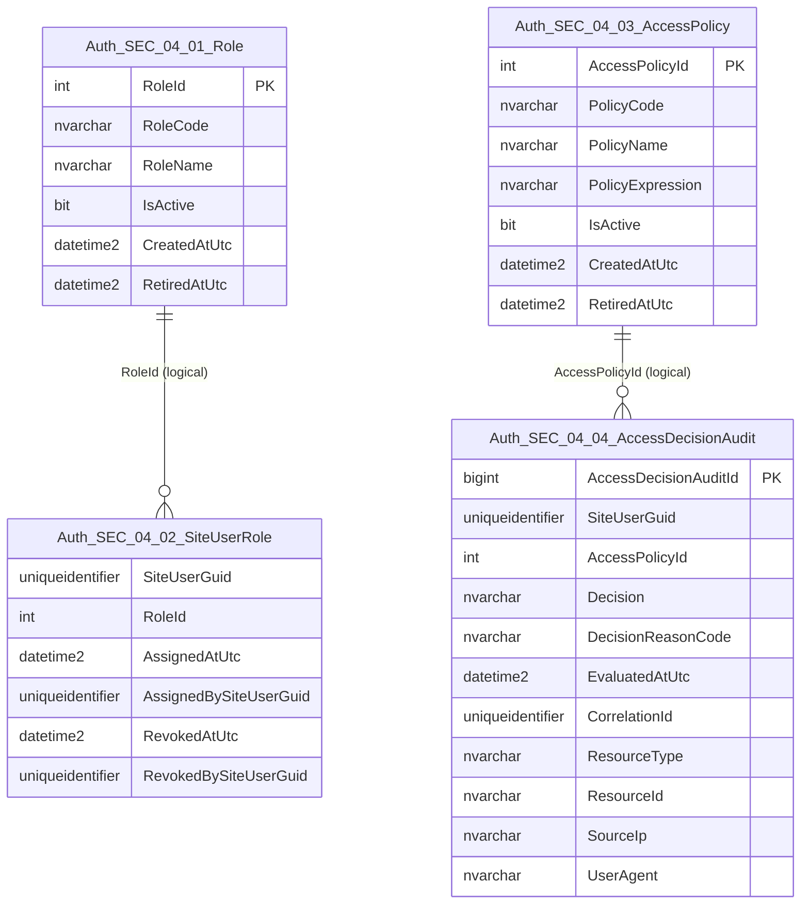

# SEC-04 — Authorisation & Access Control
## Domain Overview (ING Standard)

| **Document ID** | **Version** | **Status** | **Owner (Author)** | **Reviewer** |
| :--- | :--- | :--- | :--- |:--- |
| **SEC-04.00** | 1.0.0 | **DRAFT** | Architect | Product Owner |

<strong>Table - 1 SEC-04.00 –</strong> Document control header
 

---

## 1. Purpose

SEC-04 defines the **authorisation** domain: how permissions are defined, assigned, evaluated, and enforced.

This domain provides:
- **Role lifecycle management** (definition, retirement)
- **Role assignment & entitlement management** (user ↔ role mappings)
- **Access policy definition** (rules and criteria)
- **Access decision & enforcement audit** (grant/deny evidence)

---

## 2. Scope Boundaries

### In Scope
- Roles, entitlements, access policies
- Runtime decision records (grant / deny)
- Data quality (DQ) measures for authorisation data
- Trigger-driven audit signalling to the unified security audit spine (where implemented)

### Explicitly Out of Scope (Owned by SEC-02)
- Passwords and password reset tokens
- Credential material (hash/salt)
- Authentication session state

---

## 3. Referencing & Numbering Standard

SEC-04 uses a stable hierarchy:

- **SEC-04.01** Role Lifecycle Management
- **SEC-04.02** Role Assignment & Entitlement Management
- **SEC-04.03** Access Policy Management
- **SEC-04.04** Access Decision & Enforcement

Minor numbers are reserved for entities. Objects (procedures, views, triggers) are named consistently:
- `usp_SEC_04_<major>_<minor>_<verb><noun>`
- `vw_SEC_04_<major>_<minor>_<noun>_<purpose>`
- `trg_SEC_04_<major>_<minor>_<noun>_<purpose>`

---

## 4. Domain ERD (One-Level Neighbours Only)

<strong>Figure - 1 SEC-04.00 –</strong> One-level domain ERD for SEC-04 entities
 

---

## 5. Unified Audit Spine (Design Intention)

SEC-04 emits security-relevant signals (e.g., role grants, denials) into a **single security audit spine** (recommended design), while retaining its own purpose-built decision table for authorisation outcomes.

- Role changes and assignments SHOULD write an audit event (trigger-driven).
- Access decisions MUST be captured for governed enforcement and forensics.

---

## 6. Change History

| Version | Date | Author | Notes |
|---------|------|--------|-------|
| 1.0.0 | 2025-12-14 | Architect | Initial SEC-04 package overview aligned to ING format. |

<strong>Table - 2 SEC-04.00 –</strong> Change history
 
