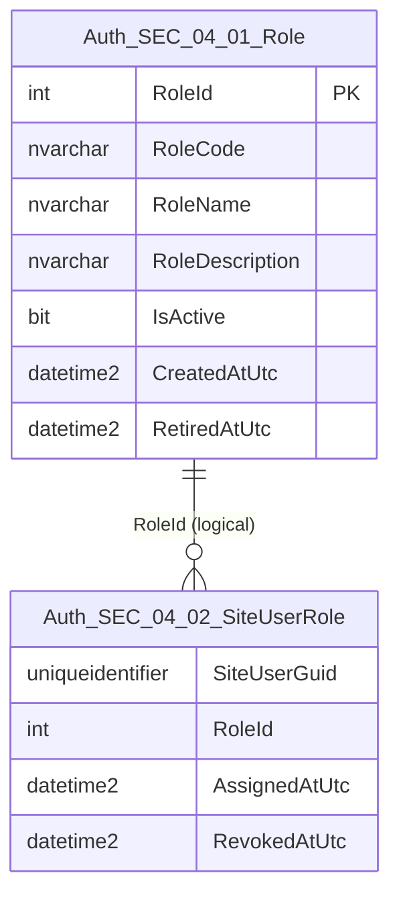
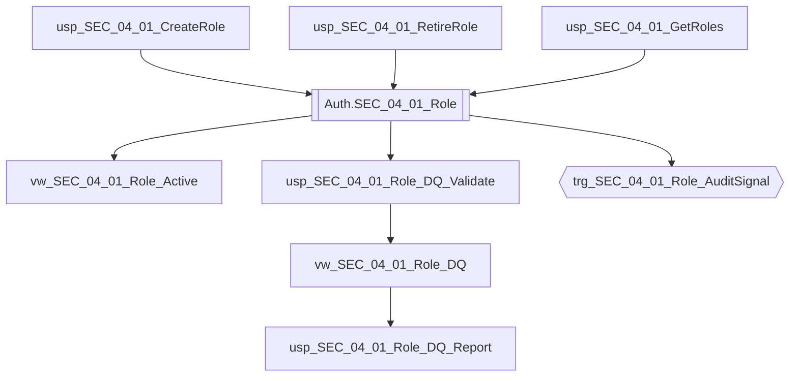

# Data Entity Specification: SEC-04.01.01 Role

| **Document ID** | **Version** | **Status** | **Owner (Author)** | **Reviewer** |
| :--- | :--- | :--- | :--- |:--- |
| **SEC-04.01.01** | 1.0.0 | **DRAFT** | Architect | Product Owner |

<strong>Table - 1 SEC-04.01.01 –</strong> Document control header
 

---

## 1. Description & Scope

The **SEC-04.01.01 Role** entity defines the **authoritative set of roles** used for entitlement resolution across the platform.

This entity supports:
- Controlled introduction of new roles (governed change)
- Role retirement (soft disable) without destroying history
- Stable identifiers for role assignments and policy evaluation

---

## 2. Referential Integrity Standard

> All relationships are **logical only**.  
> No physical FOREIGN KEY constraints exist.

Logical references:
- `RoleId` → used by **SEC-04.02.01 SiteUserRole** for assignment mapping.

---

## 3. ERD (Context) — One Level Only

<strong>Figure - 1 SEC-04.01.01 –</strong> One-level ERD context for Role
 

---

## 4. Table Definition

**Table:** `[Auth].[SEC_04_01_Role]`

| Column | Type | Null | Notes |
|--------|------|------|-------|
| `RoleId` | INT IDENTITY | NOT NULL | Primary key. Surrogate identifier. |
| `RoleCode` | NVARCHAR(50) | NOT NULL | Controlled code (e.g., `ADMIN`, `VIEWER`). Immutable after creation. |
| `RoleName` | NVARCHAR(100) | NOT NULL | Display name. |
| `RoleDescription` | NVARCHAR(500) | NULL | Optional description and usage notes. |
| `IsActive` | BIT | NOT NULL | Role enablement state. |
| `CreatedAtUtc` | DATETIME2(3) | NOT NULL | UTC issuance timestamp. |
| `RetiredAtUtc` | DATETIME2(3) | NULL | UTC timestamp when role retired (if retired). |

<strong>Table - 2 SEC-04.01.01 –</strong> Physical table definition for `[Auth].[SEC_04_01_Role]`
 

---

## 5. Data Management

> This section lists **only** the stored procedures, views, and triggers created **directly** to manage this entity, including DQ controls and audit signalling.

| Object Type | Name | Description |
|-------------|------|-------------|
| Stored Procedure | **usp_SEC_04_01_CreateRole** | Creates a new role (governed). |
| Stored Procedure | **usp_SEC_04_01_RetireRole** | Retires a role (`IsActive = 0`, sets `RetiredAtUtc`). |
| Stored Procedure | **usp_SEC_04_01_GetRoles** | Returns role catalogue (governed consumer projection). |
| View | **vw_SEC_04_01_Role_Active** | Returns active roles only. |
| View | **vw_SEC_04_01_Role_DQ** | Exposes DQ flags for role integrity (uniqueness, state consistency). |
| Stored Procedure | **usp_SEC_04_01_Role_DQ_Validate** | Executes DQ validation rules and returns pass/fail results with rule codes. |
| Stored Procedure | **usp_SEC_04_01_Role_DQ_Report** | Standardised DQ exception report for governance. |
| Trigger | **trg_SEC_04_01_Role_AuditSignal** | Emits a security event into the unified audit spine on INSERT/UPDATE (design intention). |

<strong>Table - 3 SEC-04.01.01 –</strong> Role data management objects (including DQ + audit signalling)
 

---

## 6. Data Management Diagram (Direct Objects Only)

<strong>Figure - 2 SEC-04.01.01 –</strong> Direct operational, DQ, and audit-signal objects created for Role
 

---

## 7. Data Quality Measures (DQ)

| Rule Code | Rule | Rationale |
|----------|------|-----------|
| DQ-SEC-04-ROLE-01 | `RoleCode` must be unique (case-insensitive) | Prevents ambiguous entitlement resolution. |
| DQ-SEC-04-ROLE-02 | `IsActive = 0` implies `RetiredAtUtc IS NOT NULL` | Ensures consistent retirement semantics. |
| DQ-SEC-04-ROLE-03 | `RetiredAtUtc` must be >= `CreatedAtUtc` | Prevents invalid timelines. |

---

## 8. Business Rules

- `RoleCode` is immutable once issued.
- Roles are never deleted; retirement is represented by `IsActive = 0` and `RetiredAtUtc`.
- System roles (if any) must be explicitly named and governed.
- All timestamps are stored in UTC with millisecond precision (`DATETIME2(3)`).

---

## 9. Change History

| Version | Date | Author | Notes |
|---------|------|--------|-------|
| 1.0.0 | 2025-12-14 | Architect | Initial Role entity spec aligned to SEC templates (ERD, management objects, DQ). |

<strong>Table - 4 SEC-04.01.01 –</strong> Change history
 
