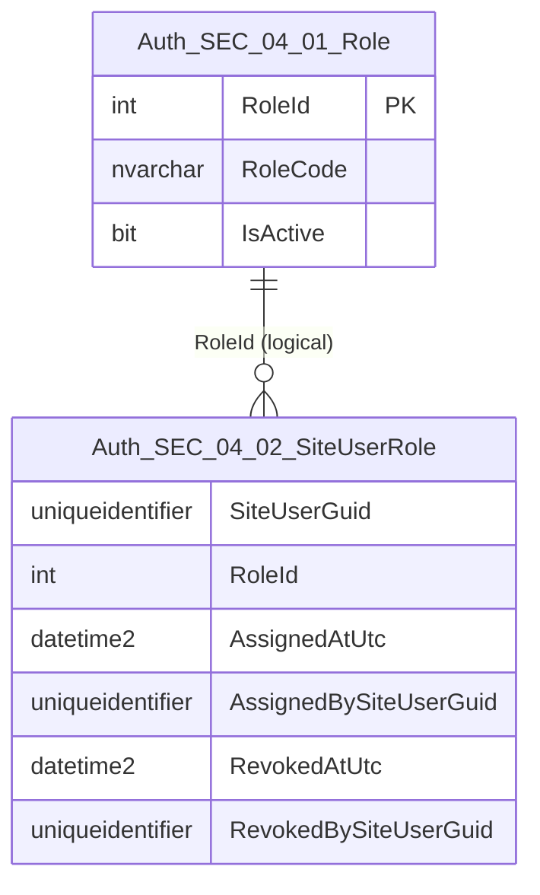
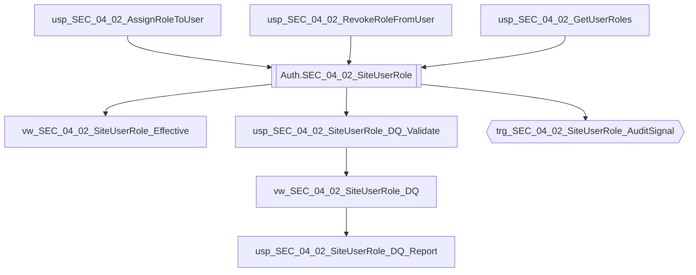

# Data Entity Specification: SEC-04.02.01 SiteUserRole

| **Document ID** | **Version** | **Status** | **Owner (Author)** | **Reviewer** |
| :--- | :--- | :--- | :--- |:--- |
| **SEC-04.02.01** | 1.0.0 | **DRAFT** | Architect | Product Owner |

<strong>Table - 1 SEC-04.02.01 –</strong> Document control header
 

---

## 1. Description & Scope

The **SEC-04.02.01 SiteUserRole** entity records **role assignments and revocations** for users.

This entity supports:
- Assigning a role to a user (grant)
- Revoking a role from a user (revoke) while retaining history
- Evidencing who performed the assignment/revocation (actor)
- DQ checks for role validity, timeline correctness, and duplicates

---

## 2. Referential Integrity Standard

> All relationships are **logical only**.  
> No physical FOREIGN KEY constraints exist.

Logical references:
- `SiteUserGuid` → **SEC-02.01 SiteUser** (identity anchor)
- `RoleId` → **SEC-04.01.01 Role**
- `AssignedBySiteUserGuid` / `RevokedBySiteUserGuid` → **SEC-02.01 SiteUser** (actor; nullable for system actions)

---

## 3. ERD (Context) — One Level Only

<strong>Figure - 1 SEC-04.02.01 –</strong> One-level ERD context for SiteUserRole
 

---

## 4. Table Definition

**Table:** `[Auth].[SEC_04_02_SiteUserRole]`

| Column | Type | Null | Notes |
|--------|------|------|-------|
| `SiteUserGuid` | UNIQUEIDENTIFIER | NOT NULL | Subject identifier (User GUID). |
| `RoleId` | INT | NOT NULL | Logical reference to Role. |
| `AssignedAtUtc` | DATETIME2(3) | NOT NULL | UTC timestamp when role granted. |
| `AssignedBySiteUserGuid` | UNIQUEIDENTIFIER | NULL | Actor granting role; NULL allowed for system actions. |
| `RevokedAtUtc` | DATETIME2(3) | NULL | UTC timestamp when role revoked (if revoked). |
| `RevokedBySiteUserGuid` | UNIQUEIDENTIFIER | NULL | Actor revoking role; NULL allowed for system actions. |

<strong>Table - 2 SEC-04.02.01 –</strong> Physical table definition for `[Auth].[SEC_04_02_SiteUserRole]`
 

---

## 5. Data Management

> This section lists **only** the stored procedures, views, and triggers created **directly** to manage this entity, including DQ controls and audit signalling.

| Object Type | Name | Description |
|-------------|------|-------------|
| Stored Procedure | **usp_SEC_04_02_AssignRoleToUser** | Assigns a role to a user (writes assignment). |
| Stored Procedure | **usp_SEC_04_02_RevokeRoleFromUser** | Revokes a role from a user (sets revoke fields). |
| Stored Procedure | **usp_SEC_04_02_GetUserRoles** | Returns effective roles for a user (active assignments only). |
| View | **vw_SEC_04_02_SiteUserRole_Effective** | Active assignments: `RevokedAtUtc IS NULL` and role active. |
| View | **vw_SEC_04_02_SiteUserRole_DQ** | Exposes DQ flags (duplicates, invalid timelines, inactive role usage). |
| Stored Procedure | **usp_SEC_04_02_SiteUserRole_DQ_Validate** | Executes DQ validation rules and returns pass/fail results with rule codes. |
| Stored Procedure | **usp_SEC_04_02_SiteUserRole_DQ_Report** | Standardised DQ exception report for governance and security review. |
| Trigger | **trg_SEC_04_02_SiteUserRole_AuditSignal** | Emits role grant/revoke events to unified audit spine on INSERT/UPDATE (design intention). |

<strong>Table - 3 SEC-04.02.01 –</strong> SiteUserRole management objects (including DQ + audit signalling)
 

---

## 6. Data Management Diagram (Direct Objects Only)

<strong>Figure - 2 SEC-04.02.01 –</strong> Direct operational, DQ, and audit-signal objects created for SiteUserRole
 

---

## 7. Data Quality Measures (DQ)

| Rule Code | Rule | Rationale |
|----------|------|-----------|
| DQ-SEC-04-SUR-01 | `AssignedAtUtc` must not be NULL | Assignment must be time-bound evidence. |
| DQ-SEC-04-SUR-02 | `RevokedAtUtc` (if present) must be >= `AssignedAtUtc` | Prevents invalid timelines. |
| DQ-SEC-04-SUR-03 | Duplicate active assignments (same user + role with `RevokedAtUtc IS NULL`) must not exist | Prevents ambiguous entitlement. |
| DQ-SEC-04-SUR-04 | Active assignments must reference an active role (`Role.IsActive = 1`) | Prevents retired roles being effective. |

---

## 8. Business Rules

- A user may have multiple roles.
- Revocation does not delete history: revocation is timestamp-based.
- `AssignedBySiteUserGuid` and `RevokedBySiteUserGuid` may be NULL only for explicit system actions.
- Effective roles are defined as assignments where:
  - `RevokedAtUtc IS NULL`, and
  - the referenced role is active.

---

## 9. Change History

| Version | Date | Author | Notes |
|---------|------|--------|-------|
| 1.0.0 | 2025-12-14 | Architect | Initial SiteUserRole entity spec aligned to SEC templates (ERD, management objects, DQ). |

<strong>Table - 4 SEC-04.02.01 –</strong> Change history
 
