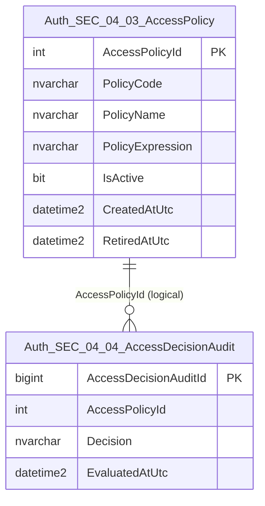
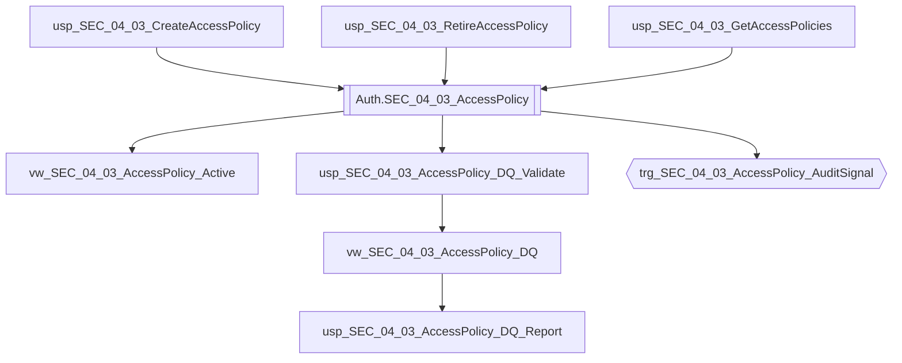

# Data Entity Specification: SEC-04.03.01 AccessPolicy

| **Document ID** | **Version** | **Status** | **Owner (Author)** | **Reviewer** |
| :--- | :--- | :--- | :--- |:--- |
| **SEC-04.03.01** | 1.0.0 | **DRAFT** | Architect | Product Owner |

<strong>Table - 1 SEC-04.03.01 –</strong> Document control header
 

---

## 1. Description & Scope

The **SEC-04.03.01 AccessPolicy** entity defines **governed access rules** used by the runtime authorisation engine.

Policies are evaluated to produce decisions (GRANT/DENY) and do not directly store user credentials.

This entity supports:
- Standardised policy codes and naming
- Expression-based evaluation (e.g., role, resource, attributes)
- Controlled activation and retirement of policies

---

## 2. Referential Integrity Standard

> All relationships are **logical only**.  
> No physical FOREIGN KEY constraints exist.

Logical references:
- `AccessPolicyId` → used by **SEC-04.04.01 AccessDecisionAudit** as the evaluated policy reference.

---

## 3. ERD (Context) — One Level Only

<strong>Figure - 1 SEC-04.03.01 –</strong> One-level ERD context for AccessPolicy
 

---

## 4. Table Definition

**Table:** `[Auth].[SEC_04_03_AccessPolicy]`

| Column | Type | Null | Notes |
|--------|------|------|-------|
| `AccessPolicyId` | INT IDENTITY | NOT NULL | Primary key. |
| `PolicyCode` | NVARCHAR(80) | NOT NULL | Controlled code (immutable) used by enforcement. |
| `PolicyName` | NVARCHAR(150) | NOT NULL | Human-readable name. |
| `PolicyExpression` | NVARCHAR(MAX) | NOT NULL | Evaluatable expression (policy engine-defined syntax). |
| `IsActive` | BIT | NOT NULL | Policy activation state. |
| `CreatedAtUtc` | DATETIME2(3) | NOT NULL | UTC issuance timestamp. |
| `RetiredAtUtc` | DATETIME2(3) | NULL | UTC timestamp when retired (if retired). |

<strong>Table - 2 SEC-04.03.01 –</strong> Physical table definition for `[Auth].[SEC_04_03_AccessPolicy]`
 

---

## 5. Data Management

| Object Type | Name | Description |
|-------------|------|-------------|
| Stored Procedure | **usp_SEC_04_03_CreateAccessPolicy** | Creates a new policy (governed). |
| Stored Procedure | **usp_SEC_04_03_RetireAccessPolicy** | Retires policy (`IsActive = 0`, sets `RetiredAtUtc`). |
| Stored Procedure | **usp_SEC_04_03_GetAccessPolicies** | Returns policy catalogue for administration / governance. |
| View | **vw_SEC_04_03_AccessPolicy_Active** | Active policies only. |
| View | **vw_SEC_04_03_AccessPolicy_DQ** | DQ flags (uniqueness, state integrity, empty expressions). |
| Stored Procedure | **usp_SEC_04_03_AccessPolicy_DQ_Validate** | Executes DQ rules and returns results with rule codes. |
| Stored Procedure | **usp_SEC_04_03_AccessPolicy_DQ_Report** | Standardised DQ exception report for policy governance. |
| Trigger | **trg_SEC_04_03_AccessPolicy_AuditSignal** | Emits policy create/retire events to unified audit spine on INSERT/UPDATE (design intention). |

<strong>Table - 3 SEC-04.03.01 –</strong> AccessPolicy management objects (including DQ + audit signalling)
 

---

## 6. Data Management Diagram (Direct Objects Only)

<strong>Figure - 2 SEC-04.03.01 –</strong> Direct operational, DQ, and audit-signal objects created for AccessPolicy
 

---

## 7. Data Quality Measures (DQ)

| Rule Code | Rule | Rationale |
|----------|------|-----------|
| DQ-SEC-04-AP-01 | `PolicyCode` must be unique (case-insensitive) | Prevents ambiguous enforcement selection. |
| DQ-SEC-04-AP-02 | `PolicyExpression` must not be empty | Prevents non-deterministic evaluations. |
| DQ-SEC-04-AP-03 | `IsActive = 0` implies `RetiredAtUtc IS NOT NULL` | Ensures consistent retirement semantics. |

---

## 8. Business Rules

- `PolicyCode` is immutable once issued.
- Policies are never deleted; retirement is represented by `IsActive = 0` and `RetiredAtUtc`.
- Policies must be testable and deterministic under the policy engine.
- All timestamps are stored in UTC with millisecond precision (`DATETIME2(3)`).

---

## 9. Change History

| Version | Date | Author | Notes |
|---------|------|--------|-------|
| 1.0.0 | 2025-12-14 | Architect | Initial AccessPolicy entity spec aligned to SEC templates (ERD, management objects, DQ). |

<strong>Table - 4 SEC-04.03.01 –</strong> Change history
 
