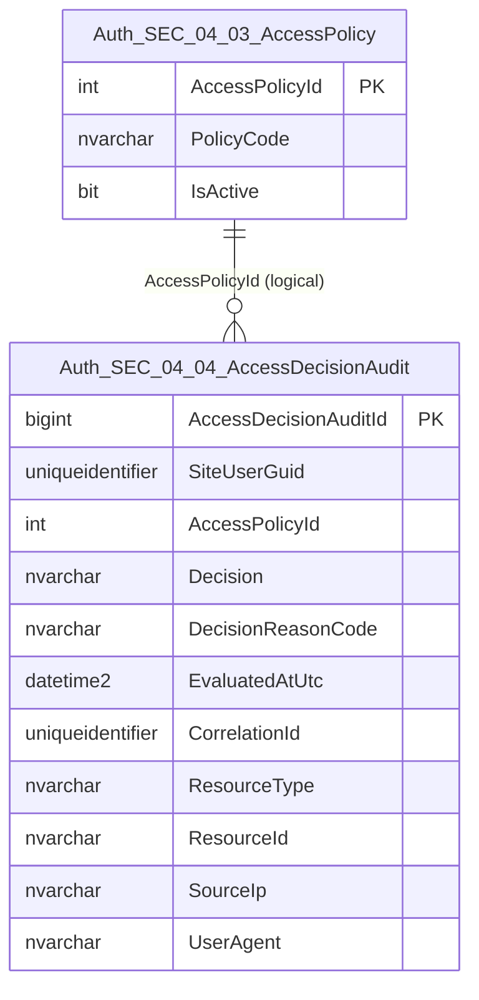
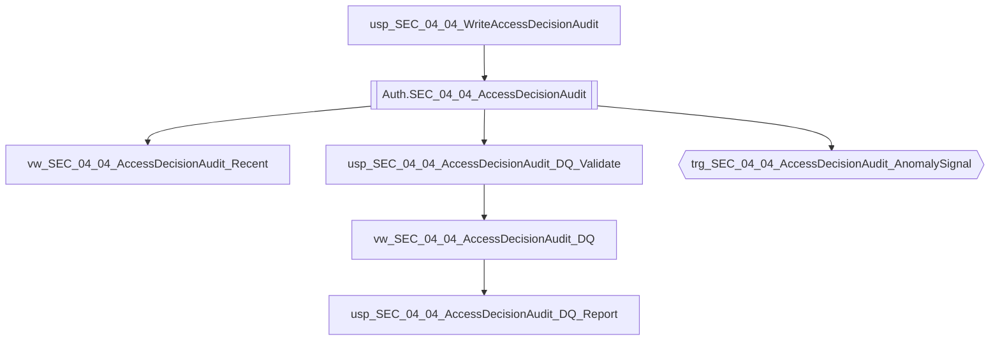

# Data Entity Specification: SEC-04.04.01 AccessDecisionAudit

| **Document ID** | **Version** | **Status** | **Owner (Author)** | **Reviewer** |
| :--- | :--- | :--- | :--- |:--- |
| **SEC-04.04.01** | 1.0.0 | **DRAFT** | Architect | Product Owner |

<strong>Table - 1 SEC-04.04.01 –</strong> Document control header
 

---

## 1. Description & Scope

The **SEC-04.04.01 AccessDecisionAudit** entity provides the **append-only evidence** of authorisation decisions.

This entity supports:
- Forensic evidence of GRANT/DENY outcomes
- Policy governance and tuning (decision reason codes)
- Security monitoring for abnormal denial rates
- DQ validation of decision completeness and traceability

This table must not contain credential material or secrets.

---

## 2. Referential Integrity Standard

> All relationships are **logical only**.  
> No physical FOREIGN KEY constraints exist.

Logical references:
- `SiteUserGuid` → **SEC-02.01 SiteUser** (subject)
- `AccessPolicyId` → **SEC-04.03.01 AccessPolicy**
- `CorrelationId` → request trace identifier (cross-domain linkage)

---

## 3. ERD (Context) — One Level Only

<strong>Figure - 1 SEC-04.04.01 –</strong> One-level ERD context for AccessDecisionAudit
 

---

## 4. Table Definition

**Table:** `[Auth].[SEC_04_04_AccessDecisionAudit]`

| Column | Type | Null | Notes |
|--------|------|------|-------|
| `AccessDecisionAuditId` | BIGINT IDENTITY | NOT NULL | Primary key for audit row. |
| `SiteUserGuid` | UNIQUEIDENTIFIER | NULL | Subject identifier (User GUID). NULL permitted for anonymous/system decisions (policy-defined). |
| `AccessPolicyId` | INT | NOT NULL | Evaluated policy reference. |
| `Decision` | NVARCHAR(10) | NOT NULL | `GRANT` or `DENY`. |
| `DecisionReasonCode` | NVARCHAR(80) | NULL | Required for `DENY` (policy-defined). |
| `EvaluatedAtUtc` | DATETIME2(3) | NOT NULL | UTC decision timestamp. |
| `CorrelationId` | UNIQUEIDENTIFIER | NULL | Trace identifier linking to request context. |
| `ResourceType` | NVARCHAR(80) | NULL | Optional resource classification (e.g., `ARTICLE`, `ADMIN_PANEL`). |
| `ResourceId` | NVARCHAR(120) | NULL | Optional resource identifier (string to support multiple systems). |
| `SourceIp` | NVARCHAR(45) | NULL | Optional IP address (IPv4/IPv6). |
| `UserAgent` | NVARCHAR(500) | NULL | Optional user agent string (truncated by policy). |

<strong>Table - 2 SEC-04.04.01 –</strong> Physical table definition for `[Auth].[SEC_04_04_AccessDecisionAudit]`
 

---

## 5. Data Management

| Object Type | Name | Description |
|-------------|------|-------------|
| Stored Procedure | **usp_SEC_04_04_WriteAccessDecisionAudit** | Writes a decision row (runtime enforcement). |
| View | **vw_SEC_04_04_AccessDecisionAudit_Recent** | Recent decisions (time-windowed governed view). |
| View | **vw_SEC_04_04_AccessDecisionAudit_DQ** | DQ flags (missing decision, missing reason, invalid timestamps). |
| Stored Procedure | **usp_SEC_04_04_AccessDecisionAudit_DQ_Validate** | Executes DQ rules and returns results with rule codes. |
| Stored Procedure | **usp_SEC_04_04_AccessDecisionAudit_DQ_Report** | Standardised DQ exception report for security and governance. |
| Trigger | **trg_SEC_04_04_AccessDecisionAudit_AnomalySignal** | Emits anomaly signals to unified audit spine for high DENY rates / suspicious patterns (design intention). |

<strong>Table - 3 SEC-04.04.01 –</strong> AccessDecisionAudit management objects (including DQ + anomaly signalling)
 

---

## 6. Data Management Diagram (Direct Objects Only)

<strong>Figure - 2 SEC-04.04.01 –</strong> Direct operational, DQ, and anomaly-signal objects created for AccessDecisionAudit
 

---

## 7. Data Quality Measures (DQ)

| Rule Code | Rule | Rationale |
|----------|------|-----------|
| DQ-SEC-04-ADA-01 | `Decision` must be `GRANT` or `DENY` | Prevents invalid enforcement evidence. |
| DQ-SEC-04-ADA-02 | `DENY` implies `DecisionReasonCode IS NOT NULL` | Ensures denial explainability. |
| DQ-SEC-04-ADA-03 | `EvaluatedAtUtc` must not be NULL | Ensures chronological evidence. |
| DQ-SEC-04-ADA-04 | `SourceIp` length must be <= 45 | Ensures IPv4/IPv6 compatibility. |

**Anomaly triggers (recommended):**
- High DENY rate per user in time window
- High DENY rate per IP in time window
- Repeated DENY for privileged resources

---

## 8. Business Rules

- Audit rows are append-only; updates/deletes are not permitted in governed environments.
- Decisions must be traceable via `CorrelationId` where available.
- If anonymous access is permitted, `SiteUserGuid` may be NULL by policy.
- All timestamps are stored in UTC with millisecond precision (`DATETIME2(3)`).

---

## 9. Change History

| Version | Date | Author | Notes |
|---------|------|--------|-------|
| 1.0.0 | 2025-12-14 | Architect | Initial AccessDecisionAudit entity spec aligned to SEC templates (ERD, management objects, DQ). |

<strong>Table - 4 SEC-04.04.01 –</strong> Change history
 
