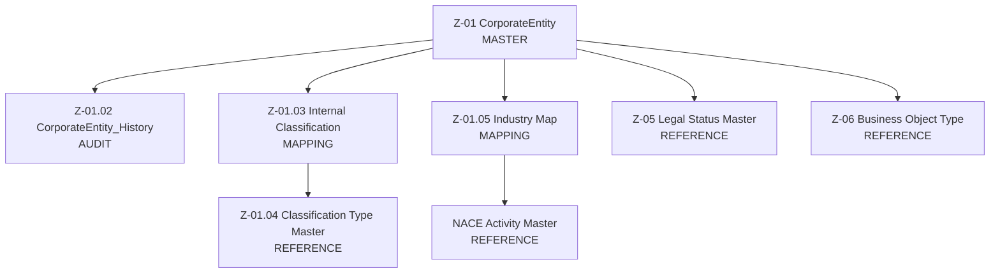

# Z-01 Domain Overview — Corporate Entity Master

**Domain:** Corporate Entity  
**Purpose:** Single, governed source of truth for legal and organisational identity  
**Standard:** ING-style Master / Reference / Mapping architecture  

---

## 1. Domain Purpose (Why Z-01 Exists)

The **Z-01 CorporateEntity domain** defines the authoritative representation of *who the organisation is*, legally and structurally.

It provides:

- A **single master identity** for every legal entity and organisational unit
- A **stable integration anchor** (`CorporateEntityGuid`) across all domains
- A **governed hierarchy** for consolidation, reporting, and risk aggregation
- A **controlled classification framework** for internal and regulatory use
- A **full audit trail** enabling temporal reconstruction and compliance

Z-01 is deliberately **non-transactional** and **non-domain-specific**.  
It exists to be *consumed*, not extended ad hoc.

---

## 2. Master / Reference / Mapping Model

### Conceptual Roles

| Layer | Purpose | Z-01 Objects |
|-----|--------|-------------|
| **Master** | Things that exist and have identity | Z-01 CorporateEntity |
| **History** | Immutable audit of master changes | Z-01.02 CorporateEntity_History |
| **Reference** | Controlled vocabularies | Z-01.04 Classification_Type_Master Z-05 Legal_Status_Master Z-06 Business_Object_Type NACE_Activity_Master |
| **Mapping** | Relationships & assignments | Z-01.03 Internal Classification Z-01.05 Industry Map |

---

## 3. Visual Domain Map

---

## 4. Consumption by Downstream Domains

Z-01 is consumed consistently across domains using `CorporateEntityGuid`.

### Finance
- Legal entity consolidation
- Group reporting structures
- Statutory reporting boundaries
- Entity-level chart-of-accounts alignment

### ESG
- Industry exposure via NACE mapping
- Group-level materiality assessment
- Historical reporting (“as-at” structure)
- Legal entity responsibility tracking

### Risk & Compliance
- KYC / AML entity identification
- Sanctions and sector screening
- Risk aggregation by legal structure
- Regulatory audit traceability

### Procurement & Supply Chain
- Supplier linkage to legal entity
- Spend analysis by group entity
- Cross-border procurement visibility
- Alignment with supplier activity mappings

---

## 5. Governance Principles

- **Single ownership:** CorporateEntity is owned and stewarded centrally
- **No physical FKs:** Referential integrity enforced logically
- **No code repurposing:** Reference codes are immutable in meaning
- **Explicit audit policy:** Structural and legal changes are historised
- **Separation of concerns:**  
  - Master = identity  
  - Reference = vocabulary  
  - Mapping = relationships  

---

## 6. Architectural Position

Z-01 sits at the **root of the enterprise data model**.

All regulated, financial, and risk-sensitive domains depend on it for:

- Identity correctness
- Structural consistency
- Auditability
- Cross-domain alignment

> If Z-01 is wrong, every report is wrong.

---
