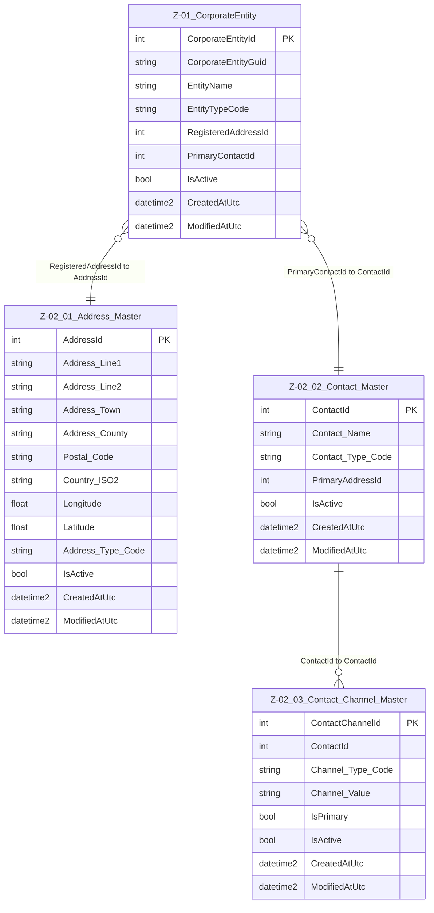

# Data Entity Specification: Z-02 Address & Contacts

| **Document ID** | **Version** | **Status** | **Owner (Author)** | **Approved By** | **Approved On** |
| :--- | :--- | :--- | :--- | :--- | :--- |
| Z-02 | 1.0.0 | **DRAFT** | Business Architect | Product Officer |  |

## 1. Description & Scope

The **Z-02 Address & Contacts** family defines the shared structures used to hold physical addresses, contact parties, and their communication channels (email, telephone, etc.).  

These entities are **cross-domain** and may be referenced by Corporate Entities, Suppliers, Sites, and other business objects.  

> **Note on referential integrity standard**  
> Logical relationships are shown in the ERD for clarity and enforced in **application and reporting layers**.  
> In line with the agreed standard, **no physical FOREIGN KEY constraints** are implemented in the database.

The Z-02 family currently contains:

- **Z-02.01 Address_Master** – canonical physical/postal address.
- **Z-02.02 Contact_Master** – the contact party (person, team, or generic contact).
- **Z-02.03 Contact_Channel_Master** – email, phone and other channels linked to a contact.

The diagram also shows how Z-02 integrates with **Z-01 CorporateEntity**, via logical pointer columns.
See dedicated pages for the entity for further details.
---

## 2. Entity–Relationship Diagram (ERD)

---
