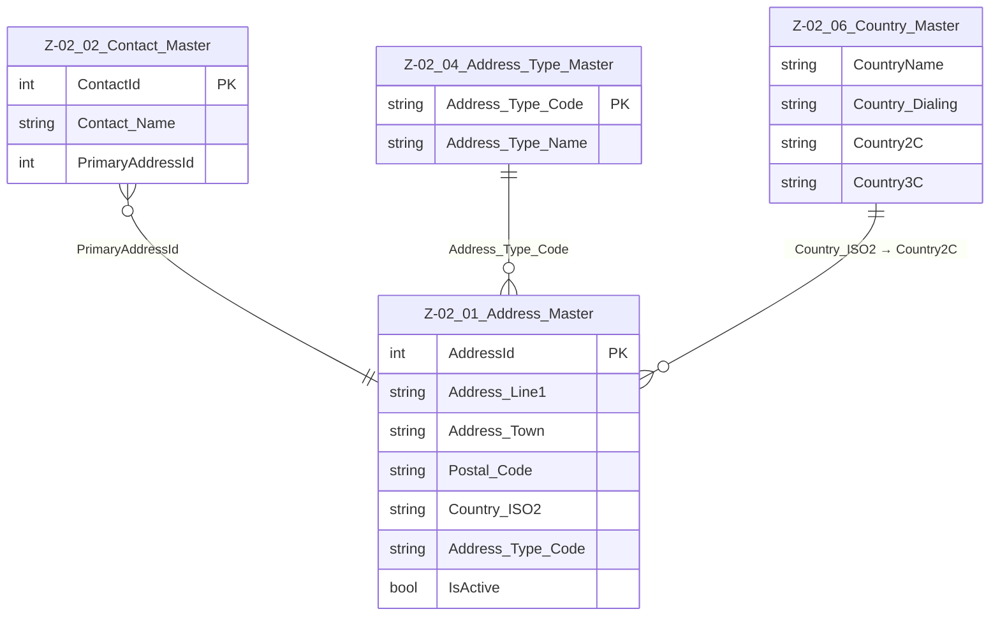

# Data Entity Specification: Z-02.01 Address_Master

| **Document ID** | **Version** | **Status** | **Owner (Author)** | **Approved By** | **Approved On** |
| :--- | :--- | :--- | :--- | :--- | :--- |
| Z-02.01 | 1.2.0 | **DRAFT** | Business Architect | Product Officer |  |

## 1. Description & Scope

The **Z-02.01 Address_Master** entity defines the canonical, reusable structure for postal and physical addresses used across the enterprise.

Addresses may be referenced logically by:

- Z‑01 CorporateEntity  
- Z‑02.02 Contact_Master  
- Other domains (Sites, Suppliers, Facilities, Assets)

Address_Master is a **shared master-data entity**, providing a single source of truth for all address definitions.

## 2. Referential Integrity Standard

> **Referential Integrity Standard**  
> Relationships involving Address_Master are **logical only** — application and reporting layers enforce correctness.  
> No physical FOREIGN KEY constraints are created at database level.

The physical implementation of this entity is:

- **Table**: `[Core].[Z_02_01_Address_Master]`

---

## 3. Entity–Relationship Diagram (Context)

---

## 4. Table Definition

**Physical table name:** `[Core].[Z_02_01_Address_Master]`

| Column | Type | Nullability | Notes |
|--------|------|-------------|-------|
| `AddressId` | INT IDENTITY(1,1) | NOT NULL | Primary key |
| `Address_Line1` | NVARCHAR(250) | NULL | Address line |
| `Address_Line2` | NVARCHAR(250) | NULL | Secondary line |
| `Address_Town` | NVARCHAR(250) | NULL | Town / City |
| `Address_County` | NVARCHAR(150) | NULL | Region / County |
| `Postal_Code` | NVARCHAR(20) | NULL | Postcode / ZIP |
| `Country_ISO2` | CHAR(2) | NULL | Logical FK → Z-02.06 Country_Master.Country2C (ISO 3166-1 Alpha-2 country code) |
| `Address_Type_Code` | NVARCHAR(50) | NOT NULL | Logical FK → Z‑02.04 |
| `Longitude` | DECIMAL(9,6) | NULL | Geo coordinate |
| `Latitude` | DECIMAL(9,6) | NULL | Geo coordinate |
| `IsActive` | BIT | NOT NULL DEFAULT 1 | Marks record active/inactive |
| `Created_By` | UNIQUEIDENTIFIER | NULL | Audit: creator |
| `Created_AtUtc` | DATETIME2(3) | NOT NULL | Audit: creation time |
| `Modified_By` | UNIQUEIDENTIFIER | NULL | Audit: last modified by |
| `Modified_AtUtc` | DATETIME2(3) | NULL | Audit: last modification time |

---

## 5. Data Management

| Object Type | Name | Description |
|-------------|------|-------------|
| **Stored Procedure** | **usp_Z_02_01_Address_Create** | Creates a new address, validates Address_Type_Code against Z‑02.04, sets audit values. |
| **Stored Procedure** | **usp_Z_02_01_Address_Update** | Updates an existing address, ensuring address identity rules and proper audit tracking. |
| **Stored Procedure** | **usp_Z_02_01_Address_Get** | Retrieves a specific address by AddressId for application services. |
| **View** | **vw_Z_02_01_Address_AllActive** | Returns all active addresses, used by UI dropdowns and reporting components. |
| **Governance Process** | **Address Stewardship Workflow** | Ensures all address changes follow data-governance approval and ISO9001 traceability. |
| **DQ Process** | **DQ_Address_ValidationReport** | Identifies invalid Address_Type_Code values, inactive references, or malformed geography data. |

---

## 6. Data Quality & Business Rules

- All addresses must reference a valid `Address_Type_Code` from Z‑02.04.  
- ISO country codes must follow ISO‑3166‑1 Alpha‑2.  
- Geolocation fields, if provided, must be valid coordinates.  
- Duplicate addresses should be prevented by application logic.  
- `IsActive = 0` must be used instead of deleting addresses.

---

## 7. Audit & Change History

Address_Master tracks all changes using:

- `Created_By`, `Created_AtUtc`  
- `Modified_By`, `Modified_AtUtc`

Additional historical logging (e.g., address versioning) may be added later if required by compliance or regulatory frameworks.
