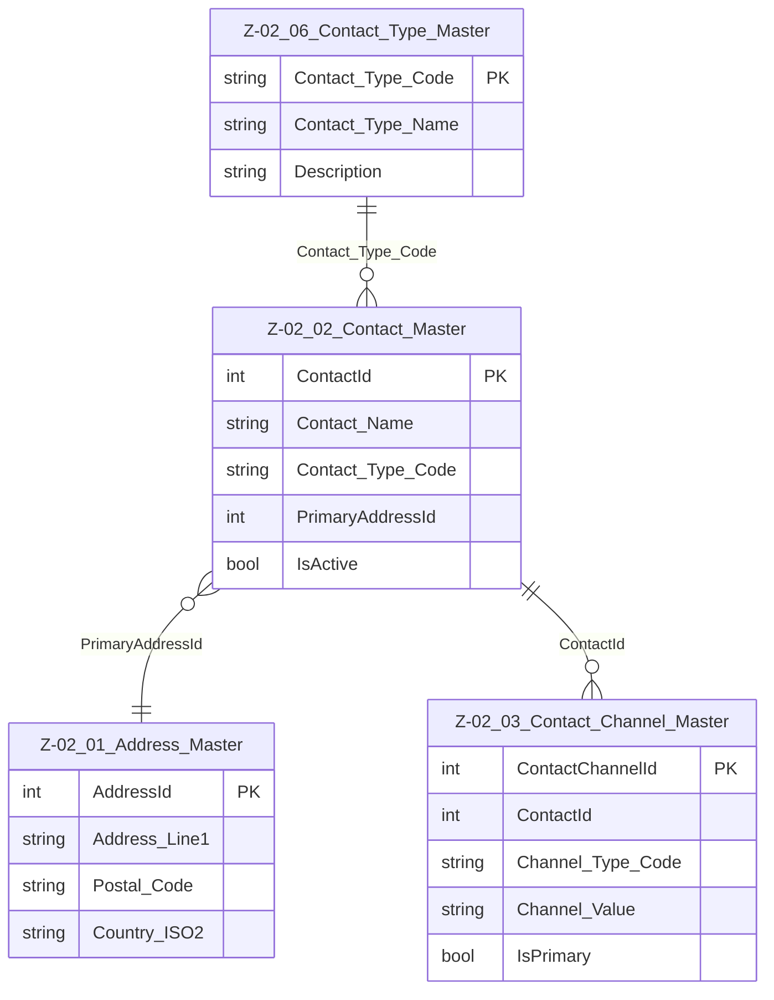

# Data Entity Specification: Z-02.02 Contact_Master

| **Document ID** | **Version** | **Status** | **Owner (Author)** | **Approved By** | **Approved On** |
| :--- | :--- | :--- | :--- | :--- | :--- |
| Z-02.02 | 1.3.0 | **DRAFT** | Business Architect | Product Officer |  |

## 1. Description & Scope

The **Z-02.02 Contact_Master** entity represents a **contact party** for the organisation.  
A contact may be:

- An individual person (e.g. *Jane Doe*)  
- A role-based contact (e.g. *Accounts Payable*)  
- A team or function (e.g. *ESG Reporting Team*)

Contacts may be associated with:

- One or more **CorporateEntities**  
- One or more communication channels via **Z-02.03 Contact_Channel_Master**  
- A primary address via **Z-02.01 Address_Master**  
- A contact type classification via **Z-02.06 Contact_Type_Master**

Contact_Master is a shared master-data entity, reused across Corporate, Supplier, ESG and Operations domains.

---

## 2. Referential Integrity Standard

> **Referential Integrity Standard**  
> Relationships involving Contact_Master are **logical only** — enforced by applications and reporting layers.  
> No physical FOREIGN KEY constraints are created at database level.

The physical implementation is:

- **Table**: `[Core].[Z_02_02_Contact_Master]`

---

## 3. Entity–Relationship Diagram (Context)

---

## 4. Table Definition

**Physical table name:** `[Core].[Z_02_02_Contact_Master]`

| Column | Type | Nullability | Notes |
|--------|------|-------------|-------|
| `ContactId` | INT IDENTITY(1,1) | NOT NULL | Primary key |
| `Contact_Name` | NVARCHAR(250) | NOT NULL | Person, team or role name |
| `Contact_Type_Code` | NVARCHAR(50) | NOT NULL | Logical FK → Z‑02.06 Contact_Type_Master |
| `PrimaryAddressId` | INT | NULL | Logical FK → Z‑02.01 Address_Master |
| `IsActive` | BIT | NOT NULL DEFAULT 1 | Active/inactive soft-delete flag |
| `Created_By` | UNIQUEIDENTIFIER | NULL | Audit |
| `Created_AtUtc` | DATETIME2(3) | NOT NULL | Audit |
| `Modified_By` | UNIQUEIDENTIFIER | NULL | Audit |
| `Modified_AtUtc` | DATETIME2(3) | NULL | Audit |

---

## 5. Data Management

| Object Type | Name | Description |
|-------------|------|-------------|
| **Stored Procedure** | **usp_Z_02_02_Contact_Create** | Validates Contact_Type_Code, validates PrimaryAddressId, sets audit fields, creates contact |
| **Stored Procedure** | **usp_Z_02_02_Contact_Update** | Updates name, type, address and IsActive flag |
| **Stored Procedure** | **usp_Z_02_02_Contact_Get** | Retrieves one contact by ContactId |
| **View** | **vw_Z_02_02_Contacts_AllActive** | Returns all active contacts |
| **Governance Process** | **Contact Stewardship Workflow** | Ensures correct creation/update/deactivation |
| **DQ Process** | **DQ_Contact_ValidationReport** | Detects invalid Contact_Type_Code, missing channels, orphan addresses |

---

## 6. Data Quality & Business Rules

- `Contact_Type_Code` **must exist** in Z‑02.06 Contact_Type_Master  
- Contacts must not be duplicated for the same logical party  
- `PrimaryAddressId` should be provided when applicable  
- `IsActive = 0` replaces hard deletion  
- Contact_Master is the authoritative source for all contact identities  

---

## 7. Audit & Change History

Tracks lifecycle using:

- `Created_By`, `Created_AtUtc`  
- `Modified_By`, `Modified_AtUtc`

More detailed lifecycle history may be stored in mapping/relationship entities where needed.
