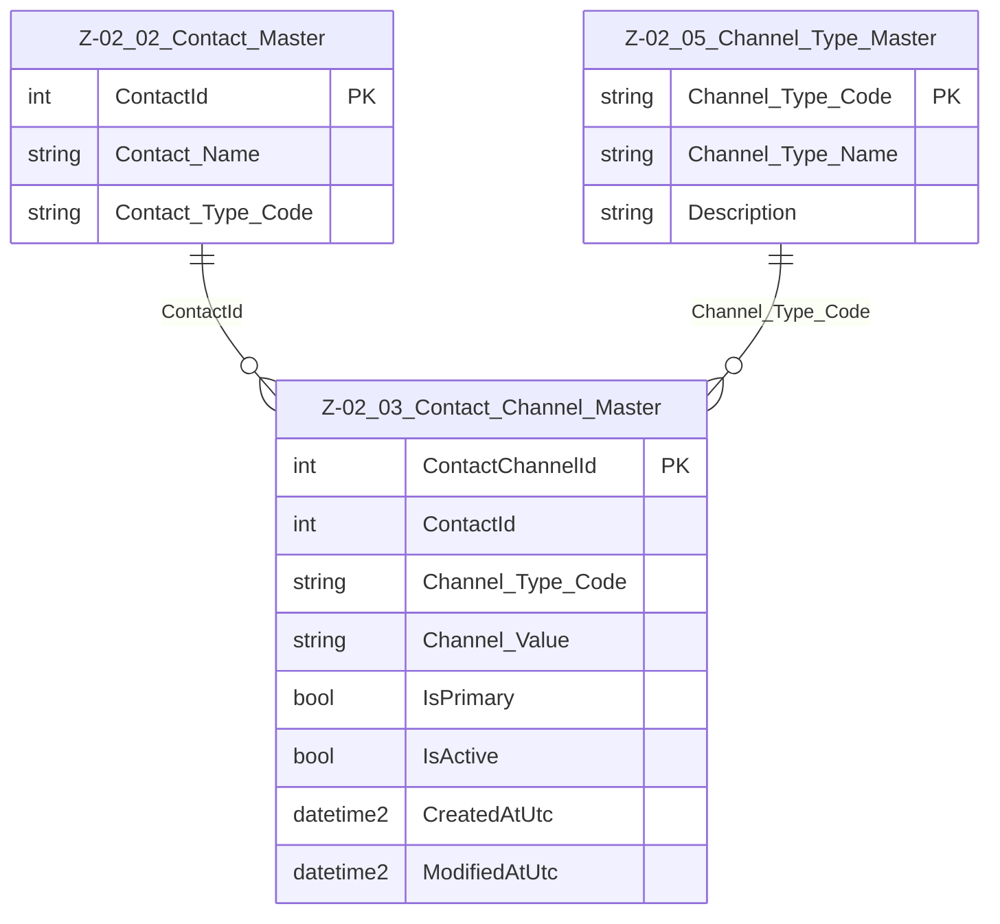

# Data Entity Specification: Z-02.03 Contact_Channel_Master

| **Document ID** | **Version** | **Status** | **Owner (Author)** | **Approved By** | **Approved On** |
| :--- | :--- | :--- | :--- | :--- | :--- |
| Z-02.03 | 1.2.0 | **DRAFT** | Business Architect | Product Officer |  |

## 1. Description & Scope

The **Z-02.03 Contact_Channel_Master** entity stores individual **communication channels** associated with a contact, such as:

- Email addresses  
- Mobile phone numbers  
- Office/desk numbers  
- Support/helpdesk lines  
- Other digital communication channels  

Each row represents **one channel instance** for a given contact.

Channels are always associated with:

- A parent contact in **Z-02.02 Contact_Master**  
- A valid channel type in **Z-02.05 Channel_Type_Master**  
- Optionally flagged as **primary**, indicating the preferred channel of that type

Contact_Channel_Master is a shared master-data entity used by all domains that need reliable, normalised contact mechanisms.

---

## 2. Referential Integrity Standard

> **Referential Integrity Standard**  
> Relationships involving Contact_Channel_Master are **logical only** — application and reporting layers enforce correctness.  
> No physical FOREIGN KEY constraints are created at database level.

The physical implementation of this entity is:

- **Table**: `[Core].[Z_02_03_Contact_Channel_Master]`

---

## 3. Entity–Relationship Diagram (Context)

---

## 4. Table Definition

**Physical table name:** `[Core].[Z_02_03_Contact_Channel_Master]`

Each row represents a **single communication channel** for a contact.

| Column | Type | Nullability | Role | Notes |
| :--- | :--- | :--- | :--- | :--- |
| `ContactChannelId` | INT IDENTITY(1,1) | NOT NULL | Primary Key | Surrogate key. |
| `ContactId` | INT | NOT NULL | Parent contact | Logical FK → Z-02.02 Contact_Master.ContactId. |
| `Channel_Type_Code` | NVARCHAR(50) | NOT NULL | Classification | Logical FK → Z-02.05 Channel_Type_Master.Channel_Type_Code. |
| `Channel_Value` | NVARCHAR(255) | NOT NULL | Payload | Email address, full phone number, or other channel identifier. |
| `IsPrimary` | BIT | NOT NULL DEFAULT 0 | Flag | Indicates whether this is the preferred channel of this type for the contact. |
| `IsActive` | BIT | NOT NULL DEFAULT 1 | Status | Soft-delete / deactivation flag. |
| `Created_By` | UNIQUEIDENTIFIER | NULL | Audit | User or service that created the row. |
| `Created_AtUtc` | DATETIME2(3) | NOT NULL | Audit | UTC timestamp for creation. |
| `Modified_By` | UNIQUEIDENTIFIER | NULL | Audit | User or service that last modified the row. |
| `Modified_AtUtc` | DATETIME2(3) | NULL | Audit | UTC timestamp of last modification. |

---

## 5. Data Management

| Object Type | Name | Description |
|-------------|------|-------------|
| **Stored Procedure** | **usp_Z_02_03_ContactChannel_Create** | Creates a new contact channel. Validates `ContactId` (exists and is active), validates `Channel_Type_Code` against Z-02.05, applies business rules, and sets audit fields. |
| **Stored Procedure** | **usp_Z_02_03_ContactChannel_Update** | Updates an existing channel (value, type, primary flag, active flag). Ensures that channel type remains valid and maintains audit consistency. |
| **Stored Procedure** | **usp_Z_02_03_ContactChannel_Get** | Retrieves a specific contact channel by `ContactChannelId`. |
| **View** | **vw_Z_02_03_ContactChannels_ByContact** | Returns all active channels for a given `ContactId`. Used by UI components, integration services, and reporting. |
| **Governance Process** | **Contact Channel Stewardship Workflow** | Governs how channels are created, updated, set as primary, and deactivated, ensuring alignment with privacy and communication policies. |
| **Reporting / DQ Process** | **DQ_ContactChannel_ValidationReport** | Validates that each channel references a valid ContactId and Channel_Type_Code and that primary-channel rules are not violated (e.g. at most one active primary channel per type per contact). |

---

## 6. Data Quality & Business Rules

- `Channel_Type_Code` **must exist and be active** in Z-02.05 Channel_Type_Master.  
- Channel values must be syntactically valid for their type:
  - Emails should match standard email patterns.  
  - Phone numbers should follow agreed dialling formats.  
- For each **(ContactId, Channel_Type_Code)** pair:
  - At most **one active primary** (`IsPrimary = 1` and `IsActive = 1`) is recommended.  
- `IsActive = 0` indicates the channel should not be used for new communications but may remain for historical/audit purposes.  
- Channels must not be left with blank `Channel_Value`.  
- Channel_Master must be used as the **authoritative source** of contact channels; other tables should not duplicate channel values.

---

## 7. Audit & Change History

Each contact channel’s lifecycle is tracked using:

- `Created_By`, `Created_AtUtc` – when and by whom the channel was created.  
- `Modified_By`, `Modified_AtUtc` – when and by whom it was last modified.

Where regulatory or business requirements demand more detailed change tracking (e.g. proof of when a channel was revoked or changed for consent reasons), this can be enhanced by:

- A dedicated channel history entity, or  
- Additional logging in upstream systems.
