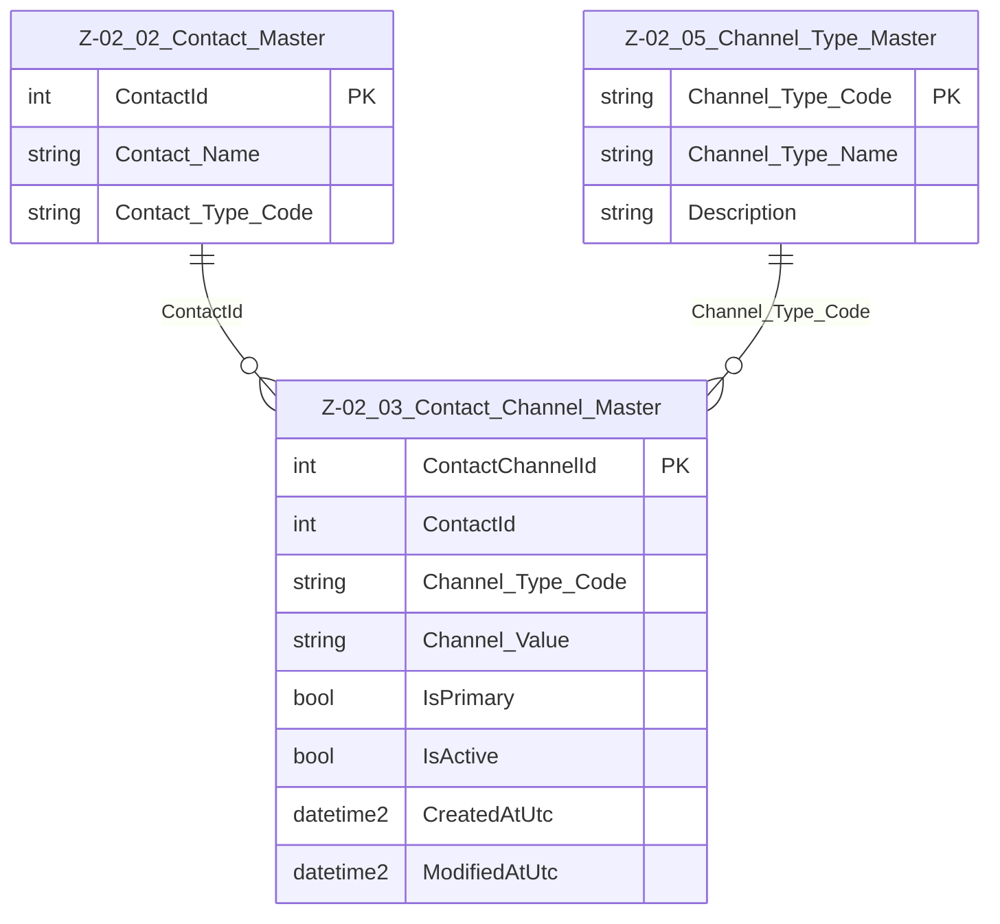

# Data Entity Specification: Z-02.03 Contact_Channel_Master

| **Document ID** | **Version** | **Status** | **Owner (Author)** | **Approved By** | **Approved On** |
| :--- | :--- | :--- | :--- | :--- | :--- |
| Z-02.03 | 1.1.0 | **DRAFT** | Business Architect | Product Officer |  |

## 1. Description & Scope

The **Z-02.03 Contact_Channel_Master** entity stores individual **communication channels** associated with a contact, such as:

- Email addresses  
- Mobile numbers  
- Office/desk numbers  
- Support/helpdesk lines  
- Other digital communication channels  

Each row captures **one channel instance** for a given contact.

Channels are always associated with:

- A parent contact in **Z-02.02 Contact_Master**
- A valid channel type from **Z-02.05 Channel_Type_Master**
- Optionally flagged as **primary**, indicating the preferred channel

> **Referential Integrity Standard**  
> Relationships are **logical only** — application and reporting layers enforce correctness.  
> No physical FOREIGN KEY constraints are created at database level.

The physical implementation of this entity is:

- **Table**: `[Core].[Z_02_03_Contact_Channel_Master]`

---

## 2. Entity–Relationship Diagram (Updated Context)

---

## 3. Data Management

| Object Type | Name | Description |
|-------------|------|-------------|
| **Stored Procedure** | **usp_Z_02_03_ContactChannel_Create** | Creates a new contact channel. Validates `ContactId` and `Channel_Type_Code`, applies business rules, and records audit metadata. |
| **Stored Procedure** | **usp_Z_02_03_ContactChannel_Update** | Updates an existing contact channel (value, type, primary flag, activation status). Ensures channel types remain valid and channels cannot be repurposed incorrectly. |
| **Stored Procedure** | **usp_Z_02_03_ContactChannel_Get** | Retrieves a specific channel by `ContactChannelId` for application services needing full detail. |
| **View** | **vw_Z_02_03_ContactChannels_ByContact** | Returns all active channels for a given ContactId. Used by UI components, integration services, and operational reports. |
| **Governance Process** | **Contact Data Quality Workflow** | Ensures each Contact has complete, valid communication details. Verifies that primary channels exist and channel types match approved reference data. |
| **Reporting / DQ Process** | **DQ_ContactChannel_ValidationReport** | Ensures all entries reference valid ContactId and valid `Channel_Type_Code` from Z-02.05. Identifies orphaned, inactive, or invalid configurations. |

---

## 4. Table Definition

**Physical table name**: `[Core].[Z_02_03_Contact_Channel_Master]`

Each row represents a **single communication channel** for a contact.

| Column | Type | Nullability | Role | Notes |
| :--- | :--- | :--- | :--- | :--- |
| `ContactChannelId` | `INT IDENTITY(1,1)` | NOT NULL | Primary Key | Surrogate key. |
| `ContactId` | `INT` | NOT NULL | Parent contact | Logical pointer → Z-02.02 Contact_Master. |
| `Channel_Type_Code` | `NVARCHAR(50)` | NOT NULL | Channel classification | Logical pointer → Z-02.05 Channel_Type_Master. |
| `Channel_Value` | `NVARCHAR(255)` | NOT NULL | Payload | Email, phone, or other channel. |
| `IsPrimary` | `BIT` | NOT NULL DEFAULT 0 | Primary flag | Only one primary channel per type recommended. |
| `IsActive` | `BIT` | NOT NULL DEFAULT 1 | Status flag | Allows soft-deactivation. |
| `Created_By` | `UNIQUEIDENTIFIER` | NULL | Audit | Who created it. |
| `Created_AtUtc` | `DATETIME2(3)` | NULL | Audit | Creation time. |
| `Modified_By` | `UNIQUEIDENTIFIER` | NULL | Audit | Who last modified it. |
| `Modified_AtUtc` | `DATETIME2(3)` | NULL | Audit | Modification time. |

---

## 5. Key Usage Patterns

- Support **multiple emails** and **multiple phone numbers** per contact  
- Allow **primary** channel selection for each type (e.g. primary email, primary phone)  
- Maintain contactability for Corporate Entities, Suppliers, ESG roles, and more  
- Provide structured, validated communication data for automated outbound processes  
- Enable reporting on contact completeness and quality  

---

## 6. Data Quality & Business Rules

- `Channel_Type_Code` **must exist** in Z-02.05 Channel_Type_Master.
- Emails should follow a valid email pattern.
- Phone numbers should follow standardised dialling formatting (where applicable).
- For each contact:
  - Only **one active primary channel per type** is recommended.
  - Inactive channels (`IsActive = 0`) must not be used operationally.
- Channel values must not be blank and must be unique **per contact + channel type** (soft rule).

---

## 7. Audit & Change History

- `Created_By`, `Created_AtUtc` store when and by whom a channel was created.
- `Modified_By`, `Modified_AtUtc` track updates (value, status, type, primary flag).
- For regulatory or governance requirements, enhanced change logging can be added through:
  - A channel history table  
  - Upstream application logs  
  - A reference-data audit trail  
