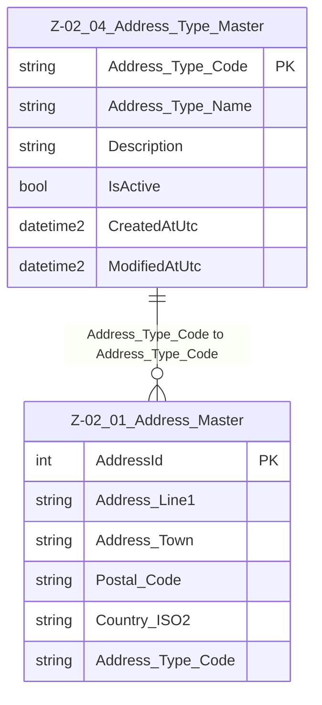

# Data Entity Specification: Z-02.04 Address_Type_Master

| **Document ID** | **Version** | **Status** | **Owner (Author)** | **Approved By** | **Approved On** |
| :--- | :--- | :--- | :--- | :--- | :--- |
| Z-02.04 | 1.0.0 | **DRAFT** | Business Architect | Product Officer |  |

## 1. Description & Scope

The **Z-02.04 Address_Type_Master** entity defines the controlled vocabulary of **address roles** used across the organisation.  
These address types classify the purpose of an address stored in **Z-02.01 Address_Master**.

Examples include:

- REGISTERED – legally registered office  
- TRADING – operational business location  
- BILLING – billing and invoicing  
- SHIPPING – delivery and logistics  
- HEAD_OFFICE – primary company HQ  

This is **reference data** and should be maintained centrally.

> **Referential Integrity Standard**  
> Relationships between Address_Type_Master and Address_Master are **logical only**.  
> No physical FOREIGN KEY constraints are enforced in the database.

---

## 2. Entity–Relationship Diagram (Context)

---

## 3. Table Definition

**Physical table name**: `[Ref].[Z_02_04_Address_Type_Master]`

| Column | Type | Nullability | Role | Notes |
|--------|------|-------------|------|-------|
| `Address_Type_Code` | NVARCHAR(50) | NOT NULL | Primary Key | Unique code defining the address classification. |
| `Address_Type_Name` | NVARCHAR(250) | NOT NULL | Display name | Human-readable version of the code. |
| `Description` | NVARCHAR(500) | NULL | Long description | Optional extended meaning. |
| `IsActive` | BIT | NOT NULL (default 1) | Status flag | Allows deactivation without deletion. |
| `Created_AtUtc` | DATETIME2(3) | NULL | Audit | Creation timestamp. |
| `Modified_AtUtc` | DATETIME2(3) | NULL | Audit | Modification timestamp. |

---

## 4. Data Quality & Business Rules

- Only values from this table should be used in Address_Master.
- Applications must validate `Address_Type_Code` before creating or updating address records.
- Only **one active row per code** is allowed.
- Codes must remain **stable** over time to preserve historical reporting.

---

## 5. Audit & Change History

This table uses lightweight auditing fields:

- `Created_AtUtc`
- `Modified_AtUtc`

Because reference data changes should be rare and tightly controlled, additional change tracking may be implemented in governance workflows rather than in the database.
