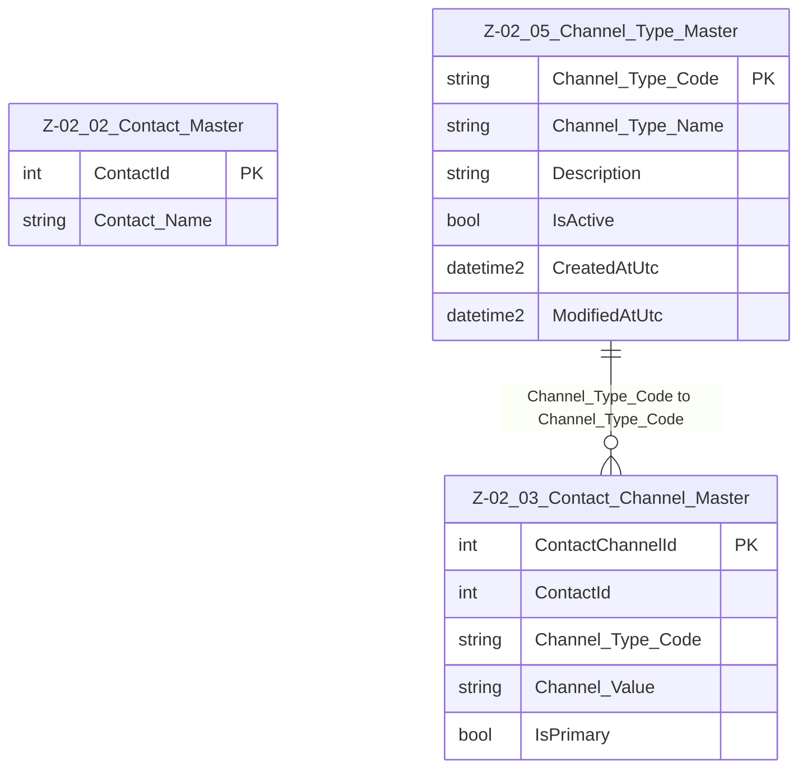

# Data Entity Specification: Z-02.05 Channel_Type_Master

| **Document ID** | **Version** | **Status** | **Owner (Author)** | **Approved By** | **Approved On** |
| :--- | :--- | :--- | :--- | :--- | :--- |
| Z-02.05 | 1.0.0 | **DRAFT** | Business Architect | Product Officer |  |

## 1. Description & Scope

The **Z-02.05 Channel_Type_Master** entity defines the controlled vocabulary of **communication channel types** used in the platform.  
It classifies channels stored in **Z-02.03 Contact_Channel_Master**.

Examples include:

- EMAIL_WORK  
- EMAIL_PERSONAL  
- PHONE_MOBILE  
- PHONE_OFFICE  
- SUPPORT_LINE  
- FAX (if required for legacy operations)

This is centrally governed reference data.

> **Referential Integrity Standard**  
> Relationships between Channel_Type_Master and Contact_Channel_Master are **logical only**, with no physical FOREIGN KEY constraints.

---

## 2. Entity–Relationship Diagram (Context)

---

## 3. Table Definition

**Physical table name**: `[Ref].[Z_02_05_Channel_Type_Master]`

| Column | Type | Nullability | Role | Notes |
|--------|------|-------------|------|-------|
| `Channel_Type_Code` | NVARCHAR(50) | NOT NULL | Primary Key | Unique identifier for the communication channel type. |
| `Channel_Type_Name` | NVARCHAR(250) | NOT NULL | Display name | Human-readable form of the channel type. |
| `Description` | NVARCHAR(500) | NULL | Optional description | Additional detail where needed. |
| `IsActive` | BIT | NOT NULL (default 1) | Status flag | Allows retiring a type without deleting it. |
| `Created_AtUtc` | DATETIME2(3) | NULL | Audit field | Creation timestamp. |
| `Modified_AtUtc` | DATETIME2(3) | NULL | Audit field | Update timestamp. |

---

## 4. Data Quality & Business Rules

- Only codes from this master should be used in Contact_Channel_Master.
- Applications must validate that `Channel_Type_Code` is valid and active.
- Only **one row per code** may exist.
- Channel type codes must remain **stable**, since they may drive routing logic, UI behavior, and workflow rules.

---

## 5. Audit & Change History

Basic audit tracking is provided through:

- `Created_AtUtc`  
- `Modified_AtUtc`

Because this is reference data, changes should occur under strict governance with appropriate approval and version control.
