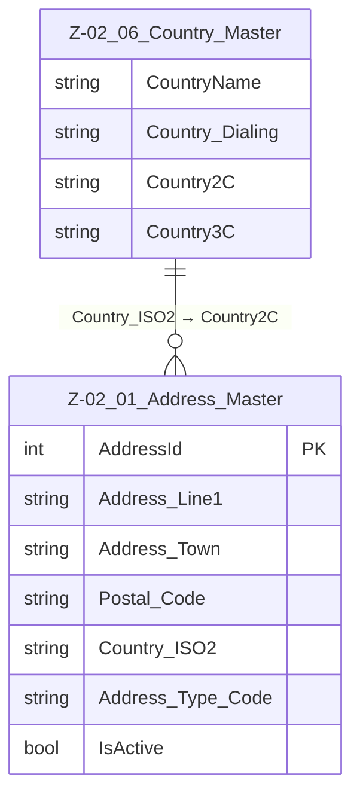

# Data Entity Specification: Z-02.06 Country_Master

| **Document ID** | **Version** | **Status** | **Owner (Author)** | **Approved By** | **Approved On** |
| :--- | :--- | :--- | :--- | :--- | :--- |
| Z-02.06 | 1.0.0 | **DRAFT** | Business Architect | Product Officer |  |

## 1. Description & Scope

The **Z-02.06 Country_Master** entity defines the master list of **countries** used across the platform.  
It provides:

- Country name  
- International dialling code  
- ISO 3166-1 alpha-2 (2C) code  
- ISO 3166-1 alpha-3 (3C) code  

This entity is currently **standalone** but is designed to be referenced logically by:

- Address-related entities (e.g. Z-02.01 Address_Master via `Country_ISO2`)  
- Telephony and communication logic (via dialling codes)  
- Other domains requiring a consistent country reference

Country_Master is the authoritative reference list for country codes and names.

---

## 2. Referential Integrity Standard

> **Referential Integrity Standard**  
> Relationships involving Country_Master are **logical only** — any consuming entities must enforce correctness in applications and reporting layers.  
> No physical FOREIGN KEY constraints are created at database level.

The current physical implementation of this entity is:

- **Table**: `[dbo].[CountryDetails]`

A future refactoring may align the physical name and schema to:

- **Table**: `[Ref].[Z_02_06_Country_Master]`

but the logical entity definition remains the same.

---

## 3. Entity–Relationship Diagram (Context)

> **Note:** Country_Master is currently a **standalone** reference table. The ERD below shows the entity in isolation for now. Future versions may add explicit logical relationships to Address_Master and other entities.

---

## 4. Table Definition

**Current physical table name:** `[dbo].[CountryDetails]`  

This table contains one row per country.

| Column | Type | Nullability | Notes |
|--------|------|-------------|-------|
| `CountryName` | NVARCHAR(50) | NOT NULL | Country display name. |
| `Country_Dialing` | NVARCHAR(50) | NOT NULL | International dialling prefix (e.g. `+44`, `+41`). |
| `Country2C` | CHAR(2) | NOT NULL | ISO 3166-1 alpha-2 country code (e.g. `GB`, `CH`). |
| `Country3C` | CHAR(3) | NOT NULL | ISO 3166-1 alpha-3 country code (e.g. `GBR`, `CHE`). |

> **Implementation Note:**  
> In a future iteration, additional fields such as `IsActive`, `Created_AtUtc`, and `Modified_AtUtc` may be added to align this table with the full audit pattern of other Z-02 reference entities.

---

## 5. Data Management

| Object Type | Name | Description |
|-------------|------|-------------|
| **Stored Procedure** | **usp_Z_02_06_Country_Create** | Inserts a new country row into `[dbo].[CountryDetails]`. Validates uniqueness of `Country2C` and `Country3C` and ensures they conform to ISO format rules. |
| **Stored Procedure** | **usp_Z_02_06_Country_Update** | Updates an existing country record (name or dialling code). Country2C/Country3C should not be repurposed once in use. |
| **Stored Procedure** | **usp_Z_02_06_Country_Get** | Returns a single country row by `Country2C` or `Country3C`. |
| **View** | **vw_Z_02_06_Country_All** | Exposes all rows from `[dbo].[CountryDetails]` for use by applications and reporting. Intended as the canonical read interface. |
| **Governance Process** | **Country Reference Stewardship** | Ensures that changes to country names or dialling codes are reviewed and aligned with external standards (e.g. ISO, ITU). |
| **Reporting / DQ Process** | **DQ_Country_ValidationReport** | Validates that all consuming systems use valid ISO country codes and dialling codes from Country_Master. Highlights mismatches and unknown codes. |

---

## 6. Data Quality & Business Rules

- `Country2C` must contain valid ISO 3166-1 alpha-2 codes.  
- `Country3C` must contain valid ISO 3166-1 alpha-3 codes.  
- `Country2C` and `Country3C` must be **unique** and stable over time. They must **not** be repurposed.  
- `Country_Dialing` values should comply with international dialling formats (e.g. `+xx`, `+xxx`).  
- `CountryName` should be kept consistent with official or widely recognised country names.  
- Country_Master is the **single source of truth** for countries; other tables must not carry separate country code lists.

---

## 7. Audit & Change History

Currently, `[dbo].[CountryDetails]` does **not** implement explicit audit fields.  
Changes should be tracked via:

- Source control and deployment scripts for country data, or  
- External configuration/audit processes

In future iterations, the table may be extended to include:

- `IsActive` (BIT)  
- `Created_AtUtc` (DATETIME2)  
- `Modified_AtUtc` (DATETIME2)

to bring it in line with the full Z-02 reference-data audit standard.
