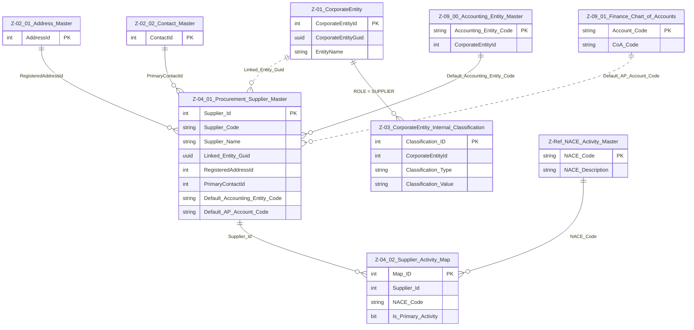

# Data Entity Specification: Z-04 Procurement Domain Overview  
**Version:** 1.2.0  
**Status:** DRAFT  

---

## 1. Description & Scope  
The **Procurement Domain (Z‑04)** governs supplier onboarding, classification, communication identity, and financial integration.

A Supplier is represented by:  
- A **CorporateEntity (Z‑01)** classified as `ROLE = SUPPLIER`, and  
- A **Supplier Master record (Z‑04.01)** containing procurement‑specific attributes.

Support structures include Address & Contacts (Z‑02) and Finance (Z‑09).  
This version **excludes ESG mapping** (Option B).

---

## 2. Referential Integrity Standard  
> All relationships in Z‑04 are **logical only**.  
> No physical FOREIGN KEY constraints exist.  
> Validations occur via application services and data quality reporting.

---

## 3. Entities in This Domain  
- **Z‑04.01 Procurement_Supplier_Master** – core supplier identity  
- **Z‑04.02 Supplier_Activity_Map** – NACE activity classifications  
- **Z‑Ref NACE_Activity_Master** – authorised industry activity codes  
- **Z‑01 CorporateEntity** – legal identity of supplier  
- **Z‑03 CorporateEntity_Internal_Classification** – flags CorporateEntities as SUPPLIER  
- **Z‑02 Address & Contact Master** – supplier communication identity  
- **Z‑09 Finance Entities** – posting defaults and buying‑entity linkage

---

## 4. One‑Tier ERD (Procurement Domain)

---

## 5. Data Flow Summary  
**Supplier legal identity → Supplier Master → Finance integration → Activity classification**

---

## 6. Data Management  
| Object Type | Name | Description |
|------------|------|-------------|
| Stored Procedure | usp_Z_04_01_Supplier_Create | Creates a Supplier; validates CorporateEntity + required references |
| Stored Procedure | usp_Z_04_01_Supplier_Update | Updates identity, finance links, lifecycle |
| Stored Procedure | usp_Z_04_02_Activity_Add | Adds NACE activity |
| Stored Procedure | usp_Z_04_02_Activity_Remove | Removes NACE activity |
| View | vw_Z_04_01_Supplier_AllActive | All active suppliers |
| View | vw_Z_04_02_Supplier_Activity | Supplier → NACE mapping |
| Governance | Supplier_Stewardship_Workflow | Controls onboarding and validation |
| DQ Process | DQ_Supplier_ValidationReport | Validates CorporateEntity, Address, Contact, CoA, NACE |

---

## 7. Architectural Role  
Z‑04 is the bridge between **CorporateEntity identity**, **communication identity**, and **financial identity**, ensuring all supplier data is standardised for AP, procurement analytics, and compliance workflows.

---