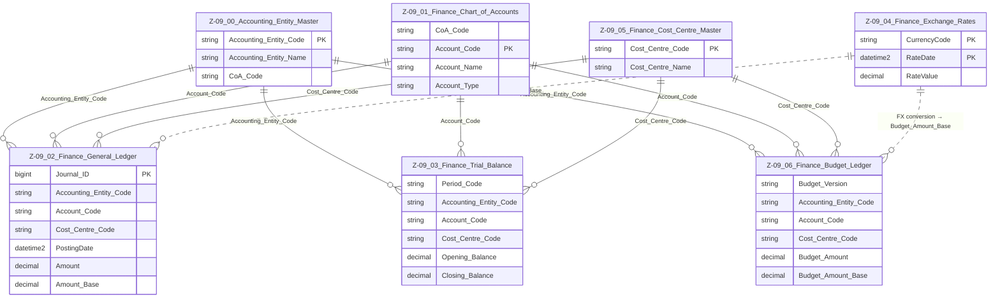

# Data Entity Specification: Z-09 Finance Domain Overview

| **Document ID** | **Version** | **Status** | **Owner (Author)** | **Approved By** | **Approved On** |
|-----------------|-------------|------------|---------------------|------------------|------------------|
| **Z-09** | 1.0.0 | **DRAFT** | Business Architect | Product Officer | |

---

## 1. Description & Scope

The **Z‑09 Finance Domain** defines the core financial structures required to support:

- Multi‑entity accounting  
- Multi‑chart-of-accounts operation  
- General ledger postings  
- Period‑level financial summaries (Trial Balance)  
- Budgets and reforecasts  
- FX valuation and base‑currency conversions  
- Integration into ESG actuals and forecasts (Z‑10 domain)

The domain is structured around **logical-only referential integrity**.  
No physical foreign keys are enforced; instead, **application and reporting layers** ensure correctness.

The Z‑09 domain contains:

- **Z‑09.00 Accounting_Entity_Master**  
- **Z‑09.01 Finance_Chart_of_Accounts**  
- **Z‑09.02 Finance_General_Ledger**  
- **Z‑09.03 Finance_Trial_Balance**  
- **Z‑09.04 Finance_Exchange_Rates**  
- **Z‑09.05 Finance_Cost_Centre_Master**  
- **Z‑09.06 Finance_Budget_Ledger**

Each entity has a dedicated specification page.

---

## 2. Referential Integrity Standard

> **Referential Integrity Standard**  
> All Z‑09 relationships are **logical only**.  
> The application layer validates Accounting Entity → CoA, CoA → Account, Cost Centre, and FX relationships.  
> No physical FOREIGN KEY constraints are created.

This supports:

- Multi‑tenant or multi‑entity environments  
- Flexible onboarding of new accounting structures  
- Historical ledger preservation without schema churn  
- Clean separation between **structural definitions** and **transactional operations**

---

## 3. Domain ERD (One‑Tier Overview)

---

## 4. Domain Behaviour Summary

### 4.1 Structural Entities
- **Z‑09.00 Accounting_Entity_Master**  
  Defines “who” the financial data belongs to and which CoA they use.

- **Z‑09.01 Finance_Chart_of_Accounts**  
  Defines “what” each financial posting represents.

- **Z‑09.05 Finance_Cost_Centre_Master**  
  Defines “where” in the organisational structure the posting belongs.

### 4.2 Transactional Entities
- **Z‑09.02 Finance_General_Ledger**  
  The atomic journal-level ledger of all financial movements.

- **Z‑09.03 Finance_Trial_Balance**  
  The per-period aggregate summarising GL activity.

### 4.3 Analytic & Support Entities
- **Z‑09.04 Finance_Exchange_Rates**  
  Provides FX rates used to calculate base-currency equivalents.

- **Z‑09.06 Finance_Budget_Ledger**  
  Stores plan/forecast financial numbers aligned with entity, account, and cost-centre structures.

---

## 5. Data Management Standards

| Object Type | Naming Prefix | Example | Description |
|-------------|---------------|---------|-------------|
| **Stored Procedures** | `usp_Z_09_xx_` | `usp_Z_09_02_GL_PostJournal` | Always start with domain + entity number. |
| **Views** | `vw_Z_09_xx_` | `vw_Z_09_03_TB_For_FinancialStatements` | Used for reporting and UI consumption. |
| **DQ Processes** | `DQ_Finance_*` | `DQ_Finance_GL_ValidationReport` | Standardised data-quality controls. |
| **Governance Workflows** | `{Entity}_Workflow` | `ChartOfAccounts_Stewardship_Workflow` | Supports ISO9001 audit traceability. |

---

## 6. Architectural Role

The Z‑09 domain serves as the **financial backbone** of the platform.  
It supports:

- **Statutory reporting**  
- **Management reporting**  
- **Audit & compliance**  
- **ESG Actuals & Forecasts (Z‑10)**  
- **Cross-entity consolidated financial views**

Its design ensures:

- Strong separation of master data vs transactional data  
- Full audit traceability  
- Multi‑entity, multi‑CoA capability  
- Forward compatibility with ESG, procurement, risk, and operational modules  

---

## 7. Related Specifications

For full details, refer to:

- **Z‑09.00 Accounting_Entity_Master**  
- **Z‑09.01 Finance_Chart_of_Accounts**  
- **Z‑09.02 Finance_General_Ledger**  
- **Z‑09.03 Finance_Trial_Balance**  
- **Z‑09.04 Finance_Exchange_Rates**  
- **Z‑09.05 Finance_Cost_Centre_Master**  
- **Z‑09.06 Finance_Budget_Ledger**

---