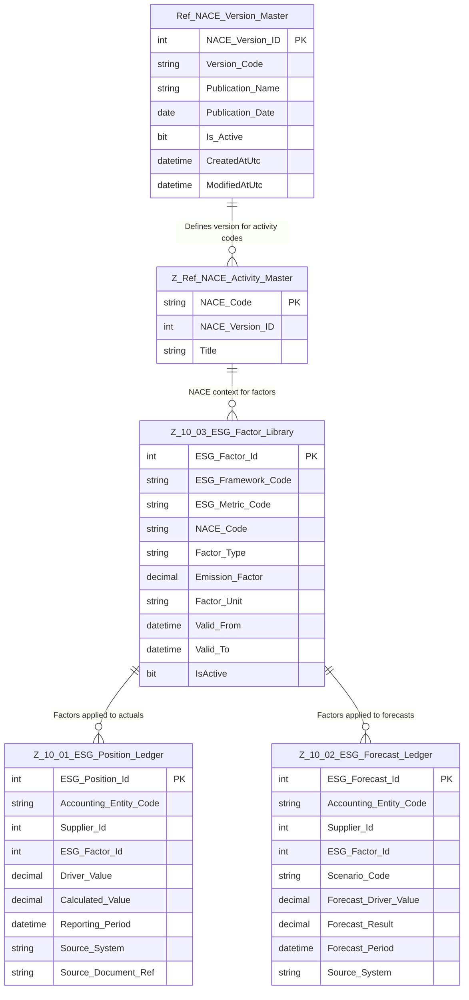

# Data Entity Specification: Z-10 Ref_NACE_Version_Master

| **Document ID** | **Version** | **Status** | **Owner (Author)** | **Approved By** | **Approved On** |
| :--- | :--- | :--- | :--- | :--- | :--- |
| Z-10 | 1.0.0 | **DRAFT** | Business Architect | Product Officer |  |

---

## 1. Description & Scope

The **[Ref].[NACE_Version_Master]** table is the **foundational reference data object** for managing the chronology and stability of all NACE economic activity code sets used in the application. It defines **each published version** of the NACE standard and anchors all downstream NACE usage for ESG factors, actual ESG positions, and ESG forecasts. :contentReference[oaicite:0]{index=0}  

In the Z-10 domain, the NACE version master underpins:

- The **NACE Activity Master** (code list for economic activities)
- The **ESG Factor Library** (Z-10.03)
- The **ESG Position Ledger – Actuals** (Z-10.01)
- The **ESG Forecast Ledger – Projections** (Z-10.02)   

The schematic below illustrates the **Z-10 domain context** and the relationships that the `Ref_NACE_Version_Master` object enjoys.

Referential Integrity Standard (Domain)
All relationships are logical only — enforced by application and reporting layers. No physical FOREIGN KEY constraints are required at database level, keeping the Z-10 domain consistent with other ESG entities.

## 2. Core Details

The [Ref].[NACE_Version_Master] table is the source of truth for NACE versioning across the platform. Its primary role is to ensure accurate, auditable, and historically consistent reporting by linking NACE classifications and ESG factors to a specific official publication date.

**Key characteristics and data fields:**

- **Version Control:** Each row represents one official NACE revision (e.g. NACE Rev. 2, NACE Rev. 2.1).
- **Chronology:** Captures the publication date and active state to support time-bounded reporting.
- **Downstream Lineage:** Provides the parent reference used by:
  - `Z_Ref_NACE_Activity_Master` to bind each activity code to a version.
  - `Z_10_03_ESG_Factor_Library` to associate ESG factors with NACE activity codes.
  - `Z_10.01` and `Z-10.02` ledgers to derive sector information logically via the factor layer.

## 3. Identity and Structure Management

This table establishes the metadata for every published version of the NACE standard used by the organisation.

| Feature            | Attribute / Column          | Primary Function |
|--------------------|-----------------------------|------------------|
| Primary Key        | NACE_Version_ID             | Auto-incrementing integer used internally for efficient lookups and for logical relationships from NACE activity codes. |
| Version Identifier | Version_Code, Publication_Name | Stores the concise internal code (e.g. REV_2_1) and the official name (e.g. NACE Rev. 2.1). |
| Chronology Data    | Publication_Date            | Stores the official date on which the NACE standard was released or adopted. |
| Status Control     | Is_Active                   | Indicates which version is currently allowed for new ESG factor sets and reporting runs. |
| Audit Fields       | CreatedAtUtc, ModifiedAtUtc | Standard audit trail for creation and last update times (UTC). |

## 4. Core Operational & Compliance Data

The NACE Version Master table is the root for versioned NACE usage in the ESG domain:

| Feature              | Attributes / Columns                             | Purpose |
|----------------------|--------------------------------------------------|---------|
| Regulatory Identity  | Publication_Name, Version_Code                   | Records the official and internal identifiers to align with external regulation and documentation. |
| Compliance Date      | Publication_Date                                 | Enables historical reproducibility by providing the governing publication date for NACE codes and ESG factors. |
| NACE Dependency      | NACE_Version_ID (in Z_Ref_NACE_Activity_Master)  | Ensures every NACE activity code is explicitly linked to a version for precise time-sliced analysis. |
| ESG Factor Lineage   | Logical chain: NACE_Version_Master → NACE_Activity_Master → ESG_Factor_Library → ESG Ledgers | Supports sector-based ESG reporting using the correct NACE revision for both actuals and forecasts. |
| Control Flags        | Is_Active                                        | Governs which NACE version is selectable for new factor sets and new NACE activity imports. |

## 5. Data Management

## 5. Data Management

| Z-Ref Code | Object Type        | Name                                         | Description |
|------------|--------------------|----------------------------------------------|-------------|
| Z_10_10    | Stored Procedure   | usp_Z_10_10_GetActiveNACEVersion            | Returns the currently active NACE version and metadata for ESG loaders and reporting. |
| Z_10_11    | Stored Procedure   | usp_Z_10_11_GetNACEVersionByDate            | Determines which NACE version applied for a given reference date (historical reporting). |
| Z_10_12    | Stored Procedure   | usp_Z_10_12_SearchNACE_AllVersions          | Searches NACE codes across **all versions** by code or title; returns full lineage. |
| Z_10_13    | Stored Procedure   | usp_Z_10_13_SearchNACE_ByVersion            | Returns the full NACE activity list for a specific `NACE_Version_ID`. |
| Z_10_14    | Stored Procedure   | usp_Z_10_14_SearchNACE_ByYear               | Resolves version by year and returns its NACE activity codes. |
| Z_10_15    | Stored Procedure   | usp_Z_10_15_CompareNACEVersions             | Compares two NACE versions (added, removed, changed, merged/split codes). |
| Z_10_16    | Stored Procedure   | usp_Z_10_16_GetNACEVersionHistory           | Returns the chronological history of all NACE versions with publication details. |
| Z_10_17    | View               | vw_Z_10_17_NACEVersion_WithUsage           | Summarises NACE version usage counts across NACE activities, ESG factors, and ledgers. |
| Z_10_40    | Stored Procedure   | usp_Z_10_40_DQ_NACE_OrphanCheck             | Detects NACE activity or ESG factor rows referencing invalid or inactive NACE versions. |
| Z_10_41    | Stored Procedure   | usp_Z_10_41_DQ_NACE_CompletenessCheck       | Validates that imported NACE activity counts match official publication totals. |
| Z_10_42    | Stored Procedure   | usp_Z_10_42_DQ_NACE_TitleFormattingCheck    | Checks formatting and data quality of NACE titles (capitalisation, whitespace, symbols). |
| Z_10_43    | Stored Procedure   | usp_Z_10_43_DQ_NACE_DuplicateCodeCheck      | Detects duplicates in a version or illegal re-use across versions. |
| Z_10_44    | Stored Procedure   | usp_Z_10_44_DQ_NACE_CrossVersionConsistency | Identifies anomalies in version-to-version transitions (unexpected additions/removals). |
| Z_10_45    | Stored Procedure   | usp_Z_10_45_DQ_NACE_ActivityIntegrityCheck  | Ensures structural completeness: hierarchy values, titles present, valid classifications. |
| Z_10_46    | Stored Procedure   | usp_Z_10_46_DQ_NACE_RevisionLineageCheck    | Validates official lineage relationships between versions (Rev.2 → Rev.2.1). |
| Z_10_47    | Stored Procedure   | usp_Z_10_47_DQ_NACE_ESGFactorLinkCheck      | Ensures ESG factors (Z-10.03) reference valid NACE codes for the correct NACE version. |
| Z_10_48    | Stored Procedure   | usp_Z_10_48_DQ_NACE_ESGLedgerLinkCheck      | Ensures ESG ledgers (Z-10.01 and Z-10.02) reference ESG factors that link to valid NACE codes. |
| Z_10_49    | Stored Procedure   | usp_Z_10_49_DQ_NACE_VersionAuditCheck       | Validates completeness of NACE version metadata (name, code, publication date, active flag, audit). |
| **Z_10_50** | **DQ Process**     | **DQ_Z_10_50_NACE_DataQualitySuite**        | **Master Data Quality process aggregating all NACE DQ checks (40–49), required for ESG audit readiness and ISO-9001 conformity; mirrors DQ pattern in Z-10.01, Z-10.02, Z-10.03.** |

**Implementation Note**  
All relationships are logical, consistent with the ESG ledgers and factor library. If physical foreign keys are implemented, they must not impede bulk loads or historical backfills.

## 6. Architectural Role

The NACE Version Master is the chronological anchor for all NACE-based reporting in the ESG domain:

### Compliance Control:
- Ensures that EU Taxonomy, CSRD and Scope 3 disclosures are aligned to the correct NACE revision for the reporting period.

### Data Integrity & Reproducibility:
- Locks the version used by ESG factors and ledger entries, so that re-runs of historical reports always reconcile to the same NACE basis.

### Cross-Domain Consistency:
- Provides a single source of truth for NACE version usage, reused by Finance, Procurement and ESG analytics modules.

## 7. Table Definition

**Physical table name:** `[Ref].[NACE_Version_Master]`

Each row represents one official NACE standard version adopted by the organisation.

| Column            | Type            | Nullability | Role          | Notes |
|-------------------|-----------------|-------------|---------------|-------|
| NACE_Version_ID   | INT IDENTITY(1,1) | NOT NULL  | Primary Key   | Surrogate key for internal references from NACE activity and ESG metadata. |
| Version_Code      | NVARCHAR(50)    | NOT NULL    | Internal identifier | Short, system-friendly code (e.g. REV_2, REV_2_1). |
| Publication_Name  | NVARCHAR(200)   | NOT NULL    | Official name | Full, human-readable publication name (e.g. NACE Rev. 2.1). |
| Publication_Date  | DATE            | NOT NULL    | Chronology    | Official publication or adoption date of the standard. |
| Is_Active         | BIT             | NOT NULL    | Status flag   | 1 = currently active for new data; 0 = historical only. |
| CreatedAtUtc      | DATETIME2(3)    | NOT NULL    | Audit         | Creation timestamp in UTC. |
| ModifiedAtUtc     | DATETIME2(3)    | NULL        | Audit         | Last update timestamp in UTC. |

**Usage Pattern**

- NACE activity codes in `Z_Ref_NACE_Activity_Master` must reference a valid `NACE_Version_ID`.
- ESG factors in `Z_10_03_ESG_Factor_Library` reference NACE codes, which in turn reference the NACE version, giving each factor an implicit version lineage.
