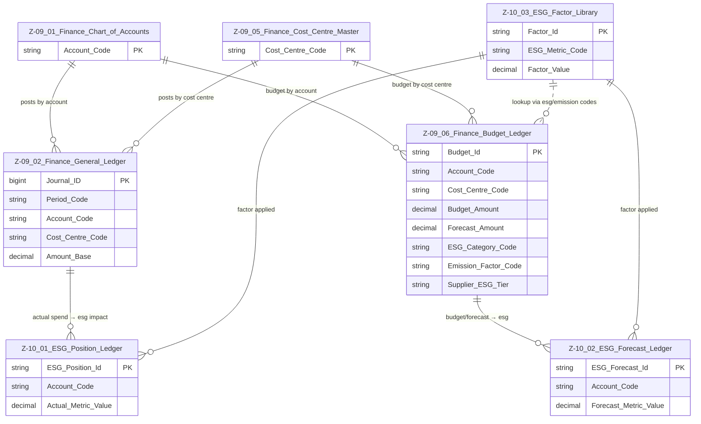

# Data Entity Specification: Z-09 / Z-10 Domain Integration (Finance ↔ ESG)

| **Document ID** | **Version** | **Status** | **Owner (Author)** | **Approved By** | **Approved On** |
| :--- | :--- | :--- | :--- | :--- | :--- |
| **Z-09_Z-10_Domain_Integration** | 1.0.0 | **DRAFT** | Business Architect | Product Officer | |

---

## 1. Purpose & Scope

This document provides a reader-friendly overview of how the **Finance Domain (Z‑09)** and **ESG Domain (Z‑10)** connect and work together.

It explains:
- The data flow from Finance → ESG  
- How actuals and budgets convert into ESG metrics  
- The bridge tables and shared dimensions  
- The master domain relationships

---

## 2. Domain Master ERD — Finance ↔ ESG Integration

---

## 3. How Finance Connects to ESG (Plain-English Summary)

### 3.1 Actuals → ESG Position (Z‑09.02 → Z‑10.01)
- The **General Ledger** records actual spend by account, cost centre, period.
- ESG Position Ledger reads that spend.
- It applies the correct **ESG factor** from Z‑10.03.
- Result:  
  **Actual environmental, social, governance impact.**

---

### 3.2 Budgets → ESG Forecast (Z‑09.06 → Z‑10.02)
- Budget lines include ESG enabling fields:
  - `ESG_Category_Code`
  - `Emission_Factor_Code`
  - `Supplier_ESG_Tier`
- ESG Forecast Ledger uses these to:
  - Find factors in Z‑10.03
  - Calculate future ESG impact

Result:  
**Future CO₂e / social / governance projections** tied directly to budget planning.

---

## 4. Shared Dimensions (Why Finance & ESG Line Up Perfectly)

Both domains use the same:

- `Account_Code`  
- `Cost_Centre_Code`  
- `Period_Code`  
- (Optional) `Entity_Code`

This ensures ESG reporting can be sliced **exactly like** financial reporting.

---

## 5. What This Integration Enables for SMEs

With this structure an SME can answer:

### ✔ “What is our ESG footprint by department or account?”  
### ✔ “How will our future budget affect our ESG performance?”  
### ✔ “Which suppliers create the highest ESG risk?”  
### ✔ “How does operational performance align with ESG commitments?”  
### ✔ “How do we satisfy bank/investor sustainability reporting?”  

---

## 6. Summary

This Z‑09 ↔ Z‑10 integration:

- Keeps **Finance** authoritative for money  
- Keeps **ESG** authoritative for impact  
- Provides clean bridges through shared keys and ESG‑aware budget fields  
- Enables powerful actual and forecast ESG analytics  
- Supports SME and regulatory frameworks simultaneously

This is the **master domain view** used by architects, SMEs, and auditors to understand the full Finance ↔ ESG data ecosystem.
