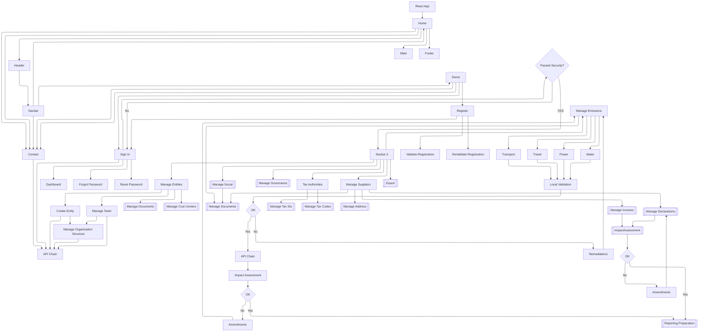

# Sustina Platform – Map of Demo Functionality
Below is the most recent version of the DEMO functionality in readiness for the CAB.
NOTE The workflow is an illustrative  non technicla overview to assist particpanet of the CAB to undertand oour offering and to stimulate thought and  inputs to the design meetings.

| **Document ID** | **Version** | **Status** | **Owner** | **Last Review** |
| :--- | :--- | :--- | :--- | :--- |
| GEN-001 | 1.1.0 | **DRAFT** | Architect | 2025-11-28 |

